# Simple Project Task Tracker 2.1 — Master Development Plan (North Star Blueprint)

**Document Identifier:** `doc/dev_plan.md`  
**Product Title:** Simple Project Task Tracker 2.1 (Executive Portfolio Intelligence System)  
**Version:** 2.1.27  
**Status:** Canonical Master Plan (North Star) — Waves **4A** and **4B** UAT-accepted; **Wave 4C-1** (high-density List) as-built; **Wave 4C-1b** (Excel task import) as-built; **Wave 4C-2a** (per-project Analytics) as-built 8 Oct 2026, UAT not yet accepted; **Wave 4C-2b** (dashboard access) as-built 9 Oct 2026, UAT not yet accepted; **Wave 4C-3** (portfolio, macro timeline, About) as-built 9 Oct 2026, UAT not yet accepted; Wave **4C-4 onward** not yet developed  
**Amendment:** Universal mutation audit trail; Completed Projects (not Archive); soft-delete / restore / purge; five-year completed retention; Super PM completed-visibility governance; per-project Issue Log; Issue Intelligence on the per-project Analytics dashboard; **agile per-wave usable increments with UAT at each wave exit**; IDE target Cursor; delivery status aligned to as-built UAT (`doc/dev_uat.md`)  
**Target Platform:** Next.js 16 (App Router), React 19, TypeScript, Tailwind CSS v4, Supabase PostgreSQL, Prisma ORM 7  
**IDE Target:** Cursor (Agent / IDE browser automation for UAT)  
**Language Standard:** Professional Australian English (`en-AU`)  
**Companion Specifications:**
* [`dev_req.md`](./dev_req.md) — Detailed System Requirements Specification (Release 2.1)
* [`dev_ref.md`](./dev_ref.md) — Raw Refinement Requirements Blueprint
* [`dev_spec.md`](./dev_spec.md) — Technical Specification Baseline (Wave 3 Close-out)
* [`dev_proc.md`](./dev_proc.md) — Historical Engineering Journal & Execution Log
* [`dev_uat.md`](./dev_uat.md) — Executable User Acceptance Testing pack (wave exit evidence)
* [`supabase-security.md`](./supabase-security.md) — Row-Level Security (RLS) Baseline

### Programme delivery status (as-built, 6 Oct 2026)

| Wave | Build | UAT | Evidence |
| :--- | :--- | :--- | :--- |
| **4A — Live schedule health** | Shipped | **Accepted** (5 Oct 2026) | `doc/dev_uat.md` — UAT-401–404, UAT-411 |
| **4B — Governed programme office** | Shipped | **Accepted** (4–5 Oct 2026; job-assisted UAT-413 / 418 included) | `doc/dev_uat.md` — UAT-405, 405A–D, 406–407, 412–422 |
| **Pre–4C UX polish** | Shipped | Operator visual check | Scope memory + pending feedback; Gantt viewport / markers — `dev_proc.md` §12.4 |
| **Custom Project ID** | Shipped | Operator check (UAT-PRJ-CPID) | `Project.customProjectId` — `dev_proc.md` §12.5 |
| **4C — Executive visualisation** | **Not in current build** | Deferred | Do not execute UAT-408–410, 423–425, UAT-R until 4C development completes |

The dated work-package table in Section 8 remains the **original planned** critical path (12 Sep–12 Oct 2026). Actual engineering and UAT calendars slipped relative to that plan; acceptance evidence is authoritative in `doc/dev_uat.md`, not the planned Sep UAT windows alone.

---

## 1. Project Overview

Simple Project Task Tracker 2.1 is an **Executive Portfolio Intelligence System** designed for capital programme governance, multi-project delivery leadership, and high-velocity engineering teams. In complex enterprise delivery, unweighted task counts and subjective progress percentages routinely obscure critical schedule slippage—a dozen rapid administrative completions cannot compensate for a four-week delay on an architectural dependency. 

Version 2.1 addresses this fundamental challenge by transitioning from an operational task tracker into an executive intelligence platform. It introduces a mathematically rigorous **Weighted Progress Engine** based on business working days (excluding statutory Australian holidays and corporate shutdowns), a **Capped Target Progress & Punctuality Score (PS) Engine** for schedule risk detection, a deterministic **11-State Status Flag Matrix**, cumulative **S-Curve & Burn-Down Visualisations**, a per-project **Issue Log** for unplanned impediments (kept strictly outside the weighted task schedule, with every mutation reflected on the same project’s Analytics tab as **Issue Intelligence**), and a multi-tiered **Executive Portfolio Dashboard** with macro Gantt roadmaps. 

Primary stakeholders comprise:
* **Super PMs (Platform Administrators & Portfolio Directors):** Requiring portfolio-wide aggregation, registration governance, holiday scheduling, safe resource reallocation, discretion over who may view Completed Projects, and exclusive restore / permanent-purge authority.
* **Project Managers (PMs / Delivery Leads):** Requiring milestone control, roster management, an Issue Log whose activity and progress appear on the project Analytics dashboard, accurate S-Curve schedule tracking, and automated delay detection.
* **Team Members (Specialist Contributors):** Requiring high-density tabular workspaces with inline editing and transparent personal workload clarity.
* **Viewers (Executive Sponsors & External Auditors):** Requiring read-only access to macro milestones, portfolio health indicators, and audited progress trails.

---

## 2. Feature List (Version 2.1 Scope)

The scope for Version 2.1 is catalogued below into discrete, testable, and demonstrable feature units. Each feature is assigned a unique identifier to facilitate sprint planning, traceable implementation, and acceptance verification.

```mermaid
graph TD
    subgraph W4A["Wave 4A: Live schedule health"]
        F2101["F-2101: Global Holiday Calendar Engine"]
        F2102["F-2102: Weighted Progress Engine"]
        F2103["F-2103: Punctuality Score and 11-State Flag Engine"]
        F2118["F-2118: Universal Mutation Audit Trail"]
        F2109A["F-2109a: Landing-card schedule health"]
    end

    subgraph W4B["Wave 4B: Governed programme office"]
        F2104["F-2104: Registration Approval and User Onboarding"]
        F2105["F-2105: Dynamic RBAC and Dashboard Delegation"]
        F2106["F-2106: Safe Account Deactivation and Purge"]
        F2107["F-2107: Project Lifecycle and Roster Editor"]
        F2108["F-2108: Project Milestone Tracking Engine"]
        F2119["F-2119: Per-Project Issue Log"]
        F2115["F-2115: Completed Projects Workspace"]
        F2116["F-2116: Soft-Delete, Restore and Retention Purge"]
        F2117["F-2117: Purged Project Register"]
        F2114B["F-2114a: Settings console minus About"]
    end

    subgraph W4C["Wave 4C: Executive visualisation"]
        F2110["F-2110: High-Density Tabular Workspace"]
        F2111["F-2111: Per-Project Analytics: Schedule and Issue Intelligence"]
        F2112["F-2112: Multi-Project Executive Portfolio Dashboard"]
        F2113["F-2113: Macro Executive Gantt Chart"]
        F2114C["F-2114b: System About Modal"]
    end

    W4A --> W4B
    W4B --> W4C
```



### F-2101: Global Holiday Calendar & Working Days Engine
* **Scope:** Dedicated CRUD management interface under `/settings/holidays` restricted to Super PMs.
* **Capability:** Captures statutory Australian public holidays and corporate shutdown dates (`@db.Date`).
* **Calculation Impact:** Underpins all scheduling arithmetic, defining working days strictly as Monday–Friday excluding registered holidays. Dynamically recalculates dependent task durations, relative weights, and target progress trajectories.
* **Wave 4A increment:** Super PMs must be able to create, edit, and delete holidays in the running application. A library without `/settings/holidays` is not a completed 4A deliverable.

### F-2102: Mathematically Rigorous Weighted Progress Engine
* **Scope:** Task-level and project-level progress computation engine (`src/lib/analytics/weighted-progress.ts`).
* **Capability:** Computes relative task weight $W_i$ based on planned working-day duration relative to aggregate project working days:
  $$W_i = \frac{D_{\text{planned}_i}}{\sum_{k=1}^{n} D_{\text{planned}_k}}$$
* **Symmetrical Summation:** Project progress is derived via the direct linear sum of weighted tasks ($P_{\text{actual}_{\text{project}}} = \sum W_i \times P_{\text{actual}_i}$; $P_{\text{target}_{\text{project}}} = \sum W_i \times P_{\text{target}_i}$), guaranteeing $100.0\%$ mathematical normalisation with zero secondary re-weighting distortion.
* **Wave 4A increment:** $W_i$, $P_{\text{target}}$, and $P_{\text{actual}}$ shall be visible on the live task List, Kanban, Gantt Progress column, task drawer, and landing cards. A calculation module that is only unit-tested is not a completed 4A deliverable.

### F-2103: Punctuality Score (PS) & 11-State Status Flag Engine
* **Scope:** Schedule variance and early warning classification engine.
* **Capability:** 
  * Target progress capped at $100\%$ ($P_{\text{target}} = \min(100\%,\ E_{\text{elapsed}} / D_{\text{planned}} \times 100\%)$), including when tasks breach their due dates.
  * Piecewise evaluation of Punctuality Score across Not Started, In Progress, and Completed tasks, plus project-level aggregate punctuality.
  * Deterministic mapping to exactly one of **11 Australian English PM Status Flags** (Due to Commence, Delayed Commencement, Critically Overdue Start, On Track, Slipping, Critically Delayed, Ahead of Schedule, Completed Ahead of Schedule, Completed On Time, Completed Late, Completed Severely Late).
* **Wave 4A increment:** The Status Flag pill shall render on the task row, Kanban card, Gantt Task column, drawer, and landing card in the running application. The Gantt Progress column shows stacked Actual / Target per task.

### F-2104: Registration Approval & User Onboarding Workflow
* **Scope:** Identity management and edge security boundary.
* **Capability:** Self-service registration creates `approvalStatus = PENDING` and sends a Supabase email-confirmation link (prefer `/auth/confirm?token_hash=…` to avoid mailbox prefetch consuming the OTP). Only after the registrant confirms (`emailConfirmedAt` set) does the account enter the Super PM approval queue (badges + optional Super PM email). Unconfirmed or unreachable addresses never appear in the queue. Until `APPROVED`, sign-in is refused and any session is signed out at the edge (login notice; `/pending-approval` redirects to the same notice). Super PMs approve at `/settings/users` **and must select `globalRole`** in that step. On approval, the applicant receives a brief email naming the assigned role and a link to `/login`, then signs in with the credentials they registered. Reject applies to pending candidates; Super PMs may permanently delete pending/rejected applicants. Approved accounts use the Privilege Matrix. Separately, Super PMs may **provision** a known person under Create account (`provisionUserBySuperPm`, FR-GOV-07): Auth identity with confirmed email + immediately `APPROVED` profile, bypassing confirmation and the queue when mailbox access is unavailable. Duplicate emails (self-service or provision) return clear Australian English errors. Email on an existing account is immutable.

### F-2104A: Password Reset & Shared Settings Account Hub
* **Scope:** Credential recovery and personal account settings (`/forgot-password`, `/settings`, `/settings/account`).
* **Capability:** Approved users request a temporary password by email (`requestPasswordResetAction`). When email is unavailable, Super PMs generate a temporary password via `resetUserPasswordBySuperPm` and share it out-of-band (shown once in the UI). All approved roles access Settings → Account to update display name and change password; Super PMs retain governance surfaces under the same Settings hub (Users & privileges, Viewer project visibility, Holidays, Deleted / Purged projects).

### F-2105: Dynamic RBAC Governance & Dashboard Delegation
* **Scope:** Granular authorization engine (`src/lib/rbac.ts`) and `/settings/users` Privilege Matrix (**Wave 4B**).
* **Capability:** Super PMs can arbitrarily delegate or revoke executive dashboard access per user across three distinct scopes: `PROJECT` (Per-Project Analytics), `PM_PORTFOLIO` (PM Portfolio Analytics), and `TOTAL_COMPANY` (Macro Enterprise Portfolio). Super PMs can also set `completedProjectAccess` (`NONE` | `ASSIGNED` | `ALL`) per account, deciding who may view projects labelled Completed, and can change `globalRole` after approval. Project visibility and write rights are strictly governed via indexed relational `ProjectMember` join records (never `User.projectVisibility[]`). Owning PMs always retain implicit access to their own completed projects. PM / Super PM home Portfolio scope supports **My projects**, **All projects**, and per-PM owned portfolios. Approvals and Privilege matrix UIs use instant name/email search; Privilege matrix adds role filter chips and expand-one editors so long directories remain scannable.

### F-2105A: Super PM Viewer Project Visibility
* **Scope:** Cross-portfolio Viewer grants (`/settings/viewer-visibility`, `src/lib/actions/viewer-visibility.ts`).
* **Capability:** After a Viewer is approved or provisioned, a Super PM grants read-only Active-project access from one Settings screen instead of asking each owning PM to edit every roster. Saves sync that Viewer’s Active `ProjectMember` rows only. Edit Project → team roster remains a valid single-project alternate path.

### F-2106: Safe Account Deactivation, Reactivation & Purge Protocol
* **Scope:** Database integrity and administrative user management (`/settings/users` Safe deletion tab; retention job).
* **Capability:** Direct cascading deletion of active accounts is blocked. Deactivation is role-aware:
  * **PM / Super PM:** Per-project ownership handover to another approved PM/Super PM; tasks and issue PIC on owned projects follow the new owner; leftover assignments on non-owned projects go to each project's lead PM; receiving PMs are emailed. At least one active approved Super PM must remain.
  * **Member:** Tasks/PIC → project owners; memberships removed.
  * **Viewer:** Soft-deactivate only.
  * Soft-deactivate sets `deactivatedAt` / `deactivatedBy`, `approvalStatus = REJECTED`, `purgeDueAt = now + 30 days` (and later `purgeWarningSentAt` when the 2-day Super PM email warning is sent). Reactivate restores approval without re-registration. Hard delete (and auto-purge after retention) permanently removes the User row and Auth identity when configured. Super PM may reassign project owners independently via Edit Project.
  * **Safe deletion directory UX** (`/settings/users` → **Safe deletion** tab): sticky name/email search across Active and Deactivated; role chips on Active (A–Z); Deactivated ordered by purge due (soonest first) with a due-soon cue within ~2 days; per-project ownership handover selects on Review & deactivate; compact action rows retained.

### F-2107: Project Lifecycle & Dynamic Roster Editor
* **Scope:** Project administration modal accessible to owning PMs and Super PMs.
* **Capability:** Inline updating of project metadata (Name, optional Custom Project ID, Description) and dynamic team roster composition (adding or removing `ProjectMember` records). When weighted actual progress is $100\%$, exposes **Move to Completed Projects**. Exposes **Delete project** (soft-delete with a blocking warning). Notes that Super PMs may also grant Viewers under Settings → Viewer project visibility.

### F-2108: Project Milestone Tracking Engine
* **Scope:** High-level contractual deliverable and stage-gate tracking (`ProjectMilestonesPanel.tsx`, `milestones.ts`).
* **Capability:** CRUD for project milestones (`initialTarget`, `updatedTarget`, `actualAchieved`, optional description). On create, `updatedTarget = initialTarget`. Project hub shows a **compact stage-gate strip** (count, next-target summary, chips; View all when long); **Add** / chip click opens a modal for create or edit (name, description, updated target, achieved date, delete). Vertical stage-gate markers on project Gantt; diamond nodes on executive macro bars (Wave 4C).

### F-2119: Per-Project Issue Log
* **Scope:** Unplanned impediment register inside each project workspace (`ProjectIssueLogView.tsx`, `IssueDetailDrawer.tsx`).
* **Nomenclature:** **Issue Log** (PMBOK / Australian PM practice). Not a Task list, not a risk register, not a Kanban column.
* **Capability:**
  * Hub tabs, in order: List, Kanban, Gantt, **Issue Log**, Analytics.
  * Sequential `ISS-001` identifiers per project.
  * Classification: category, severity, status (`open` → `in_progress` → `blocked` | `resolved` → `closed`, plus `cancelled`).
  * PIC (`picId` / `picName`) using the same badge pattern as tasks.
  * Multi-dates: initial start/end, updated start/end, actual start / actual resolution — same immutability and copy-on-create rules as tasks.
  * Fix-activity `progress` $0$–$100\%$ with bidirectional status sync; `resolved` is not auto-`closed`.
  * Optional links to a same-project Task or Milestone.
  * Threaded `IssueComment` activity.
  * Append-only `IssueActivity` event log (raise, progress, status, PIC, dates, classification, comment, close, cancel).
  * Issue-level PS and 11-state **Fix schedule flag** for display on the register and aggregation **only** inside Issue Intelligence (F-2111).
  * **Exclusion from** task $W_i$, Project PS, **Schedule** S-Curve, **task** burn-down, and Gantt task bars. Exclusion from the weighted schedule does **not** mean the work is invisible on Analytics.
  * Landing-card open-issue count; every Issue Log mutation is reflected live on the Analytics **Issue Intelligence** pane (F-2111).
  * Owning PM / Super PM full CRUD and close; members may raise and, if PIC, update progress; Viewers read-only.
  * Safe User Deletion reassigns `picId` with task assignees and writes `PIC_CHANGED` activity.
* **Wave split:** The Issue Log register, drawer, comments, `IssueActivity` writes, Fix schedule flag, and landing open-issue count ship in **Wave 4B** as a usable impediment register. Charts, KPIs, and the activity stream on the Analytics tab (F-2111 Issue Intelligence) ship in **Wave 4C**.

### F-2109: Smart Landing Page Views & Enhanced Project Cards
* **Scope:** Primary application entry point (`app/page.tsx`).
* **Capability:**
  * Role-aware smart defaults: Super PMs and PMs default to **My projects** (owned or with tasks assigned); Members/Viewers see roster-scoped Active projects. PM / Super PM **Portfolio scope** combobox switches among My projects, All projects, and per-PM owned portfolios (not quick-filter tabs). **← Back to projects** restores the last non-default scope via `/?owner=…`; brand / **Projects** / typed `/` reset to **My projects**. Scope changes show an inline list pending state (“Updating projects…”) until the RSC payload arrives.
  * **Active-only listing:** Landing page query is `lifecycleStatus = ACTIVE AND deletedAt IS NULL`.
  * Dedicated **Completed Projects** control navigating to `/projects/completed` for Super PMs, owning PMs, and accounts granted completed visibility.
  * Enhanced project cards displaying designated PM identity, real-time Status Flag pill badges, task counts, compact dual progress bars ($P_{\text{target}}$ vs. $P_{\text{actual}}$), and **open-issue count** (rose when any open issue is Critical). Cards at $100\%$ additionally show **Move to Completed Projects**.
* **Wave split:** Status Flag and dual progress bars ship in **Wave 4A** (usable schedule health). Active-only listing, Completed control, Portfolio scope, and **Move to Completed Projects** ship in **Wave 4B**. Open-issue count ships in **Wave 4B** with the Issue Log.

### F-2110: High-Density Tabular Workspace — **Wave 4C-1 (as-built 6 Oct 2026)**
* **Scope:** Workspace data presentation layer (`TaskListView.tsx`).
* **Capability:** Process-group schedule table with Australian English column headers: **No.** (1.x–5.x by process group), **Task**, **Status**, **Actual %**, **Target %**, **Initial start / due / WD**, **Updated start / due / WD** (schedule baseline for PS), **Actual start / finish / WD**, **PS**, **Status flag**. Working-day durations exclude weekends and registered holidays and use $D_{\text{planned}}=\max(1,\ldots)$ (same-day = 1 WD). Tasks group under Initiating → Closing; list order uses `listSortOrder` (independent of Kanban `sortOrder`). Inline edit for title, status, actual %, and dates; PS / Status flag / Target % / WD columns are computed read-only. Drag-and-drop reorders within or across process groups. The process-group header is a label only. Each group has one **Add row** at the bottom (freeze rail). Hovering a horizontal grid line shows a single **+** that opens an instant local draft (title + initial dates required before persist). Empty projects keep the five-group table. Inline delete with confirm uses `deleteTask`. List dates use uncontrolled inputs for keyboard entry. A quiet **Details** control opens the existing drawer for PIC, priority, checklist, and comments (fields not on the grid). The table scrollport freezes the column header, process-group headers, and the Task (plus No./drag) columns with opaque panes and a scroll-aware freeze edge; long titles wrap. Transient mutation errors (including future actual dates) auto-dismiss (~7s) and are manually closable via toast/banner.
* **As-built note:** Wave 4A already surfaces $W_i$, progress, and Status Flags on the prior card list. Wave 4C-1 replaces that list with the high-density table above (sticky / freeze polish 6 Oct 2026).

### F-2120: Excel task import — **Wave 4C-1b**
* **Why:** Programme tracking still lives in Excel. Re-keying every task blocks adoption. A well-formed workbook copies schedule cells into the project so the PM can leave the spreadsheet.
* **Who:** Owning PM and Super PM, on an Active project (`requireAdminProject`). Members and Viewers cannot import.
* **Behaviour:** Download a template, upload `.xlsx`, review a preview (create / update / untouched / errors / warnings), then commit. Matched rows update; unmatched existing tasks are kept and appended. Nothing is deleted. Re-import is safe.
* **Match:** One existing task with the same title (case-insensitive, trimmed) is updated and may move process group. Several tasks sharing that title match only inside the sheet’s process group; otherwise the row is an error.
* **Format:** Agreed starter in FR-IMP-01 (`dev_req.md`). Column labels may be tightened during the operational trial without a new wave.
* **Dates and progress:** Actual % is authoritative when present. Actual dates are copied from the sheet and are never invented. Future actuals, finish-without-start, finish before start, progress without the dates it implies, and inverted planned spans are row errors and block commit.

### F-2111: Per-Project Analytics — Schedule Visualisations & Issue Intelligence — **Wave 4C-2a (as-built 8 Oct 2026)**
* **Scope:** Analytical engine inside `ProjectAnalyticsView.tsx`, with planned `IssueIntelligencePane.tsx` and `src/lib/analytics/issue-intelligence.ts` (Wave 4B ships Issue Log only; Analytics Issue Intelligence remains 4C).
* **Capability:**
  * **Two labelled panes on the same Analytics hub tab** (not a sixth tab), stacked vertically:
    1. **Schedule Intelligence (tasks only).**
    2. **Issue Intelligence (Issue Log).**
  * **Schedule S-Curve:** Renders cumulative planned baseline ($P_{\text{target}}(t)$) versus cumulative actual achievement ($P_{\text{actual}}(t)$) over the project calendar duration using **task** weights $W_i$ only.
  * **Task burn-down:** Visualises remaining working-day *task* effort over time against an ideal linear burn-down trajectory.
  * **Schedule header:** Aggregate Punctuality Score ($\text{Project PS}$), Target vs. Actual progress divergence ($\Delta P$), overall project Status Flag. Issue counts do not appear here.
  * **Issue Intelligence header:** Non-cancelled total; cancelled count; status counts; critical-and-active; overdue; $\bar{P}_{\text{issue}}$ over the active set; mean **Issue PS** (em dash when none active); closure rate; last activity (actor, `ISS-nnn`, time). Hovering a figure explains it immediately.
  * **Issue Fix Realisation:** Duration-weighted among non-cancelled issues using $W_j^{\text{issue}}$ (equal weight fallback). Target from issue working-day elapsed/planned dates; actual as a step function of `progress` from `IssueActivity`. Chart title **Issue Fix Realisation** — never an unqualified “S-Curve”.
  * **Issue burn-down:** Remaining active issues versus calendar, against an ideal linear close-out when dates exist.
  * **Breakdowns:** Three rows — realisation and burn-down; status, severity, and PIC load; category and fix-schedule flag. The five count charts are horizontal bars. PIC load is active issues, *Unassigned* grouped.
  * **Activity stream:** Twenty most recent `IssueActivity` events; selecting a row opens the Issue drawer.
  * **Live coupling:** `getProjectIssueAnalytics(projectId)` reads the same Prisma rows as the Issue Log. Every Issue Log Server Action writes `IssueActivity` in the same transaction and `revalidatePath`s the workspace. No warehouse that can lag.
  * **Empty state:** *No issues have been logged for this project*, with a control to switch to Issue Log. Schedule pane still renders.
  * **Completed projects:** Issue Intelligence remains as historical readout. Soft-deleted projects are not analysed until restored.
  * Issues **never** enter task $W_i$, Project PS, Schedule S-Curve, or task burn-down.
* **Wave 4C increment:** This entire visualisation pane is the Wave 4C usable increment. Wave 4B UAT confirms the Issue Log register without requiring these charts.

### F-2112: Multi-Project Executive Portfolio Dashboard — **Wave 4C-3 (as-built 9 Oct 2026; UAT not yet accepted)**
* **Scope:** Dedicated enterprise routing under `/portfolio`.
* **Capability:** Two views, per decision D6. Per-project analytics stay on the project hub. The page opens only for a person holding the `PM_PORTFOLIO` or `TOTAL_COMPANY` tick:
  1. *By PM* (`PM_PORTFOLIO`): aggregated portfolio performance for the Active projects one Project Manager owns, with a PM picker.
  2. *All projects* (`TOTAL_COMPANY`): every Active project the caller may see, with a project filter and a comparison by PM. Completed projects join only when the caller holds `completedProjectAccess = ALL` and switches **Include Completed projects** on.
* **Data scope:** The server limits the rows to what the caller could open anyway (PM and Super PM: every Active project; Member: memberships; Viewer: memberships, or every Active project on `ALL_ACTIVE`). A Viewer on `ALL_ACTIVE` still needs a portfolio tick to open the page.

### F-2113: Macro Executive Gantt Chart — **Wave 4C-3 (as-built 9 Oct 2026; UAT not yet accepted)**
* **Scope:** Top-level visual timeline on `/portfolio` (`MacroTimeline.tsx`, pure engine in `src/lib/analytics/portfolio.ts`).
* **Capability:** Three uncluttered horizontal timeline bars per project: Initial Planned Span (grey), Updated Planned Span (blue), and Actual Realisation Span (green at 95% punctuality or better, amber below, hatched while still running to Today). Milestone diamond nodes sit on the bars (achieved, achieved late, past target, upcoming) with instant tooltips (no delay, on hover or keyboard focus) giving the milestone, project, target, achieved date and variance in working days. Target, Actual and Status Flag columns sit beside each row. A date outside 2000 to 2100 is ignored when the axis is drawn.

### F-2114: Global Settings Console & System About Modal
* **Scope:** Platform administration and governance console.
* **Capability:** Centralised administrative navigation under `/settings`:
  * User Approvals
  * Privilege Matrix (role, dashboard scopes, **Completed Projects visibility**)
  * Safe User Deletion
  * Holiday Calendar
  * **Deleted Projects** (restore / permanently delete)
  * **Purged Project Register** (read-only tombstones)
* System About modal displaying version `v2.1.4-executive-intel`, runtime stack details (Node.js, Next.js, React, Prisma, Supabase JS, Recharts, Tailwind CSS, PostgreSQL), database status, and formal architectural credits recognising **Yugo Ananda** as the Grand Designer and Chief Solution Architect — **Wave 4C-3 (as-built 9 Oct 2026; UAT not yet accepted)**. It opens from the account menu for any approved user.
* **Wave split:** Holiday Calendar ships in **Wave 4A**. Approvals, privilege matrix, Safe User Deletion, Viewer project visibility, Account settings, Deleted Projects, and the Purged Project Register ship in **Wave 4B** (as-built). The About modal ships in **Wave 4C-3**.

### F-2115: Completed Projects Workspace
* **Scope:** Label-only completion of programmes that have reached $100\%$ weighted actual progress.
* **Nomenclature:** **Completed Projects** is adopted. **Archive** is rejected (collides with records management and with soft-delete).
* **Capability:**
  * Manual **Move to Completed Projects** by owning PM or Super PM.
  * Automatic labelling after **30 consecutive calendar days** at $100\%$ (`completionMethod = AUTO_RETENTION`, System actor).
  * Operational row remains; landing page excludes it.
  * Dedicated `/projects/completed` view.
  * Five-year retention clock starts at `completedAt` (the labelling instant). Example: labelled **30 September 2026** → physical purge due **30 September 2031**.
  * Owning PM / Super PM may **Reopen** to Active (cancels the five-year clock).

### F-2116: Soft-Delete, Restore & Retention Purge
* **Scope:** Non-destructive delete with Super PM recovery, then timed physical removal.
* **Capability:**
  * Owning PM deletes own projects; Super PM may delete any. Mandatory warning: restore is Super PM only; unrestored rows are permanently removed after **30 calendar days**.
  * Flags: `deletedAt`, `deletedBy`, `purgeDueAt`. Hidden from landing and Completed views.
  * Super PM **Restore** from Settings → Deleted Projects.
  * Super PM **Permanently delete** (hard delete) after a typed name confirmation.
  * Retention job (`runProjectRetentionJob`) physically purges expired soft-deletes and five-year-old Completed rows, and processes soft-deactivated user warnings/purges. Super PM may invoke it manually from Deleted Projects for tests.

### F-2117: Purged Project Register
* **Scope:** Immutable tombstone table `PurgedProject`, written **before** the operational `Project` is deleted.
* **Capability:** Records original identity, denormalised owner, full audit snapshot, lifecycle at purge, related-entity counts, JSON snapshot, and the purge event (Super PM manual, 30-day soft-delete expiry, or five-year completed expiry). Super PM inspects `/settings/purged-projects`. Rows are append-only.

### F-2118: Universal Mutation Audit Trail
* **Scope:** Binding four-stamp standard on every operational mutation.
* **Capability:** `createdAt` / `createdBy` (immutable after insert) and `updatedAt` / `updatedBy` (refreshed on every update), **NOT NULL**, injected by `withAuditSession`. Automated jobs use `SYSTEM_ACTOR_ID` (durable `User` row). Actor names come from joining `User` — no per-table name columns and no separate Actor table (FR-AUD-08). Closes v2.1.0 gaps (User actors, ProjectMember updates, TaskComment stamps, nullable actors, unspecified destructive history).
* **Wave 4A increment:** Stamps are persisted from the first 4A mutation and are inspectable on the task **List** row (Created by / Updated by names). A schema-only audit trail is not a completed 4A deliverable.

---

## 3. Data Models & Entity Relationships

All database primary keys are PostgreSQL **UUID** strings. Calendar dates are stored as `@db.Date` without time components. Timestamps are stored as `timestamptz`.

### 3.0 Universal Mutation Audit Trail (binding)

Every persistable **create** and **update** shall record **when and by whom** the row was created, and **when and by whom** it was last edited.

| Stamp | Rule |
| :--- | :--- |
| `createdAt` | `timestamptz` NOT NULL, default `now()`, **immutable** after insert |
| `createdBy` | UUID NOT NULL — session user or `SYSTEM_ACTOR_ID` (`00000000-0000-4000-8000-000000000001`) |
| `updatedAt` | `timestamptz` NOT NULL, `@updatedAt` |
| `updatedBy` | UUID NOT NULL — last mutating actor or System |

Covered operational entities include `Issue` and `IssueComment`. Append-only `IssueActivity` records create stamps only and must not be updated. **v2.1.0 gaps closed by this amendment:** `User` lacked actor stamps; `ProjectMember` and `TaskComment` lacked update stamps; actor columns were nullable; automated jobs had no System actor; physical delete left no surviving row. Soft-delete / complete / restore are **updates** (refresh `updatedAt`/`updatedBy` plus dedicated lifecycle columns). Physical delete writes `PurgedProject` first, then destroys the operational graph. Injection is mandatory via `withAuditSession`.

**Actor master (best practice):** `User` is the single directory of actors (`id` → `name` / `email`). Stamp columns store UUIDs only — **no** denormalised name columns on each table, and **no** separate `Actor` table. Resolve names in Supabase SQL with `LEFT JOIN "User"` on `createdBy` / `updatedBy`. Soft (non-blocking) UUID references preserve Safe User Deletion; Wave 4B **uses** soft-deactivate so joins keep returning names until hard purge. The System actor is a durable `User` row (`SYSTEM_ACTOR_ID`, not an Auth login). See FR-AUD-03 / FR-AUD-08.

```mermaid
erDiagram
    User ||--o{ Project : "owns"
    User ||--o{ ProjectMember : "belongs to"
    User ||--o{ Task : "assigned to"
    User ||--o{ TaskComment : "authors"
    User ||..o{ Task : "createdBy / updatedBy (soft UUID)"
    
    Project ||--o{ ProjectMember : "has"
    Project ||--o{ Task : "contains"
    Project ||--o{ Milestone : "tracks"
    Project ||--o{ Issue : "logs"
    
    Task ||--o{ Subtask : "divides into"
    Task ||--o{ TaskComment : "threaded with"
    Task ||--o{ Issue : "optionally related"
    
    Issue ||--o{ IssueComment : "threaded with"
    Issue ||--o{ IssueActivity : "event log"
    Project ||--o{ IssueActivity : "project feed"

    PurgedProject {
        uuid id PK
        uuid originalProjectId
        string name
        string ownerEmail
        string ownerName
        ProjectLifecycleStatus lifecycleStatusAtPurge
        timestamptz completedAt
        timestamptz deletedAt
        timestamptz purgedAt
        uuid purgedBy
        string purgedByEmail
        string purgedByName
        PurgeTrigger purgeTrigger
        string purgeReason
        json snapshotJson
        timestamptz createdAt
        uuid createdBy
    }
    
    Holiday {
        uuid id PK
        date date UK
        string description
        boolean isNational
        timestamptz createdAt
        uuid createdBy
        timestamptz updatedAt
        uuid updatedBy
    }
    
    User {
        uuid id PK
        string email UK
        string name
        GlobalRole globalRole
        ApprovalStatus approvalStatus
        timestamptz approvedAt
        uuid approvedBy
        DashboardScope[] dashboardAccess
        CompletedProjectAccess completedProjectAccess
        timestamptz emailConfirmedAt
        timestamptz deactivatedAt
        uuid deactivatedBy
        timestamptz purgeDueAt
        timestamptz purgeWarningSentAt
        timestamptz createdAt
        uuid createdBy
        timestamptz updatedAt
        uuid updatedBy
    }
    
    Project {
        uuid id PK
        string name
        string customProjectId
        string description
        uuid ownerId FK
        ProjectLifecycleStatus lifecycleStatus
        timestamptz progressReached100At
        timestamptz completedAt
        uuid completedBy
        CompletionMethod completionMethod
        timestamptz completedPurgeDueAt
        timestamptz deletedAt
        uuid deletedBy
        timestamptz purgeDueAt
        timestamptz createdAt
        uuid createdBy
        timestamptz updatedAt
        uuid updatedBy
    }
    
    ProjectMember {
        uuid id PK
        uuid projectId FK
        uuid userId FK
        boolean canEdit
        timestamptz createdAt
        uuid createdBy
        timestamptz updatedAt
        uuid updatedBy
    }
    
    Milestone {
        uuid id PK
        uuid projectId FK
        string name
        string description
        date initialTarget
        date updatedTarget
        date actualAchieved
        timestamptz createdAt
        uuid createdBy
        timestamptz updatedAt
        uuid updatedBy
    }
    
    Issue {
        uuid id PK
        uuid projectId FK
        int issueNumber
        string title
        IssueCategory category
        IssueSeverity severity
        IssueStatus status
        uuid picId FK
        string picName
        uuid raisedBy
        date initialStartDate
        date initialDueDate
        date updatedStartDate
        date updatedDueDate
        date actualStartDate
        date actualResolutionDate
        int progress
        uuid relatedTaskId FK
        uuid relatedMilestoneId FK
        timestamptz createdAt
        uuid createdBy
        timestamptz updatedAt
        uuid updatedBy
    }

    IssueActivity {
        uuid id PK
        uuid projectId FK
        uuid issueId FK
        IssueActivityType eventType
        string summary
        json payloadJson
        timestamptz createdAt
        uuid createdBy
    }
    
    Task {
        uuid id PK
        uuid projectId FK
        string title
        string description
        TaskStatus status
        TaskPriority priority
        TaskBucket bucket
        uuid assigneeId FK
        string assigneeName
        date initialStartDate
        date initialDueDate
        date updatedStartDate
        date updatedDueDate
        date actualStartDate
        date actualCompletionDate
        int progress
        int sortOrder
        int listSortOrder
        float weightOverride
        timestamptz createdAt
        uuid createdBy
        timestamptz updatedAt
        uuid updatedBy
    }
```



### 3.1 Enumerations
```typescript
type GlobalRole = "super_pm" | "pm" | "member" | "viewer";
type ApprovalStatus = "PENDING" | "APPROVED" | "REJECTED";
type DashboardScope = "PROJECT" | "PM_PORTFOLIO" | "TOTAL_COMPANY";
type CompletedProjectAccess = "NONE" | "ASSIGNED" | "ALL";
type ProjectLifecycleStatus = "ACTIVE" | "COMPLETED";
type CompletionMethod = "MANUAL" | "AUTO_RETENTION";
type PurgeTrigger = "SUPER_PM_MANUAL" | "SOFT_DELETE_RETENTION_EXPIRED" | "COMPLETED_RETENTION_EXPIRED";
type IssueCategory =
  | "scope"
  | "schedule"
  | "cost"
  | "quality"
  | "technical"
  | "resource"
  | "stakeholder"
  | "safety"
  | "commercial"
  | "other";
type IssueSeverity = "critical" | "high" | "medium" | "low";
type IssueStatus = "open" | "in_progress" | "blocked" | "resolved" | "closed" | "cancelled";
type IssueActivityType =
  | "RAISED"
  | "STATUS_CHANGED"
  | "PROGRESS_CHANGED"
  | "PIC_CHANGED"
  | "DATES_CHANGED"
  | "CLASSIFICATION_CHANGED"
  | "COMMENTED"
  | "CLOSED"
  | "CANCELLED";
type TaskStatus = "todo" | "in_progress" | "done";
type TaskPriority = "urgent" | "important" | "medium" | "low";
type TaskBucket = "initiating" | "planning" | "executing" | "monitoring" | "closing";

type IssueIntelligenceDto = {
  kpis: {
    totalNonCancelled: number;
    cancelled: number;
    byStatus: Record<IssueStatus, number>;
    criticalActive: number;
    overdue: number;
    meanFixProgress: number; // 0–100, one decimal
    meanIssuePs: number | null;
    closureRate: number; // 0–100, one decimal
    lastActivityAt: string | null;
    lastActivityByName: string | null;
    lastActivityIssueNumber: number | null;
  };
  series: {
    fixRealisation: { t: string; targetPct: number; actualPct: number }[];
    burnDown: { t: string; remaining: number; ideal: number | null }[];
  };
  stacks: {
    status: { status: IssueStatus; count: number }[];
    severity: { severity: IssueSeverity; count: number }[];
    category: { category: IssueCategory; count: number }[];
    flags: { flag: string; count: number }[];
    picLoad: { picId: string | null; picName: string; activeCount: number }[];
  };
  activity: {
    id: string;
    issueId: string;
    issueNumber: number;
    eventType: IssueActivityType;
    summary: string;
    createdAt: string;
    createdByName: string;
  }[];
};
```

### 3.2 Canonical Prisma Models (`prisma/schema.prisma`)
```prisma
model Holiday {
  id          String   @id @default(uuid()) @db.Uuid
  date        DateTime @unique @db.Date
  description String
  isNational  Boolean  @default(true)
  
  createdAt   DateTime @default(now())
  createdBy   String   @db.Uuid
  updatedAt   DateTime @updatedAt
  updatedBy   String   @db.Uuid

  @@index([date])
}

model User {
  id              String           @id @db.Uuid
  email           String           @unique
  name            String
  globalRole      GlobalRole       @default(member)
  approvalStatus  ApprovalStatus   @default(PENDING)
  approvedAt      DateTime?
  approvedBy      String?          @db.Uuid
  dashboardAccess          DashboardScope[]         @default([PROJECT])
  completedProjectAccess   CompletedProjectAccess   @default(NONE)
  projectVisibilityMode    ProjectVisibilityMode    @default(SELECTED)
  emailConfirmedAt DateTime?
  deactivatedAt   DateTime?
  deactivatedBy   String?          @db.Uuid
  purgeDueAt      DateTime?
  purgeWarningSentAt DateTime?

  createdAt       DateTime         @default(now())
  createdBy       String           @db.Uuid
  updatedAt       DateTime         @updatedAt
  updatedBy       String           @db.Uuid

  ownedProjects   Project[]        @relation("ProjectOwner")
  projectMembers  ProjectMember[]
  assignedTasks   Task[]           @relation("TaskAssignee")
  assignedIssues  Issue[]          @relation("IssuePic")
  comments        TaskComment[]
  issueComments   IssueComment[]

  @@index([email])
  @@index([approvalStatus])
  @@index([emailConfirmedAt])
  @@index([deactivatedAt])
  @@index([purgeDueAt])
}

model Project {
  id              String   @id @default(uuid()) @db.Uuid
  name            String
  customProjectId String   @default("")
  description     String   @default("")
  ownerId         String   @db.Uuid

  lifecycleStatus      ProjectLifecycleStatus @default(ACTIVE)
  progressReached100At DateTime?
  completedAt          DateTime?
  completedBy          String?                @db.Uuid
  completionMethod     CompletionMethod?
  completedPurgeDueAt  DateTime?
  deletedAt            DateTime?
  deletedBy            String?                @db.Uuid
  purgeDueAt           DateTime?
  
  createdAt   DateTime @default(now())
  createdBy   String   @db.Uuid
  updatedAt   DateTime @updatedAt
  updatedBy   String   @db.Uuid

  owner       User            @relation("ProjectOwner", fields: [ownerId], references: [id])
  members     ProjectMember[]
  tasks       Task[]
  milestones  Milestone[]
  issues      Issue[]
  issueActivities IssueActivity[]

  @@index([ownerId])
  @@index([lifecycleStatus, deletedAt])
  @@index([progressReached100At])
  @@index([completedPurgeDueAt])
  @@index([purgeDueAt])
}

model ProjectMember {
  id        String   @id @default(uuid()) @db.Uuid
  projectId String   @db.Uuid
  userId    String   @db.Uuid
  canEdit   Boolean  @default(true)
  
  createdAt DateTime @default(now())
  createdBy String   @db.Uuid
  updatedAt DateTime @updatedAt
  updatedBy String   @db.Uuid

  project   Project  @relation(fields: [projectId], references: [id], onDelete: Cascade)
  user      User     @relation(fields: [userId], references: [id], onDelete: Cascade)

  @@unique([projectId, userId])
  @@index([userId])
  @@index([projectId])
}

model Milestone {
  id             String    @id @default(uuid()) @db.Uuid
  projectId      String    @db.Uuid
  name           String
  description    String?   @default("")
  initialTarget  DateTime  @db.Date
  updatedTarget  DateTime  @db.Date
  actualAchieved DateTime? @db.Date

  createdAt      DateTime  @default(now())
  createdBy      String    @db.Uuid
  updatedAt      DateTime  @updatedAt
  updatedBy      String    @db.Uuid

  project        Project   @relation(fields: [projectId], references: [id], onDelete: Cascade)

  @@index([projectId])
  @@index([updatedTarget])
}

model Task {
  id                   String       @id @default(uuid()) @db.Uuid
  projectId            String       @db.Uuid
  title                String
  description          String       @default("")
  status               TaskStatus   @default(todo)
  priority             TaskPriority @default(medium)
  bucket               TaskBucket   @default(executing)
  assigneeId           String?      @db.Uuid
  assigneeName         String       @default("")
  
  initialStartDate     DateTime?    @db.Date
  initialDueDate       DateTime?    @db.Date
  updatedStartDate     DateTime?    @db.Date
  updatedDueDate       DateTime?    @db.Date
  actualStartDate      DateTime?    @db.Date
  actualCompletionDate DateTime?    @db.Date
  
  progress             Int          @default(0)
  sortOrder            Int          @default(0)
  listSortOrder        Int          @default(0)
  weightOverride       Float?

  createdAt            DateTime     @default(now())
  createdBy            String       @db.Uuid
  updatedAt            DateTime     @updatedAt
  updatedBy            String       @db.Uuid

  project              Project       @relation(fields: [projectId], references: [id], onDelete: Cascade)
  assignee             User?         @relation("TaskAssignee", fields: [assigneeId], references: [id], onDelete: SetNull)
  subtasks             Subtask[]
  comments             TaskComment[]

  @@index([projectId])
  @@index([projectId, status, sortOrder])
  @@index([projectId, bucket, listSortOrder])
}
  id                   String        @id @default(uuid()) @db.Uuid
  projectId            String        @db.Uuid
  issueNumber          Int
  title                String
  description          String        @default("")
  category             IssueCategory @default(technical)
  severity             IssueSeverity @default(medium)
  status               IssueStatus   @default(open)
  picId                String?       @db.Uuid
  picName              String        @default("")
  raisedBy             String        @db.Uuid
  raisedAt             DateTime      @default(now())
  initialStartDate     DateTime?     @db.Date
  initialDueDate       DateTime?     @db.Date
  updatedStartDate     DateTime?     @db.Date
  updatedDueDate       DateTime?     @db.Date
  actualStartDate      DateTime?     @db.Date
  actualResolutionDate DateTime?     @db.Date
  progress             Int           @default(0)
  impactSummary        String        @default("")
  resolutionSummary    String        @default("")
  relatedTaskId        String?       @db.Uuid
  relatedMilestoneId   String?       @db.Uuid
  sortOrder            Int           @default(0)
  createdAt            DateTime      @default(now())
  createdBy            String        @db.Uuid
  updatedAt            DateTime      @updatedAt
  updatedBy            String        @db.Uuid

  @@unique([projectId, issueNumber])
  @@index([projectId, status, severity])
}

model IssueActivity {
  id          String            @id @default(uuid()) @db.Uuid
  projectId   String            @db.Uuid
  issueId     String            @db.Uuid
  eventType   IssueActivityType
  summary     String
  payloadJson Json
  createdAt   DateTime          @default(now())
  createdBy   String            @db.Uuid

  @@index([projectId, createdAt])
  @@index([issueId, createdAt])
}

model PurgedProject {
  id                     String                  @id @default(uuid()) @db.Uuid
  originalProjectId      String                  @db.Uuid
  name                   String
  description            String
  ownerId                String?                 @db.Uuid
  ownerEmail             String
  ownerName              String
  lifecycleStatusAtPurge ProjectLifecycleStatus
  createdAtOriginal      DateTime
  createdByOriginal      String?
  createdByEmailOriginal String?
  updatedAtOriginal      DateTime
  updatedByOriginal      String?
  updatedByEmailOriginal String?
  completedAt            DateTime?
  completedBy            String?
  completedByEmail       String?
  completionMethod       CompletionMethod?
  completedPurgeDueAt    DateTime?
  deletedAt              DateTime?
  deletedBy              String?
  deletedByEmail         String?
  memberCount            Int
  taskCount              Int
  subtaskCount           Int
  commentCount           Int
  milestoneCount         Int
  issueCount             Int
  issueCommentCount      Int
  issueActivityCount     Int
  lastKnownActualProgress Float?
  lastKnownTargetProgress Float?
  snapshotJson           Json
  purgedAt               DateTime                @default(now())
  purgedBy               String                  @db.Uuid
  purgedByEmail          String
  purgedByName           String
  purgeTrigger           PurgeTrigger
  purgeReason            String?
  createdAt              DateTime                @default(now())
  createdBy              String                  @db.Uuid

  @@index([originalProjectId])
  @@index([purgedAt])
  @@index([purgeTrigger])
  @@index([ownerEmail])
}
```

---

## 4. API Surface & Server Action Contracts

All server mutations and data queries execute exclusively through **Next.js Server Actions** (`"use server"`). No direct client-side database connections or browser Supabase Data API calls are permitted. Every action re-validates authentication, user approval status, and project-level authorization. Every write is wrapped in `withAuditSession` so `createdBy` / `updatedBy` cannot be omitted.

```typescript
// Shared Action Result Contract
type ActionResult<T> =
  | { success: true; data: T }
  | { success: false; error: string; code?: string };
```

### 4.1 Global Holiday Server Actions (`src/lib/actions/holidays.ts`)
* `listHolidays(): Promise<ActionResult<Holiday[]>>`
  * *Responsibility:* Fetches all registered corporate and national holidays ordered by date.
* `createHoliday(input: { date: string; description: string; isNational: boolean }): Promise<ActionResult<Holiday>>`
  * *Authorization:* Super PM only.
  * *Side Effect:* Revalidates holiday caches; triggers project duration/weight re-evaluation.
* `deleteHoliday(id: string): Promise<ActionResult<void>>`
  * *Authorization:* Super PM only.

### 4.2 User Governance & Administration Actions (`src/lib/actions/users.ts`)
* `listProjects(scope?: { browseOwnerId?: string | null })` — Active landing list. PM default = owned ∪ tasked; optional `browseOwnerId` for peer portfolio (PM/Super PM only). Member/Viewer = `ProjectMember` only.
* `listBrowsableProjectOwners()` — PM/Super PM owners with Active projects (home-page filter).
* `listManagedUsers(): Promise<ActionResult<ManagedUserDto[]>>`
  * *Authorization:* Super PM only.
* `countPendingApprovals(): Promise<number>`
  * *Authorization:* Super PM only. Counts confirmed PENDING (non-deactivated) for badges.
* `approveUser(input: { userId: string; globalRole: GlobalRole }): Promise<ActionResult<ManagedUserWithMailDto>>`
  * *Authorization:* Super PM only. Sets `APPROVED`, records `approvedAt` / `approvedBy`, and assigns `globalRole` in the same write. Super PM role forces `completedProjectAccess = ALL`. Applicant approval email is scheduled after the write (SMTP or Resend).
* `rejectUser(userId: string): Promise<ActionResult<ManagedUserDto>>`
  * *Authorization:* Super PM only. For pending candidates (not a substitute for privilege edits on approved users).
* `deleteRegistrationApplicant(userId: string): Promise<ActionResult<{ id: string }>>`
  * *Authorization:* Super PM only. Permanently removes PENDING or REJECTED applicants who are not in Safe deletion; clears Auth identity when the service role key is configured.
* `provisionUserBySuperPm(input: { name; email; temporaryPassword; confirmPassword; globalRole }): Promise<ActionResult<ManagedUserDto>>`
  * *Authorization:* Super PM only. Creates Auth user with `email_confirm: true` and an immediately `APPROVED` Prisma profile (FR-GOV-07). Requires `SUPABASE_SERVICE_ROLE_KEY`. Rolls back Auth if the profile write fails. Duplicate emails return `DUPLICATE_EMAIL_PROVISION_MESSAGE`.
* `resetUserPasswordBySuperPm(userId): Promise<ActionResult<{ userId; email; name; temporaryPassword }>>`
  * *Authorization:* Super PM only (not self). Generates a temporary password, updates Auth, returns the password once for offline hand-off (FR-GOV-08).
* `updateManagedUserName(input: { userId; name }): Promise<ActionResult<ManagedUserDto>>`
  * *Authorization:* Super PM only (not self). Email remains immutable.
* `updateUserPrivileges(input: { userId: string; globalRole: GlobalRole; dashboardAccess: DashboardScope[]; completedProjectAccess: CompletedProjectAccess }): Promise<ActionResult<ManagedUserDto>>`
  * *Authorization:* Super PM only. Records `updatedBy`. Super PM's own `completedProjectAccess` cannot be reduced below `ALL`.
* `getUserDeletionImpact` / `deactivateUser` / `reactivateUser` / `hardDeleteUser` / `runUserRetentionPass` — role-aware soft-deactivate with handover, reactivate, hard delete, and retention (Wave 4B).
* `reassignProjectOwner` — Super PM project ownership transfer with email (Wave 4B).

### 4.3 Project Lifecycle & Milestone Actions (`src/lib/actions/projects.ts` & `milestones.ts`)
* `updateProjectDetails(input: { projectId: string; name: string; customProjectId?: string; description: string }): Promise<ActionResult<Project>>`
  * *Authorization:* Project Admin (owning PM) or Super PM.
* `updateProjectRoster(input: { projectId: string; memberUserIds: string[] }): Promise<ActionResult<void>>`
  * *Authorization:* Project Admin or Super PM. Synchronises `ProjectMember` join records.
* `listMilestones(projectId: string): Promise<ActionResult<Milestone[]>>`
  * *Authorization:* Any user with read access to the project.
* `createMilestone(input: { projectId: string; name: string; description?: string; targetDate: string }): Promise<ActionResult<Milestone>>`
  * *Authorization:* Project Admin or Super PM. Automatically initializes `updatedTarget = targetDate`.
* `updateMilestone(input: { milestoneId: string; name?: string; description?: string; updatedTarget?: string; actualAchieved?: string | null }): Promise<ActionResult<Milestone>>`
  * *Authorization:* Project Admin or Super PM.
* `deleteMilestone(milestoneId: string): Promise<ActionResult<void>>`
  * *Authorization:* Project Admin or Super PM.

### 4.3B Issue Log Actions (`src/lib/actions/issues.ts`)
* `listIssues(projectId: string): Promise<ActionResult<Issue[]>>`
  * *Authorization:* Any user with read access to the project.
* `createIssue(input: { projectId: string; title: string; description?: string; category: IssueCategory; severity: IssueSeverity; picId?: string; initialStartDate?: string; initialDueDate?: string; impactSummary?: string; relatedTaskId?: string; relatedMilestoneId?: string }): Promise<ActionResult<Issue>>`
  * *Authorization:* Super PM, owning PM, or project member. Allocates next `issueNumber`. Copies initial dates into updated dates. Sets `raisedBy` / `raisedAt`. Writes `IssueActivity` (`RAISED`) in the same transaction. `revalidatePath`s the project workspace (Issue Log **and** Analytics).
* `updateIssue(input: { issueId: string; patch: Partial<IssueWritableFields> }): Promise<ActionResult<Issue>>`
  * *Authorization:* Super PM / owning PM (all fields); PIC (progress, dates, comments, status except `closed`). Enforces progress ↔ status sync. Writes `PROGRESS_CHANGED`, `STATUS_CHANGED`, `PIC_CHANGED`, `DATES_CHANGED`, and/or `CLASSIFICATION_CHANGED` as applicable, then `revalidatePath`.
* `closeIssue(input: { issueId: string; resolutionSummary: string }): Promise<ActionResult<Issue>>`
  * *Authorization:* Owning PM or Super PM. Writes `CLOSED` activity and `revalidatePath`.
* `deleteIssue(issueId: string): Promise<ActionResult<void>>`
  * *Authorization:* Owning PM or Super PM. ConfirmDialog required. Cascades comments and activity. `revalidatePath` so Issue Intelligence drops the issue.
* `addIssueComment(input: { issueId: string; content: string }): Promise<ActionResult<IssueComment>>`
  * *Authorization:* Any project member, owning PM, or Super PM. Writes `COMMENTED` activity and `revalidatePath`.
* `loadProjectAnalytics(projectId: string): Promise<ProjectAnalyticsBundle | null>` — **as built (W4C-2a/2b); replaces the planned `getProjectIssueAnalytics`**
  * *Authorization:* Any user with read access to the project who also holds the `PROJECT` dashboard scope (same gate as the Analytics tab). Returns `null` otherwise.
  * *Returns:* progress events, issue activity rows (the latest 2,000, newest first), and the sanitised project note with its stamp. Section 3.7 / F-2111 KPIs, Fix Realisation and burn-down series, and breakdown stacks are computed client-side by `src/lib/analytics/issue-intelligence.ts` from these live Prisma rows. Must not consult a warehouse.
* Internal helper `recordIssueActivity(...)` is **not** a public Server Action; Issue Log actions call it inside their write transaction.

### 4.3A Project Completion, Soft-Delete & Purge Actions (`src/lib/actions/project-lifecycle.ts`)
* `markProjectCompleted(projectId: string): Promise<ActionResult<Project>>`
  * *Authorization:* Owning PM or Super PM. Requires $P_{\text{actual}} = 100\%$ and `deletedAt IS NULL`.
* `reopenProject(projectId: string): Promise<ActionResult<Project>>`
  * *Authorization:* Owning PM or Super PM. Requires `lifecycleStatus = COMPLETED` and `deletedAt IS NULL`.
* `listCompletedProjects(): Promise<ActionResult<Project[]>>`
  * *Authorization:* Super PM (all); owning PM (owned); `ASSIGNED` / `ALL` per `completedProjectAccess`.
* `softDeleteProject(projectId: string): Promise<ActionResult<void>>`
  * *Authorization:* Owning PM (own) or Super PM. Sets `deletedAt`, `deletedBy`, `purgeDueAt = now() + 30 days`.
* `listDeletedProjects(): Promise<ActionResult<Project[]>>`
  * *Authorization:* Super PM only.
* `restoreProject(projectId: string): Promise<ActionResult<Project>>`
  * *Authorization:* Super PM only.
* `purgeProject(input: { projectId: string; reason?: string; confirmName: string }): Promise<ActionResult<{ purgedProjectId: string }>>`
  * *Authorization:* Super PM only. Writes `PurgedProject` then deletes the operational graph. `purgeTrigger = SUPER_PM_MANUAL`.
* `listPurgedProjects(): Promise<ActionResult<PurgedProject[]>>`
  * *Authorization:* Super PM only.
* `runProjectRetentionJob(): Promise<ActionResult<{ autoCompleted: number; purgedSoftDeleted: number; purgedCompleted: number; usersWarned: number; usersPurged: number }>>`
  * *Authorization:* Super PM (manual invoke from Settings → Deleted Projects → **Run retention job**, with confirm) or System cron. Actor = `SYSTEM_ACTOR_ID`. Order: auto-complete → 30-day soft-delete expiry → five-year completed expiry → soft-deactivated user warning/purge (`runUserRetentionPass`).

### 4.4 Task & Inline Grid Actions (`src/lib/actions/tasks.ts`)
* `updateTaskInline(input: { taskId: string; patch: Partial<Pick<Task, "status" | "priority" | "progress" | "assigneeId" | "assigneeName">> }): Promise<ActionResult<Task>>`
  * *Authorization:* Project Member with `canEdit: true`, Project Admin, or Super PM.
  * *Side Effect:* Synchronises bidirectional progress/status rules and recalculates punctuality flags.

### 4.5 Executive Portfolio Actions (`src/lib/actions/portfolio.ts`) — **Wave 4C-3 (as-built 9 Oct 2026)**
* `getPortfolioSummary(input?: { scope?: "pm" | "all" | null; pmId?: string | null; includeCompleted?: boolean }): Promise<ActionResult<PortfolioDto>>`
  * *Authorization:* An approved session user who holds `PM_PORTFOLIO` (By PM) or `TOTAL_COMPANY` (All projects). A request for a view the caller does not hold falls back to the one they do hold, or fails with `FORBIDDEN`. Super PM holds both.
  * *Data scope:* `portfolioProjectsFilter` in `rbac.ts`. The Completed cohort is added only when `completedProjectAccess = ALL` and `includeCompleted` is true.
  * *Returns:* Project rows with task, milestone and issue inputs, PM options, the stored note and who may edit it, plus compact progress history. The page computes the figures in the browser with the viewer’s own “today”, using the same `computeProjectScheduleHealth` as the project hub.
  * *Payload control:* progress events keep the last event per task per day; issue history rows carry no summary; the recent-activity stream takes the latest 200 rows.
* `savePortfolioNote(target: { scope: "all" } | { scope: "pm"; pmId: string }, html: string): Promise<ActionResult<PortfolioNoteDto>>`
  * *Authorization (D3):* All projects: any PM and any Super PM who holds `TOTAL_COMPANY`. Per PM: that PM when they hold `PM_PORTFOLIO`, and any Super PM. Last save wins; the stamp shows who saved.
  * *Integrity:* HTML passes the allow-list `sanitizeNoteHtml`; at most 20,000 characters (server check plus a database CHECK); the note is keyed by `scopeKey` (`ALL` or `PM:<uuid>`).
* `getAboutInfo(): Promise<ActionResult<AboutInfo>>` (`src/lib/actions/about.ts`)
  * *Authorization:* any approved user. Returns release, credits, runtime versions and database state (connected, latency, PostgreSQL version). A failed probe reports only “not connected”; error text is never returned.

---

## 5. Authentication & Authorisation Requirements

### 5.1 Simplified Registration & Approval Flow
```mermaid
sequenceDiagram
    actor Candidate as User Candidate
    participant App as Next.js App
    participant Auth as Supabase Auth
    participant MW as Edge Middleware
    participant DB as PostgreSQL (Prisma)
    actor SuperPM as Super PM

    Candidate->>App: Submits Registration Form
    App->>Auth: supabase.auth.signUp()
    App->>DB: Bootstrap Profile (PENDING, emailConfirmedAt null)
    Auth-->>Candidate: Confirmation Email Sent
    Note over Candidate,SuperPM: Unreachable emails never confirm — never enter Super PM queue
    Candidate->>Auth: Clicks Confirmation Link
    Auth-->>App: /auth/callback exchanges code
    App->>DB: Set emailConfirmedAt; notify Super PMs
    App->>Auth: Sign out (stay signed out until approved)

    Candidate->>App: Attempts sign-in while PENDING
    App->>Auth: signInWithPassword
    App->>Auth: Sign out + error / login notice

    SuperPM->>App: Reviews /settings/users (confirmed PENDING only)
    SuperPM->>DB: approveUser(APPROVED + globalRole)
    App-->>Candidate: Approval email with assigned role

    Candidate->>App: Signs in with registered credentials
    MW->>DB: Inspect approvalStatus
    DB-->>MW: APPROVED
    MW-->>Candidate: Access Granted (Landing Page)
```

**Alternate path — Super PM direct provisioning (FR-GOV-07):** when the person is known but cannot use email confirmation, the Super PM submits Create account at `/settings/users`. The app calls `auth.admin.createUser` (`email_confirm: true`) and inserts an `APPROVED` profile with `emailConfirmedAt` set. The user signs in immediately with the temporary password; they never enter the PENDING queue.

### 5.2 Role-Based Access Control (RBAC) Matrix

| Operational Capability | Super PM | Project Manager (Owner) | Project Manager (Peer browse) | Team Member (Roster) | Viewer (Settings- or roster-granted) | Candidate (Pending) |
| :--- | :---: | :---: | :---: | :---: | :---: | :---: |
| **System Settings, Holiday Calendar, Deleted Projects, Purged Register** | Full Access | Denied | Denied | Denied | Denied | Denied |
| **Settings → Account (own name / password)** | Allowed | Allowed | Allowed | Allowed | Allowed | Denied |
| **User Approval, Direct Provisioning, Privilege Override, Password Reset for others & Completed Visibility** | Full Access | Denied | Denied | Denied | Denied | Denied |
| **Safe User Deletion & Reassignment** | Full Access | Denied | Denied | Denied | Denied | Denied |
| **Home: portfolio scope (My / All / per-PM)** | Allowed | Allowed | Allowed | Denied | Denied | Denied |
| **Create New Project** | Allowed | Allowed | Denied | Denied | Denied | Denied |
| **Edit Project Roster & Metadata** | Allowed | Allowed | Denied | Denied | Denied | Denied |
| **Move to Completed / Reopen** | Allowed | Allowed (owned) | Denied | Denied | Denied | Denied |
| **View Completed Projects** | All | Owned always; others if granted | If granted | If granted | If granted | Denied |
| **Soft-delete project** | Allowed | Allowed (owned) | Denied | Denied | Denied | Denied |
| **Restore / Permanently delete project** | Allowed | Denied | Denied | Denied | Denied | Denied |
| **Manage Project Milestones** | Allowed | Allowed | Denied | Denied | Denied | Denied |
| **Raise Issue** | Allowed | Allowed | Denied | Allowed | Denied | Denied |
| **Edit Issue (PIC progress / dates)** | Allowed | Allowed | Denied | Allowed if PIC | Denied | Denied |
| **Close / Delete Issue** | Allowed | Allowed | Denied | Denied | Denied | Denied |
| **Create tasks / Kanban reorder** | Allowed | Allowed | Denied | Denied | Denied | Denied |
| **Edit / delete assigned task (PIC)** | Allowed | Allowed | Allowed if PIC | Allowed if PIC | Denied | Denied |
| **View Project Workspace (5 Views)** | All Active (+ Completed if authorised) | Owned / tasked (+ own Completed) | Peer Active (read) | Roster Active only | Roster Active only | Denied |
| **Per-Project Analytics Dashboard** | Allowed | Allowed | Read | Read | Read | Denied |
| **PM Portfolio Dashboard** | Allowed | If Delegated | If Delegated | If Delegated | Denied | Denied |
| **Total Company Executive Dashboard** | Allowed | If Delegated | If Delegated | If Delegated | Denied | Denied |

---

## 6. Mathematical Foundations & Calculation Engines

### 6.1 Working Days & Duration Calculation
All duration calculations strictly count business working days (Monday to Friday) excluding statutory holidays:
$$\operatorname{IsWorkDay}(t) = \begin{cases} 
0 & \text{if } \operatorname{DayOfWeek}(t) \in \{\text{Saturday}, \text{Sunday}\} \\
0 & \text{if } t \in \mathcal{H} \quad (\text{Registered Holiday}) \\
1 & \text{otherwise}
\end{cases}$$

Planned duration for task $i$ between `updatedStartDate` ($T_{\text{start}_i}$) and `updatedDueDate` ($T_{\text{due}_i}$):
$$D_{\text{planned}_i} = \max\left(1, \sum_{t = T_{\text{start}_i}}^{T_{\text{due}_i}} \operatorname{IsWorkDay}(t)\right)$$

### 6.2 Relative Task Weight ($W_i$)
$$W_i = \frac{D_{\text{planned}_i}}{\sum_{k=1}^{n} D_{\text{planned}_k}}$$
* **Constraint:** $\sum_{i=1}^{n} W_i = 1.0 \quad (100.0\%)$ across the **tasks** of the project. Issues are excluded.
* **Fallback:** If $\sum D = 0$ (e.g. empty project or missing dates), $W_i = 1/n$.

### 6.3 Symmetrical Progress Direct Sum
* Task-level: $\text{WeightedActual}_i = P_{\text{actual}_i} \times W_i$; $\text{WeightedTarget}_i = P_{\text{target}_i} \times W_i$.
* Project-level direct linear summation:
  $$P_{\text{actual}_{\text{project}}} = \sum_{i=1}^{n} \text{WeightedActual}_i$$
  $$P_{\text{target}_{\text{project}}} = \sum_{i=1}^{n} \text{WeightedTarget}_i$$

### 6.4 Capped Target Progress ($P_{\text{target}}$)
For $T_{\text{now}} \ge T_{\text{start}_i}$:
$$E_{\text{elapsed}_i} = \sum_{t = T_{\text{start}_i}}^{T_{\text{now}}} \operatorname{IsWorkDay}(t)$$
$$P_{\text{target}_i} = \min\left(100\%,\ \frac{E_{\text{elapsed}_i}}{D_{\text{planned}_i}} \times 100\%\right)$$
*(Target progress remains at $100\%$ when $T_{\text{now}} > T_{\text{due}_i}$.)*

### 6.5 Punctuality Score (PS) Piecewise Formulation
1. **Not Started ($P_{\text{actual}} = 0\%$):**
   $$\text{PS}_i = \begin{cases} 
   100.0\% & \text{if } T_{\text{now}} < T_{\text{start}_i} \\
   \max\left(0.0\%, (1.0 - P_{\text{target}_i}) \times 100\%\right) & \text{if } T_{\text{now}} \ge T_{\text{start}_i}
   \end{cases}$$
2. **In Progress ($0\% < P_{\text{actual}} < 100\%$):**
   $$\text{PS}_i = \begin{cases}
   100.0\% + P_{\text{actual}_i} & \text{if } T_{\text{now}} < T_{\text{start}_i} \quad \text{(Early execution)} \\
   100.0\% & \text{if } T_{\text{now}} \ge T_{\text{start}_i} \text{ and } P_{\text{target}_i} = 0 \\
   \frac{P_{\text{actual}_i}}{P_{\text{target}_i}} \times 100\% & \text{if } T_{\text{now}} \ge T_{\text{start}_i} \text{ and } P_{\text{target}_i} > 0
   \end{cases}$$
3. **Completed ($P_{\text{actual}} = 100\%$):**
   $$\text{PS}_i = \frac{D_{\text{planned}_i}}{\max\left(1, D_{\text{actual}_i}\right)} \times 100\%$$
   where $D_{\text{actual}_i}$ is working days from effective planned start $T_{\text{start}_i}$ through $T_{\text{actualCompletion}_i}$ (schedule span). Late finishes therefore yield low PS even when active work was a single day.
4. **Project-Level Aggregate PS:**
   $$\text{Project PS} = \begin{cases}
   100.0\% & \text{if } P_{\text{target}_{\text{project}}} = 0 \text{ and } P_{\text{actual}_{\text{project}}} = 0 \\
   100.0\% + P_{\text{actual}_{\text{project}}} & \text{if } P_{\text{target}_{\text{project}}} = 0 \text{ and } P_{\text{actual}_{\text{project}}} > 0 \\
   \frac{P_{\text{actual}_{\text{project}}}}{P_{\text{target}_{\text{project}}}} \times 100\% & \text{if } P_{\text{target}_{\text{project}}} > 0
   \end{cases}$$

### 6.6 The 11-State Status Flag Matrix

| ID | Status Flag Name | PS Range | Criteria | Semantic Visual Token |
| :--- | :--- | :--- | :--- | :--- |
| **SF-01** | **Due to Commence** | $\text{PS} = 100\%$ | $P_{\text{actual}} = 0\% \;\land\; T_{\text{now}} < T_{\text{start}}$ | Sky badge (`bg-sky-500/10 text-sky-400 border-sky-500/30`) |
| **SF-02** | **Delayed Commencement** | $85\% \le \text{PS} \le 100\%$ | $P_{\text{actual}} = 0\% \;\land\; T_{\text{now}} \ge T_{\text{start}}$ | Amber badge (`bg-amber-500/10 text-amber-400 border-amber-500/30`) |
| **SF-03** | **Critically Overdue Start** | $\text{PS} < 85\%$ | $P_{\text{actual}} = 0\% \;\land\; T_{\text{now}} \ge T_{\text{start}}$ | Rose badge (`bg-rose-500/10 text-rose-400 border-rose-500/30`) |
| **SF-04** | **On Track** | $95\% \le \text{PS} < 105\%$ | $0\% < P_{\text{actual}} < 100\%$ | Emerald badge (`bg-emerald-500/10 text-emerald-400 border-emerald-500/30`) |
| **SF-05** | **Slipping** | $85\% \le \text{PS} < 95\%$ | $0\% < P_{\text{actual}} < 100\%$ | Amber badge (`bg-amber-500/10 text-amber-400 border-amber-500/30`) |
| **SF-06** | **Critically Delayed** | $\text{PS} < 85\%$ | $0\% < P_{\text{actual}} < 100\%$ | Rose badge (`bg-rose-500/10 text-rose-400 border-rose-500/30`) |
| **SF-07** | **Ahead of Schedule** | $\text{PS} \ge 105\%$ | $0\% < P_{\text{actual}} < 100\%$ | Teal badge (`bg-teal-500/10 text-teal-400 border-teal-500/30`) |
| **SF-08** | **Completed Ahead of Schedule** | $\text{PS} \ge 105\%$ | $P_{\text{actual}} = 100\%$ | Indigo badge (`bg-indigo-100 text-indigo-950`) |
| **SF-09** | **Completed On Time** | $95\% \le \text{PS} < 105\%$ | $P_{\text{actual}} = 100\%$ | Zinc badge (`bg-zinc-200 text-zinc-900`) |
| **SF-10** | **Completed Late** | $85\% \le \text{PS} < 95\%$ | $P_{\text{actual}} = 100\%$ | Amber badge (`bg-amber-200 text-amber-950`) |
| **SF-11** | **Completed Severely Late** | $\text{PS} < 85\%$ | $P_{\text{actual}} = 100\%$ | Rose badge (`bg-rose-200 text-rose-950`) |

---

## 7. Edge Cases, Constraints & Out-of-Scope Items

### 7.1 Mathematical & Data Edge Cases
* **Zero or Inverted Dates:** If $T_{\text{start}} > T_{\text{due}}$, the calculation engine automatically clamps $T_{\text{due}} = T_{\text{start}}$ and records duration as 1 working day.
* **Tasks Across Non-Working Windows:** If a task spans exclusively over a weekend or public holiday, duration is clamped to $\max(1, \text{WorkingDays})$ to guarantee non-zero weights.
* **Commencement Day In-Progress Tasks:** When $T_{\text{now}} = T_{\text{start}}$ and work commences ($P_{\text{actual}} > 0$), elapsed working days evaluate to 0 or 1; PS evaluates to $100.0\%$ to prevent division by zero.
* **Negative PS Suppression:** In severe delays ($P_{\text{target}} > 100\%$), not-started task PS is clamped at $\max(0.0\%, 100\% - P_{\text{target}})$.

### 7.2 Relational Integrity & Security Constraints
* **Issue versus Task:** Issues reuse working-day and PS *functions* for a per-issue Fix schedule flag and for **Issue Intelligence** on the Analytics tab. They **must not** enter $\sum D_{\text{planned}}$, task $W_i$, Project PS, **Schedule** S-Curve series, task burn-down, or Gantt task rows. Local issue weights $W_j^{\text{issue}}$ exist only inside the Issue Intelligence pane.
* **Landing-page completeness:** Queries for `/` shall exclude `COMPLETED` and soft-deleted rows. A dedicated Completed Projects control is mandatory wherever the landing page is shown to authorised roles.
* **Retention clocks:**
  * Auto-complete: 30 calendar days from `progressReached100At` while still at $100\%$ and still Active.
  * Soft-delete purge: 30 calendar days from `deletedAt`.
  * Completed purge: **five years** from `completedAt` (labelling instant), not from first reaching $100\%$. Example: labelled 30 September 2026 → purge 30 September 2031.
* **Purge atomicity:** `PurgedProject` insert and operational `DELETE` share one transaction. A purge that deletes without a tombstone is a severity-1 defect.
* **First Normal Form (1NF) Compliance:** Array storage of foreign project IDs on the `User` model (`projectVisibility: String[]`) is strictly banned. Visibility is governed via the indexed relational `ProjectMember` table. Completed visibility is `completedProjectAccess`, not an array of project ids.
* **Strict Foreign Key Constraints:** Cascade deletion of a user profile with active projects or tasks is prevented at the database and application levels. Reassignment via **Safe deletion** (per-project ownership handover on Review & deactivate) is mandatory for PM/Super PM targets.
* **Edge Session Enforcement:** Unapproved users cannot execute Server Actions. Requests are intercepted at the middleware boundary.

### 7.3 Explicitly Out of Scope for Release 2.1
* Automated timesheet logging and per-hour financial billing.
* Multi-timezone international holiday calendars (calendar is unified to Australian standards).
* Bi-directional third-party Jira / Microsoft Project real-time synchronization.

---

## 8. Implementation Order (Phased Wave Roadmap)

The development plan is structured into three consecutive execution waves under the **Wave 4 Milestone Programme**. Work is strictly sequential: each work package starts the calendar day after its predecessor finishes. Durations are **calendar days**. The programme opens on **Saturday 12 September 2026** and closes on **Monday 12 October 2026** (31 calendar days).

### 8.0 Agile delivery rules (binding)

These rules override any reading of the waves as “engines first, screens later, UAT last”.

1. **Usable increment:** A wave is complete only when a Super PM or PM can exercise the increment in the **running application** against live Supabase PostgreSQL. Libraries, Prisma migrations, Server Action contracts, and unit tests are necessary but **not sufficient**. A wave that ships only code that nobody can click is a failed wave and shall be replanned before the next wave starts.
2. **UAT at every wave exit:** Each wave ends with a dedicated UAT package (`W4A-U`, `W4B-U`, `W4C-U`) executed on the integrated build. The next wave **must not** start until that package is accepted. Priority-1 defects found in a wave’s UAT are fixed in that wave; they are not carried forward as known issues.
3. **Fail fast:** Unit tests and the four engineering quality gates (Section 9) run throughout the wave. They are a prerequisite to opening the wave UAT window, not a substitute for it.
4. **Regression at release:** Wave 4C UAT re-executes the Wave 4A and Wave 4B packs on the fully integrated product (pack **UAT-R**). That is close-out regression, not the first time those scenarios are run.
5. **Vertical slices:** Features are sliced so the stakeholder sees value at each gate. Calculation engines are wired into existing v2.0 surfaces in Wave 4A. Governance and the Issue Log are operable in Wave 4B. Executive charts and portfolio views land in Wave 4C.

**Usable increment per wave**

| Wave | Who can use it on exit day | What they can do in the running app |
| :--- | :--- | :--- |
| **4A — Live schedule health** | Super PM; owning PM; members on existing projects | Super PM maintains the holiday calendar. PMs see working-day weights, capped target progress (max $100\%$), Punctuality Score, 11 Status Flags, and audit stamps on List, Kanban, Gantt, the task drawer, and landing cards. |
| **4B — Governed programme office** | Super PM; owning PM; members; unapproved candidates | Super PM approves users, delegates privileges, hands over departing accounts, restores or purges deleted work, and inspects the Purged Project Register. PMs edit roster and milestones, maintain the Issue Log, move finished programmes to Completed Projects, and soft-delete with a warning. |
| **4C — Executive visualisation** | Super PM; PM; delegated portfolio viewers | PMs use the high-density task grid and the full Analytics tab (Schedule Intelligence and Issue Intelligence). Executives with a portfolio tick use `/portfolio` (By PM and All projects) and the macro timeline. Anyone can open the About modal. |

> **Note on visualisation:** A Mermaid `gantt` diagram is not used here. The Cursor / VS Code Markdown preview rejects that diagram type (task metadata commas, `after` tags, and `axisFormat` tokens all surface as “Mermaid Syntax Error”). The schedule is therefore given as a dependency flowchart (flowchart syntax is proven in Section 2 of this document) plus an explicit dated work-package table.

### 8.1 Critical path (sequential)

```mermaid
flowchart TD
    Start([Programme start 12 Sep 2026]) --> A1
    subgraph W4A[Wave 4A Live schedule health]
        A1["W4A-1 Schema, migrations, audit trail<br/>12 to 13 Sep 2026 - 2d"]
        A2["W4A-2 Holiday engine and Super PM holiday UI<br/>14 to 15 Sep 2026 - 2d"]
        A3["W4A-3 Weights, PS, flags on live workspace<br/>16 to 17 Sep 2026 - 2d"]
        AU["W4A-U Wave 4A UAT<br/>18 Sep 2026 - 1d"]
        A1 --> A2 --> A3 --> AU
    end
    AU --> GateA{{Wave 4A UAT accepted}}
    GateA --> B1
    subgraph W4B[Wave 4B Governed programme office]
        B1["W4B-1 Registration approval workflow<br/>19 to 20 Sep 2026 - 2d"]
        B2["W4B-2 RBAC delegation and safe deletion<br/>21 to 22 Sep 2026 - 2d"]
        B3["W4B-3 Roster, milestones, Issue Log<br/>23 to 25 Sep 2026 - 3d"]
        B4["W4B-4 Lifecycle, retention and purge<br/>26 to 28 Sep 2026 - 3d"]
        BU["W4B-U Wave 4B UAT<br/>29 to 30 Sep 2026 - 2d"]
        B1 --> B2 --> B3 --> B4 --> BU
    end
    BU --> GateB{{Wave 4B UAT accepted}}
    GateB --> C1
    subgraph W4C[Wave 4C Executive visualisation]
        C1["W4C-1 High-density tabular workspace — as-built"]
        C1b["W4C-1b Excel task import"]
        C2a["W4C-2a Per-project Analytics core"]
        C2b["W4C-2b Dashboard access realignment"]
        C3["W4C-3 Portfolio, macro timeline, About"]
        C4["W4C-4 PDF export"]
        CU["W4C-U Wave 4C UAT plus regression"]
        C1 --> C1b --> C2a --> C2b --> C3 --> C4 --> CU
    end
    CU --> Done([Release 2.1 accepted 12 Oct 2026])
```



### 8.2 Master schedule

| ID | Wave | Work package | Start | Finish | Duration | Predecessor | Primary outputs |
| :--- | :--- | :--- | :--- | :--- | ---: | :--- | :--- |
| **W4A-1** | 4A | Prisma schema, migrations, audit injection | 12 Sep 2026 | 13 Sep 2026 | 2d | — | Full 2.1 schema (`Holiday`, `Milestone`, `Issue`, `IssueComment`, `IssueActivity`, `PurgedProject`, lifecycle columns); `withAuditSession` on writes |
| **W4A-2** | 4A | Holiday engine **and** Super PM UI | 14 Sep 2026 | 15 Sep 2026 | 2d | W4A-1 | `working-days.ts`; `/settings/holidays` CRUD in the running app |
| **W4A-3** | 4A | Weights, PS, flags on live v2.0 surfaces | 16 Sep 2026 | 17 Sep 2026 | 2d | W4A-2 | `weighted-progress.ts`; $W_i$, $P_{\text{target}}$, PS, 11 flags on List, Kanban, Gantt, drawer, landing cards |
| **W4A-U** | 4A | **Wave 4A UAT** | 18 Sep 2026 *(planned)* | 18 Sep 2026 | 1d | W4A-3 | UAT-401 to UAT-404, UAT-411 — **accepted 5 Oct 2026** (`doc/dev_uat.md`) |
| **W4B-1** | 4B | Registration approval workflow | 19 Sep 2026 | 20 Sep 2026 | 2d | W4A-U | Email-confirm gate, `/settings/users`, forced sign-out, approval email; Create account provisioning (FR-GOV-07) |
| **W4B-2** | 4B | RBAC delegation and safe deletion | 21 Sep 2026 | 22 Sep 2026 | 2d | W4B-1 | Privilege matrix including `completedProjectAccess`; Safe deletion tab with ownership handover; Viewer project visibility |
| **W4B-3** | 4B | Roster, milestones, Issue Log | 23 Sep 2026 | 25 Sep 2026 | 3d | W4B-2 | Edit Project modal; Milestone CRUD and Gantt markers; Issue Log register, drawer, `IssueActivity`; landing open-issue count |
| **W4B-4** | 4B | Lifecycle, retention and purge | 26 Sep 2026 | 28 Sep 2026 | 3d | W4B-3 | Completed Projects; soft-delete / restore; `runProjectRetentionJob` (incl. user retention); Purged Project Register; Completed control on landing |
| **W4B-U** | 4B | **Wave 4B UAT** | 29 Sep 2026 *(planned)* | 30 Sep 2026 | 2d | W4B-4 | UAT-405, UAT-405A–D, UAT-406 to UAT-407, UAT-412 to UAT-422 — **accepted 4–5 Oct 2026** (`doc/dev_uat.md`; UAT-413/418 job-assisted) |
| **W4C-1** | 4C | High-density tabular workspace | 01 Oct 2026 | 03 Oct 2026 | 3d | W4B-U | Process-group schedule table; `listSortOrder`; inline edit; DnD — **as-built 6 Oct 2026** |
| **W4C-1b** | 4C | Excel task import | 08 Oct 2026 | 08 Oct 2026 | 1d | W4C-1 | FR-IMP-01 template, preview, create project — **as-built** |
| **W4C-2a** | 4C | Per-project Analytics core | 08 Oct 2026 | 08 Oct 2026 | 4d | W4C-1b | `TaskProgressEvent`; Schedule + Issue Intelligence; report-style project note with popup editor; rule-based takeaways; export-ready layout — **as-built; UAT not yet accepted** |
| **W4C-2b** | 4C | Dashboard access realignment | 09 Oct 2026 | 09 Oct 2026 | 1.5d | W4C-2a | `PROJECT` gates the Analytics tab; Viewer `projectVisibilityMode`; privilege defaults D2 — **as-built; UAT not yet accepted** |
| **W4C-3** | 4C | Portfolio, macro timeline, About | 09 Oct 2026 | 09 Oct 2026 | 4d | W4C-2b | `/portfolio` By PM and All projects; three-bar timeline with milestone diamonds; rolled-up Schedule and Issue Intelligence; portfolio notes; PM comparison; About modal; `PortfolioNote` with row-level security — **as-built; UAT not yet accepted** |
| **W4C-4** | 4C | Executive PDF export | — | — | 2d | W4C-3 | Print routes + server PDF for all three dashboards; inside Release 2.1 — **next package; not started** |
| **W4C-U** | 4C | **Wave 4C UAT + regression** | — | — | 3d | W4C-4 | UAT-408–410, 423–425, 426–428, UAT-IMP, pack **UAT-R** — **deferred until 4C-4 ships** |

**Wave roll-up**

| Wave | Planned window | Calendar days | Usable increment on exit | Exit gate | As-built (5 Oct 2026) |
| :--- | :--- | ---: | :--- | :--- | :--- |
| **4A — Live schedule health** | 12–18 Sep 2026 | 7 | Holidays and schedule health in the running app | Wave 4A UAT pack accepted | **Shipped + UAT accepted** |
| **4B — Governed programme office** | 19–30 Sep 2026 | 12 | Approvals, Issue Log, Completed/Deleted/Purged operable | Wave 4B UAT pack accepted | **Shipped + UAT accepted** |
| **4C — Executive visualisation** | 01 Oct 2026 onward | — | List, Excel import, Analytics, portfolio, PDF, About | Wave 4C UAT pack + UAT-R accepted | **4C-1, 4C-1b, 4C-2a, 4C-2b, and 4C-3 as-built; 4C-4 onward not started** |
| **Programme** | 12 Sep–12 Oct 2026 | **31** | Release 2.1 accepted | All three wave packs green | **Blocked on Wave 4C** |

No parallel tracks are authorised on the critical path above. A later wave must not start while its predecessor’s UAT pack still has open priority-1 defects.

The Gantt-style calendar is therefore:

```text
Sep 2026                    Oct 2026
12 13 14 15 16 17 18 19 20 21 22 23 24 25 26 27 28 29 30 | 01 02 03 04 05 06 07 08 09 10 11 12
W4A-1|--|
     W4A-2|--|
          W4A-3|--|
                U|
                 W4B-1|--|
                       W4B-2|--|
                             W4B-3|------|
                                       W4B-4|------|
                                                 W4B-U|--|
                                                         W4C-1|------|
                                                               W4C-2|------|
                                                                     W4C-3|------|
                                                                           W4C-U|------|
```

### Wave 4A — Live schedule health
* **Objective:** Put working-day weights, Punctuality Scores, Status Flags, holiday administration, and audit stamps into the hands of Super PMs and PMs on the existing workspace — not only into libraries.
* **Stakeholder-usable deliverables:**
  1. Prisma migration for the full 2.1 schema (including Issue and lifecycle tables so later waves do not re-baseline the database) and `withAuditSession` on every write.
  2. Super PM holiday calendar at `/settings/holidays`, backed by `working-days.ts`. Creating a Tuesday holiday must change a Mon–Wed task from 3 days to 2 **in the UI**.
  3. $W_i$, $P_{\text{target}}$, $P_{\text{actual}}$, Project PS, and the 11 Status Flags rendered on List, Kanban, Gantt, the task drawer, and landing cards.
  4. Four-stamp audit visible when a task is created and then edited by a second user.
  5. Automated mathematical unit tests (engineering gate before UAT, not the UAT itself).
* **Explicitly not in 4A:** Issue Log UI, S-Curve charts, Issue Intelligence pane, registration approval, Completed Projects, `/portfolio`. Those wait for later waves; their tables may exist unused.
* **UAT pack:** UAT-401, UAT-402, UAT-403, UAT-404, UAT-411 — **accepted** (`doc/dev_uat.md`, 5 Oct 2026).
* **Exit criteria:** Wave 4A UAT pack accepted on live Supabase. A PM can demonstrate schedule health on a real project without opening a test runner. **Met as of 5 Oct 2026.**

### Wave 4B — Governed programme office
* **Objective:** A Super PM can run the platform as a PMO, and a PM can run a project’s roster, milestones, Issue Log, and lifecycle, without waiting for executive charts.
* **Stakeholder-usable deliverables:**
  1. Email-confirm-gated registration approval queue, forced sign-out until APPROVED, approval email with role, middleware session gate; Super PM Create account / password reset; shared Settings hub.
  2. Privilege matrix (`dashboardAccess`, `completedProjectAccess`), **Safe deletion** with ownership handover, and Super PM **Viewer project visibility** (cross-portfolio Active grants via `ProjectMember`).
  3. Edit Project (roster), PM Portfolio scope (My / All / per-PM), Milestone CRUD with Gantt vertical markers, Issue Log register and drawer with transactional `IssueActivity` writes, landing-card open-issue count.
  4. Completed Projects, soft-delete with warning, Super PM restore, Super PM hard-delete, Purged Project Register, `runProjectRetentionJob` (projects + soft-deactivated users), Super PM **Run retention job** control on Deleted Projects.
* **Explicitly not in 4B:** Schedule S-Curve, Issue Fix Realisation charts, `/portfolio`, high-density inline grid, About modal. The Issue Log is usable as a register; Analytics Issue Intelligence waits for 4C.
* **UAT pack:** UAT-405, UAT-405A, UAT-405B, UAT-405C, UAT-405D, UAT-406, UAT-407, UAT-412 to UAT-422 — **accepted** (`doc/dev_uat.md`, 4–5 Oct 2026).
* **Exit criteria:** Wave 4B UAT pack accepted. Super PM can approve a user, grant Viewer visibility across projects, complete a handover, restore a deleted project, run retention, and inspect a purge tombstone. A PM can log, progress, and close an issue without distorting task weights. **Met as of 5 Oct 2026.**

### Wave 4C — Executive visualisation
* **Objective:** Deliver the remaining executive readouts on top of a programme office that is already in daily use.
* **Stakeholder-usable deliverables:**
  1. High-density inline-edit task grid.
  2. Per-project Analytics: Schedule Intelligence and Issue Intelligence (`IssueIntelligencePane.tsx`, `issue-intelligence.ts`, `getProjectIssueAnalytics`).
  3. `/portfolio` with two views (By PM and All projects), the macro timeline, rolled-up analytics and notes, and the System About modal.
* **UAT pack:** UAT-408, UAT-409, UAT-410, UAT-423 to UAT-427, plus **UAT-R** (full re-run of Wave 4A and Wave 4B packs on the integrated build). UAT-408 and UAT-423–427 are executable and not yet accepted. UAT-409 and UAT-410 are executable on the 4C-3 build and not yet accepted. UAT-R waits for 4C-4 and close-out.
* **Exit criteria:** Wave 4C UAT pack and UAT-R accepted. Release 2.1 is accepted only when all three wave packs are green. **Not met** — 4C-1 through 4C-3 are as-built; 4C-4 (PDF) and the 4C UAT pack are still open.

---

## 9. Quality Gates & Verification Strategy

Every work package within Version 2.1 must satisfy the following engineering gates **before** that wave’s UAT window opens:

```bash
# Gate 1: Strict TypeScript Compilation
npx tsc --noEmit

# Gate 2: Code Hygiene & Accessibility Linting
npm run lint

# Gate 3: Production Build Validation
npm run build

# Gate 4: Database Schema Verification
npx prisma migrate status
```

**Gate 5 — Wave UAT (binding):** The wave UAT pack is executed in the running application against live Supabase. The next wave does not start until the pack is accepted. Priority-1 defects are fixed in-wave.

### User Acceptance Testing (UAT) — grouped by wave

**Executable pack:** `doc/dev_uat.md` (browser-agent steps, landmarks, deferred 4C, run sheet). Summary bullets below match that pack.

Scenarios are accepted **in the wave that first makes them exercisable**. They are not deferred to a single end-of-programme UAT. Wave 4C additionally re-runs the earlier packs as **UAT-R**.

#### Wave 4A pack (`W4A-U` — planned 18 September 2026; **accepted 5 October 2026**)
1. **UAT-401 (Holiday Engine):** Super PM creates a national holiday on Tuesday in `/settings/holidays`; a Mon–Wed task duration equals 2 working days **on the task row**.
2. **UAT-402 (Weighted Progress):** Task A (10 days) and Task B (2 days) display weights of $83.3\%$ and $16.7\%$ on the live List view.
3. **UAT-403 (Punctuality Score):** As of 20/09/2026, a task with Updated Start `07/09/2026`, Updated Due `18/09/2026` (10 WD), and $50\%$ progress reports $P_{\text{target}} = 100\%$ (capped), $\text{PS} = 50.0\%$, and **Critically Delayed** on the task and landing card.
4. **UAT-404 (Status Flag SF-01):** An unstarted task due next week displays **Due to Commence** with a sky blue badge in the running app.
5. **UAT-411 (Audit stamps):** Create a task as User A, then edit it as User B — **List** shows **Created by** = User A’s login name and **Updated by** = User B’s login name (UUIDs are not shown; the drawer does not display audit stamps).

#### Wave 4B pack (`W4B-U` — planned 29–30 September 2026; **accepted 4–5 October 2026**)
6. **UAT-405 (Approval Onboarding):** Register → confirm email on `/auth/confirm` → refused sign-in until Super PM approves with role; applicant gets approval email; then signs in with registered credentials. Unreachable emails stay off the queue. Rejected/pending applicants can be deleted permanently from Approvals.
6a. **UAT-405A (Direct Provisioning):** Super PM creates an account under Create account (name, email, temporary password, role). New user is immediately `APPROVED` and can sign in without confirmation or queue wait. Duplicate email shows a clear error.
6b. **UAT-405B (Password Reset & Account Settings):** Forgot password emails a temporary password when mail works; Super PM Reset password shows a one-time temporary password; Settings → Account lets any approved user change name/password (email read-only); non–Super PM Settings lists Account only.
6c. **UAT-405C (Project visibility):** PM default home = owned/tasked; Portfolio scope supports All projects and per-PM browse; assigned tasks remain editable. Member/Viewer see roster-only projects; Member edits only assigned tasks; Viewer is read-only. Assignee picker opens on focus with roster + owner + Super PM and type-to-filter.
6d. **UAT-405D (Viewer visibility — Super PM):** Approve a Viewer; Super PM grants Active projects A/B under Settings → Viewer project visibility; Viewer home shows only those projects (read-only). Non–Super PM cannot open the page. Grants persist as `ProjectMember` rows.
7. **UAT-406 (Safe Deletion Wizard):** Deleting a PM prompts asset reassignment and transfers owned projects without orphan errors.
8. **UAT-407 (Milestones):** Hub shows a compact milestone strip; Add/Edit modal creates or revises a stage gate (`updatedTarget` mirrors `initialTarget` on create); Gantt shows a vertical marker.
9. **UAT-412 (Manual complete):** At $100\%$, owning PM moves the project to Completed — it leaves `/` and appears on `/projects/completed`; `completedPurgeDueAt = completedAt + 5 years`.
10. **UAT-413 (Auto-complete):** After 30 days at $100\%$ without the button, the job labels Completed with System actor and `AUTO_RETENTION`. *(Job-assisted UAT may seed disposable `progressReached100At` timestamps; must not alter the system clock or non-fixture portfolio rows.)*
11. **UAT-414 (Completed visibility):** Member with `NONE` cannot list others' completed work; Super PM grant of `ASSIGNED` reveals membership-scoped completed projects. Owning PM sees own completed without a grant.
12. **UAT-415 (Soft-delete warning):** Delete shows the 30-day / Super PM restore warning; after confirm the project leaves Active and Completed views.
13. **UAT-416 (Restore):** Super PM restore from Settings returns the prior lifecycle; PMs are forbidden.
14. **UAT-417 (Hard-delete):** Super PM permanent delete writes `PurgedProject` with `SUPER_PM_MANUAL` then removes the operational row.
15. **UAT-418 (Five-year purge):** Project labelled Completed on 30/09/2026 is physically removed on 30/09/2031 with `COMPLETED_RETENTION_EXPIRED` and System actor. *(Job-assisted UAT may advance disposable `completedPurgeDueAt` only; System actor tombstone required.)*
16. **UAT-419 (Issue raise):** PM logs an issue with PIC and initial dates — `ISS-001` appears; updated dates mirror initial; progress $0\%$; audit stamps set.
17. **UAT-420 (Issue progress):** PIC moves progress $40\%$ then $100\%$ — status `in_progress` then `resolved`; project task weights **unchanged**. (Issue Intelligence charts are Wave 4C — see UAT-423.)
18. **UAT-421 (Issue close):** Non-PIC member cannot close; owning PM closes with `resolutionSummary`.
19. **UAT-422 (Issue excluded from weights):** One 10-day task plus an 8-day issue — task weight remains $100\%$; issue absent from Gantt task rows.

#### Wave 4C pack (`W4C-U` — planned 10–12 October 2026; **in progress — 4C-1 to 4C-3 executable, PDF and close-out pending**)
20. **UAT-408 (S-Curve Realisation):** Schedule S-Curve plots cumulative target against actual *task* progress realisation.
21. **UAT-409 (Macro Executive Gantt):** `/portfolio` renders three clean macro bars per project with interactive milestone diamond nodes and instant tooltips. By PM and All projects both load for a person holding the matching tick; a Member without a tick is sent to the home page.
22. **UAT-410 (Credits Modal):** System About modal renders version `v2.1.4-executive-intel` and official architectural credits.
23. **UAT-423 (Issue Intelligence live progress):** After PIC sets ISS-001 to $40\%$, Analytics Issue Intelligence shows $40\%$ mean progress and Fix Realisation actual; Schedule S-Curve is unchanged.
24. **UAT-424 (Issue Intelligence activity stream):** A comment on ISS-001 appears as `COMMENTED` in the Analytics activity stream with actor and timestamp; Last activity KPI matches.
25. **UAT-425 (Issue Intelligence empty state):** A project with tasks but no issues shows *No issues have been logged for this project* on Analytics; Schedule pane still plots.
26. **UAT-R (Regression):** Re-execute the entire Wave 4A pack and Wave 4B pack on the integrated 4C build. Any failure is a priority-1 regression and blocks release acceptance.

---

### Document control

| Version | Date | Notes |
|---------|------|--------|
| 2.1.4 | Prior | North Star plan through Wave 4 programme design (agile UAT gates) |
| 2.1.5 | 5 Oct 2026 | IDE Target → Cursor; companion `dev_uat.md`; as-built Wave 4A/4B acceptance vs planned schedule; User `purgeDueAt` / `purgeWarningSentAt`; retention job return shape + user pass; Safe deletion naming aligned to UI |
| 2.1.6 | 5 Oct 2026 | Portfolio scope session persistence on `/`; Gantt taller scrollport; Today/milestone lines end on task body; same-day milestone offset |
| 2.1.7 | 6 Oct 2026 | Portfolio scope pending feedback; holistic pre–Wave 4C UX polish record |
| 2.1.8 | 6 Oct 2026 | Optional Custom Project ID on Project; ER diagram + Prisma excerpts updated |
| 2.1.9 | 6 Oct 2026 | Portfolio scope: Back to projects restores; brand / Projects / typed `/` reset; product title 2.1 |
| 2.1.10 | 6 Oct 2026 | W4C-1 high-density List table (process-group No., WD columns, inline edit, DnD, `listSortOrder`) |
| 2.1.11 | 6 Oct 2026 | List freeze-panes (header + Task), wrapping titles, WD columns use `plannedWorkingDuration` (same-day = 1) |
| 2.1.12 | 6 Oct 2026 | List freeze bleed/Status crop; process-group + Insert freeze-rail; dismissible action errors |
| 2.1.13 | 6 Oct 2026 | List: one Add row per process group; hover + inserts between tasks |
| 2.1.14 | 6 Oct 2026 | List: gap-hover +, draft rows, inline delete, empty-table, date typing |
| 2.1.15 | 6 Oct 2026 | List gap hover: JS `hot` state (tr group-hover unreliable); dates: uncontrolled while focused |
| 2.1.16 | 6 Oct 2026 | Actual finish confirm→Done/100%; Project PS above List; centre WD; grid-edge insert |
| 2.1.17 | 8 Oct 2026 | Stakeholder decisions D1–D6; F-2120 Excel task import (W4C-1b); Wave 4C restated as 1b → 2a → 2b → 3 → 4 → U. Decisions may be adjusted after the operational trial. |
| 2.1.18 | 8 Oct 2026 | W4C-2a as-built: TaskProgressEvent with labelled backfill, Schedule and Issue Intelligence, milestone table, plain project note, rule-based takeaways. UAT-423–425 not yet accepted. Portfolio notes follow in W4C-3. |
| 2.1.20 | 8 Oct 2026 | Date fields use a right-hand calendar button that opens the native picker. |
| 2.1.21 | 8 Oct 2026 | Project note is report prose. Editing is a popup with a short rich-text toolbar. |
| 2.1.22 | 8 Oct 2026 | Schedule Intelligence adds a task-status pie, planned-effort bars by process group, and an overdue task list. |
| 2.1.23 | 8 Oct 2026 | Task status doughnut; high-contrast chart hover cards; immediate Issue Intelligence figure explanations; issue charts in three rows. |
| 2.1.24 | 8 Oct 2026 | In-page date calendar so month arrows do not commit a date. Issue Log register edits title, PIC, and updated dates. Analytics tab follows Issue Log. |
| 2.1.25 | 8 Oct 2026 | One-line Issue Log rows. Analytics visual refresh (palette, cards, hover, responsive layout) and a cheaper Analytics pane (code-split, mounted only while visible, memoised charts). |
| 2.1.26 | 9 Oct 2026 | W4C-2b as-built: Analytics tab requires `PROJECT`; Viewer Selected or All Active; role defaults D2. Portfolio page remains W4C-3. |
| 2.1.27 | 9 Oct 2026 | W4C-3 as-built: `/portfolio` (By PM, All projects), macro timeline, rolled-up Schedule and Issue Intelligence, PM comparison, project filter, optional Completed cohort, portfolio notes (D3), About modal, entry points. `PortfolioNote` added; row-level security enabled on the three tables that lacked it. Task, issue, milestone and import dates are limited to 2000–2100. Next package is W4C-4 (PDF). |

### 8.3 Wave 4C restatement (binding from 8 Oct 2026)

Stakeholder decisions recorded 8 Oct 2026. They may be adjusted after a few weeks of operational trial.

| ID | Decision |
| :--- | :--- |
| **D1** | Append-only `TaskProgressEvent` so Schedule S-Curve actuals are historical, not guessed. Backfill older tasks from actual dates as an approximation and label that. |
| **D2** | Default dashboard scopes: Super PM all three (locked); PM all three; Member `PROJECT` only; Viewer `PROJECT` only. Super PM may revoke or grant per user. |
| **D3** | The All-projects note may be edited by any PM and any Super PM. Last save wins; stamps show who. Per-project note: owning PM and Super PM. Per-PM note: that PM and Super PM. |
| **D4** | Viewer data scope and dashboard capability stay separate. New `projectVisibilityMode`: `SELECTED` (checklist) or `ALL_ACTIVE`. |
| **D5** | PDF export ships inside Release 2.1 as **W4C-4**. |
| **D6** | `/portfolio` has two scopes only: **By PM** and **All projects**. Per-project analytics stay on the project hub. A filter on All projects covers comparison. |

**Dashboards**

1. **Per project** — project hub → Analytics. Schedule Intelligence (S-curve, burn-down, task-status doughnut, effort by process group, overdue list), Issue Intelligence, milestone table, notes, rule-based summary and key takeaways.
2. **Per PM** — `/portfolio?scope=pm&pm=<id>`. Header, macro timeline (three bars per project: Initial = earliest initial start → latest initial due; Updated = earliest updated start → latest updated due; Actual = earliest actual start → latest actual finish, hatched to Today when work has started and not finished), milestone diamonds, Target / Actual / Status Flag per project, then the same analytical blocks rolled up, notes, takeaways.
3. **All projects** — `/portfolio?scope=all`. Same as By PM across Active projects, plus a By-PM comparison. Completed projects appear only when the caller has `completedProjectAccess = ALL` and turns the cohort on.

**Entry points (as-built 4C-3):** header **Portfolio** (only with `PM_PORTFOLIO` or `TOTAL_COMPANY`); landing scope control link “Analytics for this scope →”; “Project Manager: <name>” under the project title on the hub, linking to that PM’s portfolio when the caller holds `PM_PORTFOLIO`; About in the account menu.

**Notes:** the per-project note (W4C-2a) is shown as report prose. Owning PM and Super PM edit it in a popup (bold, italic, underline, strike, heading, lists, highlight, link). The server keeps sanitised HTML on `AnalyticsNote`. Last save wins. Portfolio notes (W4C-3) use the same editor, stored in `PortfolioNote`. The editor is a small in-house toolbar over a sanitised allow-list; it is not Tiptap.

**Takeaways:** deterministic rule engine in `insights.ts`. No model call in 2.1. Each insight cites the figures it used.

**Export-ready layout (from 4C-2a):** fixed content width, section cards that do not split, chart heights in pixels, every figure also in text, light print theme. W4C-4 renders those print routes to PDF.

**Access:** `dashboardAccess` is enforced on the project hub (4C-2b). Privilege matrix owns capability. Project visibility owns which projects a Viewer may open, including `ALL_ACTIVE`. A dashboard only aggregates projects inside the caller’s data scope. `PM_PORTFOLIO` and `TOTAL_COMPANY` gate `/portfolio` (4C-3); a Viewer on `ALL_ACTIVE` needs a portfolio tick as well.

*End of Development Plan (`doc/dev_plan.md`). Approved as the North Star Master Blueprint for Release 2.1 development. Waves 4A and 4B are as-built and UAT-accepted; Wave 4C-1, 4C-1b, 4C-2a, 4C-2b, and 4C-3 are as-built; Wave 4C-4 (PDF export) is the next package.*
