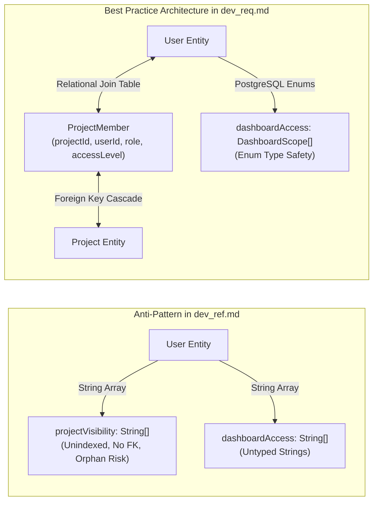
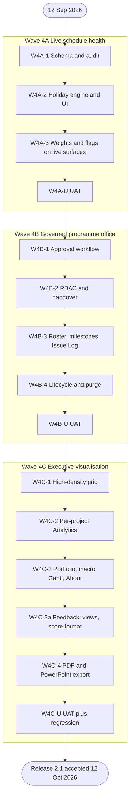

# Simple Project Task Tracker 2.1 — System Requirements & Technical Architecture Specification

**Document Identifier:** `doc/dev_req.md`  
**Product Title:** Simple Project Task Tracker 2.1 (Executive Portfolio Intelligence System)  
**Document Version:** 2.1.46
**Status:** Approved Technical Requirements Specification — Waves **4A** and **4B** as-built and UAT-accepted; Wave **4C-1** List as-built; Wave **4C-1b** Excel import as-built; Wave **4C-2a** per-project Analytics as-built 8 Oct 2026 (UAT pack not yet accepted); Wave **4C-2b** dashboard access as-built 9 Oct 2026 (UAT not yet accepted); Wave **4C-3** portfolio, macro timeline and About as-built 9 Oct 2026 (UAT not yet accepted); Wave **4C-3a** feedback package (score format, Analytics layout, Gantt and Kanban density) as-built 9 Oct 2026 (UAT not yet accepted); Wave **4C-4** executive PDF and PowerPoint export as-built 10 Oct 2026 (UAT not yet accepted); Wave **4C-U** close-out remains binding
**Amendment:** Universal mutation audit trail; Completed Projects workspace; soft-delete / restore / five-year completed retention; Purged Project Register; Super PM completed-visibility governance; per-project Issue Log; Issue Intelligence on the per-project Analytics dashboard; **agile per-wave usable increments with UAT at each wave exit**; IDE / delivery alignment with Cursor and as-built UAT  
**IDE Target:** Cursor (Agent / IDE browser automation for UAT)  
**Language Standard:** Professional Australian English (`en-AU`)  
**Companion Documents:**
* [`dev_ref.md`](./dev_ref.md) — Raw Refinement Requirements Blueprint
* [`dev_plan.md`](./dev_plan.md) — Baseline Product Master Plan
* [`dev_uat.md`](./dev_uat.md) — Executable User Acceptance Testing pack (wave exit evidence)
* [`dev_proc.md`](./dev_proc.md) — Historical Engineering Journal & Execution Log
* [`dev_spec.md`](./dev_spec.md) — Technical Specification (Wave 3 baseline; **deferred refresh after Wave 4C**)
* [`supabase-security.md`](./supabase-security.md) — RLS & Security Policy Baseline

**Authoring & Review Guild:**
* **Principal Business Analyst:** Requirements Elicitation, Scope Definition, and PMBOK Alignment
* **Chief Solution Architect:** System Architecture, Relational Integrity, and Mathematical Modelling
* **Technical Lead:** Next.js 16 / React 19 / Prisma 7 Implementation Standards & Best Practices
* **Senior Project Manager:** Delivery Milestones, Governance, and **per-wave** UAT Verification Matrices

### Programme delivery status (as-built, 6 Oct 2026)

| Wave | Build | UAT | Evidence |
| :--- | :--- | :--- | :--- |
| **4A — Live schedule health** | Shipped | **Accepted** (5 Oct 2026) | `doc/dev_uat.md` — UAT-401–404, UAT-411 |
| **4B — Governed programme office** | Shipped | **Accepted** (4–5 Oct 2026; job-assisted UAT-413 / 418) | `doc/dev_uat.md` — UAT-405, 405A–D, 406–407, 412–422 |
| **Pre–4C UX polish** | Shipped | Operator visual check | Scope memory + pending feedback; Gantt viewport / markers — `dev_proc.md` §12.4 |
| **Custom Project ID** | Shipped | Operator check (UAT-PRJ-CPID) | `Project.customProjectId` — `dev_proc.md` §12.5 |
| **4C — Executive visualisation** | **Not in current build** | Deferred | Do not execute UAT-408–410, 423–425, UAT-R until 4C development completes |

The dated Wave 4 windows in Chapter 8 remain the **original planned** critical path. Acceptance evidence is authoritative in `doc/dev_uat.md`.

---

## 1. Executive Summary & Business Objective

### 1.1 Business Context & System Evolution
Simple Project Task Tracker began as a single-user, LocalStorage-backed prototype (v1.0) and matured into an enterprise-grade, cloud-backed multi-user collaborative platform (v2.0) featuring Kanban boards, MS Planner–style task detail drawers, interactive Gantt timelines, and project-level progress metrics.

Version 2.1 represents a quantum evolutionary leap. It transitions the product from an operational task management tool into an **Executive Portfolio Intelligence System**. In modern capital project delivery, leadership cannot rely on unweighted task counts or subjective completion percentages. Ten minor administrative tasks cannot mask a critical four-week infrastructure delay. 

### 1.2 Core Objectives of Release 2.1
1. **Mathematically Rigorous Weighted Progress Engine:** Eliminate simplistic arithmetic averaging. Project progress is determined dynamically by the working-day duration of individual tasks relative to the project portfolio, honouring statutory Australian public holidays and corporate shutdown periods.
2. **Punctuality Score Engine (PS Engine):** Replace lagging indicators with predictive, real-time schedule health monitoring. Target progress is capped at $100\%$ on and after the due date; Status Flags and Actual vs Target divergence still surface commencement slippage and execution delays.
3. **11-State Status Flag State Machine:** Provide clear, instant operational and executive situational awareness using standardised Australian English Project Management nomenclature and visual indicators.
4. **Multi-Project Executive Portfolio Dashboards:** Introduce macro-level visibility across three distinct organisational scopes: Project-level, Project Manager (PM) Portfolio, and Total Company Capital Investment.
5. **Visual Schedule Realisation (S-Curves & Burn-Downs):** Deliver industry-standard cumulative progress S-Curves and remaining effort burn-down visualisations on the per-project Analytics tab, together with a dedicated **Issue Intelligence** pane that reflects Issue Log activity and fix-activity progress without contaminating the task-weighted schedule.
6. **Executive Macro Gantt Chart:** Provide high-level three-tiered timeline bars (Initial, Updated, Actual) with integrated Milestone diamond nodes.
7. **Enterprise User Governance & Relational Integrity:** Enforce a two-stage registration approval workflow, granular dashboard access delegation (including who may view Completed Projects), and strict safe-deletion protocols preventing database orphaned references.
8. **Universal Mutation Audit Trail:** Every persistable create and update shall record *when* and *by whom* the row was created, and *when* and *by whom* it was last edited, including automated system jobs.
9. **Completed Projects Workspace:** Projects that have reached $100\%$ weighted actual progress may be labelled Completed (manually or automatically after 30 days). Labelling is a view concern: the operational row remains, but the project is excluded from the landing page.
10. **Soft-Delete, Restore and Physical Purge:** Owning PMs soft-delete with a warning. Super PMs restore or permanently purge from Settings. Unrestored soft-deletes are physically removed after 30 days. Completed projects are physically removed five years after the Completed *label* was applied. Every physical removal is retained in the **Purged Project Register**.
11. **Per-Project Issue Log:** Each project shall host a dedicated Issue Log for unplanned impediments. PMs track fix-activity progress, PIC, and initial / updated / actual start and end dates. Issues never enter the weighted task schedule. **Every Issue Log mutation shall be reflected, live, on that project’s Analytics dashboard (Issue Intelligence pane).**

---

## 2. Stakeholder & Persona Analysis

| Persona | Organisational Role | Primary Objectives in v2.1 | Pain Points Addressed |
| :--- | :--- | :--- | :--- |
| **Super PM** *(Platform Admin & Portfolio Director)* | Chief Operating Officer / Head of PMO / Portfolio Director | Needs macro oversight across all company initiatives, authority to approve new personnel, power to reassign abandoned projects, governance over national holiday calendars, discretion over who may view Completed Projects, and exclusive rights to restore or permanently purge deleted work. | Lack of portfolio-wide aggregation; uncontrolled self-registration; cascading data loss when personnel depart; no recycle bin or purge register for destroyed programmes. |
| **Project Manager (PM)** *(Project Controller & Delivery Lead)* | Delivery Lead / Senior PM / Scrum Master | Needs to control project memberships, set official Milestones, maintain an Issue Log of unplanned impediments with PIC and multi-dates, see that Issue Log activity and progress are mirrored on the project Analytics dashboard, monitor realistic S-Curve deviations, identify at-risk tasks via Punctuality Scores, move finished programmes into Completed Projects, and retire obsolete projects without destroying history immediately. | Inability to edit project metadata or members; lack of milestone tracking; no structured issue register; issue work invisible on Analytics; distorted progress caused by unweighted task counts; finished work cluttering the landing page; irreversible delete with no warning. |
| **Team Member** *(Task Realiser & Specialist Contributor)* | Engineer / Designer / Business Analyst / Contractor | Needs high-density data views for rapid inline task updates, transparent visibility of their workload and due dates, and zero friction in daily progress reporting. | Cluttered landing pages with irrelevant projects; slow multi-step drawer editing for quick status adjustments. |
| **Viewer** *(Stakeholder & Executive Sponsor)* | Executive Sponsor / Client / External Auditor | Needs clear, high-level read-only visibility into macro schedules, milestones, and punctuality flags without the risk of accidental mutations. | Unclear project health status; fear of unauthorised data tampering. |
| **Candidate User** *(Unapproved Registrant)* | Newly onboarded employee or external vendor | Needs to confirm email, then wait for Super PM approval while remaining signed out, with clear messaging on login/register. | Ambiguous login states, silent rejections, or junk emails polluting the Super PM queue. |

---

## 3. Mathematical Foundations & Calculation Engines

### 3.1 Working Days & Global Holiday Engine
All scheduling and duration calculations within Version 2.1 operate strictly upon **Business Working Days**, defined as Monday through Friday, excluding registered corporate shutdowns and statutory holidays.

#### Mathematical Definition:
Let calendar days be represented by integers $t \in \mathbb{Z}$. A calendar day $t$ is an active working day ($\operatorname{IsWorkDay}(t) = 1$) if and only if:
$$\operatorname{IsWorkDay}(t) = \begin{cases} 
0 & \text{if } \operatorname{DayOfWeek}(t) \in \{\text{Saturday}, \text{Sunday}\} \\
0 & \text{if } t \in \mathcal{H} \\
1 & \text{otherwise}
\end{cases}$$
where $\mathcal{H}$ represents the set of all calendar dates recorded in the `Holiday` repository.

#### Planned Duration Formulation:
For any task $i$ with `updatedStartDate` ($T_{\text{start}_i}$) and `updatedDueDate` ($T_{\text{due}_i}$):
$$D_{\text{planned}_i} = \max\left(1, \sum_{t = T_{\text{start}_i}}^{T_{\text{due}_i}} \operatorname{IsWorkDay}(t)\right)$$

> [!IMPORTANT]
> **Architectural Guardrail (Minimum Duration Rule):**  
> If $T_{\text{start}_i} = T_{\text{due}_i}$ on a working day, $D_{\text{planned}_i} = 1$. If a task spans entirely across a non-working period (e.g. over a weekend or public holiday), the planned duration is clamped to a minimum of **1 working day** to prevent zero-division errors in downstream weighting formulas. If dates are inverted ($T_{\text{start}_i} > T_{\text{due}_i}$), the engine automatically clamps $T_{\text{due}_i} = T_{\text{start}_i}$.

---

### 3.2 Relative Task Weight Engine ($W_i$)

To achieve true schedule reality, tasks requiring longer working-day commitments exert proportionally greater influence over the project's aggregate completion.

#### Relative Task Weight Formula:
$$W_i = \frac{D_{\text{planned}_i}}{\sum_{k=1}^{n} D_{\text{planned}_k}}$$
Where:
* $n$ is the total count of tasks in the project.
* $D_{\text{planned}_i}$ is the working-day duration of task $i$.
* $\sum_{k=1}^{n} D_{\text{planned}_k}$ is the aggregate working-day duration of the project.

#### Symmetrical Normalisation:
The sum of all relative task weights within a project strictly equals unity ($100\%$):
$$\sum_{i=1}^{n} W_i = 1.0 \quad (100.0\%)$$

> [!NOTE]
> **Edge Case Formulation (Zero-Task & Unscheduled Projects):**  
> If a project contains zero tasks, or if all tasks possess unassigned dates, $W_i$ defaults to $1/n$ (uniform distribution), ensuring mathematical stability.

---

### 3.3 Symmetrical Progress Aggregation Engine

Progress is calculated symmetrically at both the task micro-level and the project macro-level.

#### Task-Level Progress Metrics ($i$):
* **Weighted Target Progress:**
  $$\text{WeightedTarget}_i = P_{\text{target}_i} \times W_i$$
* **Weighted Actual Progress:**
  $$\text{WeightedActual}_i = P_{\text{actual}_i} \times W_i$$

#### Project-Level Progress Metrics (Linear Direct Sum):
Project progress is calculated via the direct linear summation of weighted task values, guaranteeing zero secondary re-weighting distortion:
$$P_{\text{actual}_{\text{project}}} = \sum_{i=1}^{n} \left( P_{\text{actual}_i} \times W_i \right) = \sum_{i=1}^{n} \text{WeightedActual}_i$$
$$P_{\text{target}_{\text{project}}} = \sum_{i=1}^{n} \left( P_{\text{target}_i} \times W_i \right) = \sum_{i=1}^{n} \text{WeightedTarget}_i$$

Both $P_{\text{actual}_{\text{project}}}$ and $P_{\text{target}_{\text{project}}}$ are reported to one decimal place in the user interface (e.g. `68.4%`).

---

### 3.4 Punctuality Score (PS) Engine & Capped Target Rates

Target progress advances with elapsed working days until the planned window is fully consumed, then remains at $100\%$ even when today is past the due date. Actual progress remains independently capped at $100\%$. Slippage after the due date is expressed by Actual lagging Target at $100\%$, by Punctuality Score, and by Status Flags — not by Target exceeding $100\%$.

#### Elapsed Working Days ($E_{\text{elapsed}}$):
Let $T_{\text{now}}$ be the current local calendar date (`YYYY-MM-DD`).
$$E_{\text{elapsed}_i} = \begin{cases}
0 & \text{if } T_{\text{now}} < T_{\text{start}_i} \\
\sum_{t = T_{\text{start}_i}}^{T_{\text{now}}} \operatorname{IsWorkDay}(t) & \text{if } T_{\text{now}} \ge T_{\text{start}_i}
\end{cases}$$

#### Capped Target Progress Rate ($P_{\text{target}}$):
$$P_{\text{target}_i} = \min\left(100\%,\ \frac{E_{\text{elapsed}_i}}{D_{\text{planned}_i}} \times 100\%\right)$$

*(When $T_{\text{now}} > T_{\text{due}_i}$, elapsed working days may exceed $D_{\text{planned}}$, but $P_{\text{target}}$ remains $100\%$. Project-level $P_{\text{target}_{\text{project}}}$ inherits the same cap because it is the weight-sum of task targets.)*

---

### 3.5 Piecewise Formulation of the Punctuality Score (PS)

The Punctuality Score measures execution efficiency against timeline commitments.

#### 1. Incomplete Tasks ($P_{\text{actual}} < 100\%$):
* **State 1A: Not Started ($P_{\text{actual}} = 0\%$):**
  $$\text{PS}_i = \begin{cases}
  100.0\% & \text{if } T_{\text{now}} < T_{\text{start}_i} \\
  \max\left(0.0\%, \left(1.0 - P_{\text{target}_i}\right) \times 100\%\right) & \text{if } T_{\text{now}} \ge T_{\text{start}_i}
  \end{cases}$$
* **State 1B: In Progress ($0\% < P_{\text{actual}} < 100\%$):**
  $$\text{PS}_i = \begin{cases}
  100.0\% + P_{\text{actual}_i} & \text{if } T_{\text{now}} < T_{\text{start}_i} \quad \text{(Early execution)} \\
  \frac{P_{\text{actual}_i}}{P_{\text{target}_i}} \times 100\% & \text{if } T_{\text{now}} \ge T_{\text{start}_i} \text{ and } P_{\text{target}_i} > 0 \\
  100.0\% & \text{if } T_{\text{now}} \ge T_{\text{start}_i} \text{ and } P_{\text{target}_i} = 0 \text{ (Commencement Day)}
  \end{cases}$$

#### 2. Completed Tasks ($P_{\text{actual}} = 100\%$, or status Done):
A finished task is judged by its handover against the planned due date (updated due, otherwise initial due). The length of the actual effort, including an early start, does not decide the score. If the actual finish is unrecorded, today is used. $D_{\text{planned}}$ is at least 1. $D_{\text{ahead}}$ is the working days strictly after the actual finish through the due date. $D_{\text{overdue}}$ is the working days strictly after the due date through the actual finish.

* **Finished strictly before the due date** ($T_{\text{actualCompletion}} < T_{\text{due}}$). The flag is Completed Ahead of Schedule. The score is at least 105 (shown as 1.05):
  $$\text{PS}_i = \max\left(105,\ 105 + \frac{D_{\text{ahead}}}{D_{\text{planned}_i}} \times 100\right)$$
* **Finished on the due date** ($T_{\text{actualCompletion}} = T_{\text{due}}$). The flag is Completed On Time:
  $$\text{PS}_i = 100$$
* **Finished after the due date** ($T_{\text{actualCompletion}} > T_{\text{due}}$). The task is late even when the score is still close to 100:
  $$\text{PS}_i = \frac{D_{\text{planned}_i}}{D_{\text{planned}_i} + D_{\text{overdue}}} \times 100$$
  Completed Late when this score is at least 85. Completed Severely Late when it is below 85.

When no due date exists, the score falls back to planned working days divided by the working days from the planned start through the actual finish.

> [!NOTE]
> **Display convention (release 2.1.31).** The formulas above and the status-flag thresholds work on the 0–100 scale. A Punctuality Score is a score, not a ratio of progress, and people read `89.3%` as progress. Every surface therefore shows PS as a two-decimal number, $\text{PS}/100$ rounded to two places: `89.3` is shown as `0.89`, and `1.00` means exactly on schedule. Actual progress, Target progress and the difference stay percentages. Unfinished work uses the bands $\text{PS} \ge 1.05$, $0.95 \le \text{PS} < 1.05$, $0.85 \le \text{PS} < 0.95$, and $\text{PS} < 0.85$. Storage stays on the 0–100 scale. From 2.1.33 a finished task or project is classified by the due-date comparison above. Release 2.1.28 used three decimals (`0.893`, `1.000`).

#### 3. Project-Level Aggregate Punctuality Score:
While any task is unfinished, the project score stays the weighted actual-versus-target ratio:
$$\text{Project PS} = \begin{cases}
100.0\% & \text{if } P_{\text{target}_{\text{project}}} = 0 \text{ and } P_{\text{actual}_{\text{project}}} = 0 \\
100.0\% + P_{\text{actual}_{\text{project}}} & \text{if } P_{\text{target}_{\text{project}}} = 0 \text{ and } P_{\text{actual}_{\text{project}}} > 0 \\
\frac{P_{\text{actual}_{\text{project}}}}{P_{\text{target}_{\text{project}}}} \times 100\% & \text{if } P_{\text{target}_{\text{project}}} > 0
\end{cases}$$

When every task is complete, the project uses the same deadline comparison as a finished task. The project due date is the latest planned due. The handover is the latest actual finish. The planned duration is the working days from the earliest planned start to that latest due. An early start on a task does not make the project late when that handover is on or before the project due date.

---

### 3.6 Matrix of 11 Status Flags (Australian English PM Standard)

Every task and project is classified into exactly one of eleven deterministic states based on its lifecycle state, PS benchmark, and temporal relationship with $T_{\text{start}}$.

| Flag ID | Status Flag Nomenclature | PS Range | Lifecycle State & Temporal Criteria | Alert Level | Semantic Visual Tokens (Tailwind) |
| :--- | :--- | :--- | :--- | :--- | :--- |
| **SF-01** | **Due to Commence** | $\text{PS} = 100\%$ | $P_{\text{actual}} = 0\% \;\land\; T_{\text{now}} < T_{\text{start}}$ | Informational | Sky badge (`bg-sky-100 text-sky-950` / dark `bg-sky-950/60 text-sky-100`) |
| **SF-02** | **Delayed Commencement** | $85\% \le \text{PS} \le 100\%$ | $P_{\text{actual}} = 0\% \;\land\; T_{\text{now}} \ge T_{\text{start}}$ | Warning (Amber) | Amber badge (`bg-amber-100 text-amber-950` / dark `text-amber-100`) |
| **SF-03** | **Critically Overdue Start** | $\text{PS} < 85\%$ | $P_{\text{actual}} = 0\% \;\land\; T_{\text{now}} \ge T_{\text{start}}$ | Critical (Red) | Rose badge (`bg-rose-100 text-rose-950` / dark `text-rose-100`) |
| **SF-04** | **On Track** | $95\% \le \text{PS} < 105\%$ | $0\% < P_{\text{actual}} < 100\%$ | Healthy (Green) | Emerald badge (`bg-emerald-100 text-emerald-950` / dark `text-emerald-100`) |
| **SF-05** | **Slipping** | $85\% \le \text{PS} < 95\%$ | $0\% < P_{\text{actual}} < 100\%$ | Warning (Amber) | Amber badge (`bg-amber-100 text-amber-950` / dark `text-amber-100`) |
| **SF-06** | **Critically Delayed** | $\text{PS} < 85\%$ | $0\% < P_{\text{actual}} < 100\%$ | Critical (Red) | Rose badge (`bg-rose-100 text-rose-950` / dark `text-rose-100`) |
| **SF-07** | **Ahead of Schedule** | $\text{PS} \ge 105\%$ | $0\% < P_{\text{actual}} < 100\%$ | Positive (Teal) | Teal badge (`bg-teal-100 text-teal-950` / dark `text-teal-100`) |
| **SF-08** | **Completed Ahead of Schedule** | $\text{PS} \ge 105$ | Finished strictly before the planned due date | Completed (Blue) | Indigo badge (`bg-indigo-100 text-indigo-950` / dark `text-indigo-100`) |
| **SF-09** | **Completed On Time** | $\text{PS} = 100$ | Finished on the planned due date | Completed (Zinc) | Zinc badge (`bg-zinc-200 text-zinc-900` / dark `bg-zinc-800 text-zinc-100`) |
| **SF-10** | **Completed Late** | $\text{PS} \ge 85$ | Finished after the planned due date | Overdue (Amber) | Amber badge (`bg-amber-200 text-amber-950` / dark `text-amber-50`) |
| **SF-11** | **Completed Severely Late** | $\text{PS} < 85$ | Finished after the planned due date | Severe (Red) | Rose badge (`bg-rose-200 text-rose-950` / dark `text-rose-50`) |

> [!NOTE]
> The **PS Range** column is on the stored 0–100 scale. On screen those numbers are divided by 100 (FR-UI-08). Unfinished work still uses PS ≥ 1.05, 0.95 ≤ PS < 1.05, 0.85 ≤ PS < 0.95, and PS < 0.85. A finished task or project follows the due-date comparison in §3.5: after the due date the flag is Late or Severely Late, even when the score is still 0.85 or higher.

> [!NOTE]
> Badge tokens must keep readable contrast in light and dark themes. Do not use low-opacity dark washes (`*-950/30`) with mid-tone text on Kanban or List surfaces. Where Status Flags are shown, surfaces shall **not** also show a separate **Overdue** pill (List, Kanban, Gantt).

> [!TIP]
> **Resolution of Edge Discontinuity (Delayed Commencement vs SF-01):**  
> In the raw draft, tasks on the exact commencement day ($T_{\text{now}} = T_{\text{start}}$) with $P_{\text{actual}} = 0\%$ had $\text{PS} = 100\%$, which created an ambiguity with SF-01. As specified above, $T_{\text{now}} < T_{\text{start}}$ exclusively receives **Due to Commence**. Once $T_{\text{now}} \ge T_{\text{start}}$ without commencement, the task immediately drops into **Delayed Commencement** ($85\% \le \text{PS} \le 100\%$), transitioning to **Critically Overdue Start** once $\text{PS} < 85\%$.

### 3.7 Issue Intelligence aggregates (Analytics pane only)

These formulae power the **Issue Intelligence** pane on the per-project Analytics tab. They **must not** be substituted for Section 3.2–3.6 task and project schedule maths.

Let $I$ be every issue on the project, $C$ the cancelled subset, $N = I \setminus C$ with $m = |N|$, $A = \{ j \in I : \text{status}_j \in \{\text{open}, \text{in\_progress}, \text{blocked}\} \}$, and $R = \{ j \in I : \text{status}_j \in \{\text{resolved}, \text{closed}\} \}$.

**Mean fix-activity progress** (active set only):

$$\bar{P}_{\text{issue}} = \begin{cases} 0 & |A| = 0 \\ \dfrac{1}{|A|}\sum_{j \in A} \text{progress}_j & \text{otherwise} \end{cases}$$

**Closure rate:**

$$R_{\text{closure}} = \begin{cases} 0 & m = 0 \\ |R|/m & \text{otherwise} \end{cases}$$

**Local issue weights** (never written into task $W_i$):

$$D_{\text{planned},j}^{\text{issue}} = \text{WorkingDays}(\text{updatedStartDate}_j,\ \text{updatedDueDate}_j)$$

$$W_j^{\text{issue}} = \begin{cases} 1/m & \sum_{k \in N} D_{\text{planned},k}^{\text{issue}} = 0 \text{ or } m = 0 \\ D_{\text{planned},j}^{\text{issue}} \big/ \sum_{k \in N} D_{\text{planned},k}^{\text{issue}} & \text{otherwise} \end{cases}$$

**Issue Fix Realisation** at calendar instant $t$:

$$P_{\text{issue actual}}(t) = \sum_{j \in N} W_j^{\text{issue}} \times P_{\text{actual},j}^{\text{issue}}(t)$$

$$P_{\text{issue target}}(t) = \sum_{j \in N} W_j^{\text{issue}} \times P_{\text{target},j}^{\text{issue}}(t)$$

$P_{\text{target},j}^{\text{issue}}(t)$ reuses the task target-progress function on the issue’s updated dates. $P_{\text{actual},j}^{\text{issue}}(t)$ is a right-continuous step function of `progress`, reconstructed from `IssueActivity` events of type `RAISED` (value $0$) and `PROGRESS_CHANGED`; its value at $T_{\text{now}}$ equals the current `Issue.progress`.

**Mean Issue PS** over $A$ reuses Section 3.5 per issue and averages arithmetically. Render an em dash when $|A|=0$. **Issue PS is never rolled into Project PS.**

**Issue burn-down remaining** at date $t$: $|\{ j \in A_t \}|$ where $A_t$ is the active set reconstructed at $t$ from status-change activity (`resolved` / `closed` / `cancelled` remove the issue from remaining). The ideal series is the straight line from $m$ at $\min_j \text{raisedAt}_j$ to $0$ at $\max_j \text{updatedDueDate}_j$ among $N$; omit the ideal series when those dates are absent.

UI percentages in this pane are reported to one decimal place, consistent with project progress.

---

## 4. Functional Requirements Specification

### Module A: Global Holiday Calendar Management (FR-HOL)

* **FR-HOL-01 [Super PM Authority]:** The system shall provide a dedicated Global Holiday Calendar interface accessible exclusively to users with the `super_pm` role under `/settings/holidays`.
* **FR-HOL-02 [Holiday Entity Attributes]:** Each holiday record shall capture:
  * `date`: Calendar date (`@db.Date`, unique).
  * `description`: Descriptive name (e.g. "Australia Day", "Easter Monday", "End of Year Shutdown").
  * `isNational`: Boolean distinguishing official gazetted public holidays from internal corporate shutdowns.
  * Audit fields: `createdAt`, `createdBy`, `updatedAt`, `updatedBy`.
* **FR-HOL-03 [Dynamic Recalculation Trigger]:** When a holiday is created, modified, or deleted, all dependent task durations, task weights, target progresses, and project metrics shall be re-evaluated on subsequent reads or background cache updates without data corruption.

---

### Module B: User Registration, Approval & Advanced RBAC Governance (FR-GOV)

* **FR-GOV-01 [Registration Approval Lifecycle]:**
  * New user registrations shall default to `approvalStatus = PENDING` and bootstrap a provisional `globalRole` of `member` (not authoritative until approval).
  * Email addresses shall be stored in canonical form (`trim` + lower-case). The same address must not be registered twice via self-service or Super PM provisioning (directory unique constraint + Auth uniqueness + case-insensitive checks). Duplicate attempts shall return a clear Australian English error directing the user to sign in, Forgot password, or Resend confirmation (self-service), or to manage the existing directory row (Super PM provisioning).
  * **Email is immutable** on an existing account. Changing email means registering a new account, transferring projects/tasks/memberships to the new account, then Super PM deletion of the old account.
  * Registration shall send a Supabase Auth email-confirmation link. Addresses that cannot receive mail never confirm and **never** enter the Super PM approval queue.
  * `User.emailConfirmedAt` is set only after successful email confirmation. Until that stamp exists, the registrant is invisible to the Super PM pending queue and to pending-count badges / Super PM notify emails.
  * Until `approvalStatus = APPROVED`, the registrant **cannot sign in** and must remain signed out (no workspace session). Sign-in attempts for PENDING / REJECTED / unconfirmed accounts shall sign out any session and return a clear error or login notice.
  * After approval, the applicant signs in with the email and password they registered. The Super PM-assigned `globalRole` is then authoritative (FR-GOV-03).
* **FR-GOV-02 [Pending Approval Routing]:**
  * Edge middleware (`src/lib/supabase/middleware.ts`) shall detect any authenticated user where `approvalStatus !== APPROVED`, **force sign-out**, and redirect to `/login?notice=awaiting_approval` (or `rejected`). Unapproved users must not retain a usable session.
  * Legacy route `/pending-approval` may redirect to the same login notice for bookmark compatibility; it is not a signed-in holding page.
* **FR-GOV-03 [Super PM Approval Console]:**
  * Super PMs shall have a dedicated management interface at `/settings/users` with tabs for Approvals, Create account (FR-GOV-07), Privilege matrix, and Safe deletion.
  * Approvals shall display accounts grouped by approval status (`PENDING`, `APPROVED`, `REJECTED`), each group sorted **oldest registration first**.
  * Approvals shall provide an **instant name/email search** that filters every status group as the Super PM types (sticky filter bar; scrollable group lists). Empty-match copy shall be clear.
  * The **PENDING** group and pending-count badges shall include **only** rows with `emailConfirmedAt IS NOT NULL` (and not deactivated).
  * When approving a pending (or re-approving a rejected) account, the Super PM **must select the assigned `globalRole`** (`pm` | `member` | `viewer` | `super_pm`) in the same action. The system records `approvedAt`, `approvedBy`, and the chosen role.
  * On successful approval, the system shall send the applicant a brief email stating that registration was approved and naming the assigned role, with a link to `/login`. Mail is delivered via SMTP or Resend when configured; approval still succeeds if mail is skipped, with a clear UI warning.
  * Reject applies only to pending candidates (not to already-approved accounts). Approved accounts are adjusted via the Privilege Matrix (Edit privileges).
  * Super PMs may permanently remove pending or rejected registration applicants who never entered Safe deletion (`deleteRegistrationApplicant`), which clears the directory row and the Auth identity when a service role key is configured.
  * Optional Super PM email alerts fire when a registrant **confirms email** (enters the queue), with a deep link to `/settings/users` — not merely on form submit.
  * **Privilege matrix directory UX:** approved active accounts appear as a compact A–Z directory with **instant name/email search**, **role filter chips** (All / Super PM / PM / Member / Viewer), and **progressive disclosure** — expand one person at a time to edit display name, reset password, role, Completed visibility, and dashboard scopes. Avoid rendering every full privilege form at once.
* **FR-GOV-04 [Dynamic Dashboard Scopes]:**
  * Dashboard scopes are a **capability**, enforced on the hub Analytics tab. `/portfolio` uses the same check (FR-PORT-01). Enforcement of the hub tab is as-built in Wave **4C-2b**, and of `/portfolio` in Wave **4C-3** (both 9 Oct 2026).
  * Defaults (Super PM may revoke or grant any non–Super PM scope):
    1. **Super PM:** `PROJECT`, `PM_PORTFOLIO`, `TOTAL_COMPANY` — locked.
    2. **PM:** all three.
    3. **Member:** `PROJECT` only.
    4. **Viewer:** `PROJECT` only.
  * Scopes:
    1. `PROJECT`: Per-project Analytics on the project hub.
    2. `PM_PORTFOLIO`: Portfolio analytics for one PM (`/portfolio?scope=pm`).
    3. `TOTAL_COMPANY`: All-projects analytics (`/portfolio?scope=all`).
  * A dashboard aggregates only projects inside the caller’s data scope. For a Viewer that is the granted set, or every Active project when `projectVisibilityMode = ALL_ACTIVE` (FR-GOV-04B).
  * Changing role in the privilege matrix fills that role’s default ticks. The Super PM may adjust them before saving. Approval and direct provisioning write the same defaults.
* **FR-GOV-04B [Viewer project visibility mode — Wave 4C-2b]:**
  * Stored on `User.projectVisibilityMode` as `SELECTED` | `ALL_ACTIVE`. Default `SELECTED`. The column is ignored for every role other than Viewer.
  * **Selected:** the Viewer opens Active projects that have a `ProjectMember` row (Settings → Viewer project visibility checklist, or Edit Project roster).
  * **All Active:** the Viewer may open every non-deleted Active project, read-only, without a tick per project. Completed, soft-deleted, and purged projects stay out of this mode. Switching to All Active does **not** delete the checklist rows, so Selected can be restored.
  * This mode is data scope. It does not grant `PM_PORTFOLIO` or `TOTAL_COMPANY`. A Viewer still needs `PROJECT` to see the Analytics tab.
  * Administered only by a Super PM at `/settings/viewer-visibility`. The privilege matrix does not edit this mode.
* **FR-GOV-04A [Completed Projects Visibility — Super PM Invocation]:**
  * Super PMs shall arbitrarily decide, per account, whether that account may view projects labelled Completed.
  * Stored on `User.completedProjectAccess` as `NONE` | `ASSIGNED` | `ALL`.
  * **Non-overridable implicits:** Super PM always has `ALL`. An owning PM always sees **their own** completed projects even when the stored value is `NONE`.
  * `ASSIGNED`: the user may open Completed Projects and see completed rows for which they are owner or `ProjectMember`.
  * `ALL`: the user may see every completed (non-deleted) project in the tenant.
  * Privilege changes shall stamp `updatedAt` / `updatedBy` on the User row and are administered under `/settings/users` (Privilege matrix directory — search, role filter, expand to edit).
* **FR-GOV-05 [Dynamic Project Membership & Management]:**
  * Super PMs possess unconditional read, write, and administrative rights across every project (absolute privileges), including opening any project by URL. The **home-page list** still uses the same scoped filters as a PM (below) so Portfolio scope is meaningful.
  * Super PMs can reassign the designated PM of any project to any **approved, active** user (PM or Super PM for ownership).
  * **PM / Super PM landing scope (default — “My projects”):** Active projects the user **owns**, or Active projects that have at least one task on which they are a PIC (`Task.assigneeId` or `TaskAssignee.userId`). Administrative rights (`admin`) on the home card apply to owned projects; Super PM remains `admin` on every project they open.
  * **Portfolio scope browser:** On the home page, a PM or Super PM may select **All projects** (every Active project), or another PM/Super PM’s owned Active portfolio. **← Back to projects** from a project hub shall restore that last non-default scope. Navigating via the header brand, **Projects**, or a typed homepage URL shall reset to **My projects**. Edit privileges are unchanged by the list filter (owning PM / Super PM / assignee rules still apply). Peer portfolios remain read-only at project level for a non-owning PM; assignees may still mutate their own tasks.
  * **Member:** Sees only projects where they are a `ProjectMember`. Project-level access is **read**. They may mutate **only** tasks on which they are a PIC (and comment on those tasks). They may raise issues on member projects. They do **not** get the peer portfolio browser.
  * **Viewer:** Sees only Active projects where a Super PM or owning PM has granted them a `ProjectMember` row. Access is strictly read-only (no task mutations, no comments, no issues). They do **not** get the peer portfolio browser.
  * **Viewer grant UI (preferred — Super PM):** Settings → **Viewer project visibility** (`/settings/viewer-visibility`). The Super PM selects an approved Viewer and checks the Active programmes they may open. Saves sync that Viewer’s Active-project `ProjectMember` rows only (other roster members untouched; soft-deleted / Completed memberships left alone). This avoids asking every owning PM to edit each project after a new Viewer is approved.
  * **Viewer grant UI (alternate — owning PM / Super PM):** Edit Project → team roster still adds or removes a Viewer on a single project.
  * Project membership and registered task or issue PIC accounts may target **only** approved, active human accounts (not pending, rejected, deactivated, or the System actor). Edit Project roster checkboxes list directory users; **task/issue PIC pickers** list the project roster plus the owning PM and every active Super PM, then previously used custom names. A task may have several PICs (2.1.44). An issue still has one PIC. Server Actions reject other **account** targets. A custom PIC is a display name with a null user id (`TaskAssignee.userId` / `picId`), remembered in `CustomAssignee` so the same name can be chosen again. Custom names are not user accounts and do not grant access. Visibility must remain relational (`ProjectMember`); `User.projectVisibility: String[]` is forbidden.
* **FR-GOV-06 [Safe Account Deactivation, Reactivation & Purge]:**
  * Direct cascade deletion of active user accounts is strictly prohibited. Self-deactivation and modification of the System actor are forbidden.
  * **PM / Super PM deactivation:** The Super PM is warned that every owned project must be assigned to another approved, active PM or Super PM (not the target). Under Settings → Users & privileges → **Safe deletion**, Review & deactivate lists each owned project; the Super PM selects a replacement per project. Tasks and issue PIC fields on those projects that were assigned to the target move to the new owner. Tasks and PIC on non-owned projects move to each project's owning PM. Memberships are removed. Receiving PMs are emailed (aggregated by recipient) with project names and transferred task titles. Another Super PM may be deactivated only if at least one active, approved Super PM remains.
  * **Member deactivation:** Warning then confirm. Tasks and issue PIC fields are reassigned to each project's `ownerId` (lead PM). Memberships are removed.
  * **Viewer deactivation:** Warning then soft-deactivate; no project or task changes are required.
  * Soft-deactivation sets `deactivatedAt`, `deactivatedBy`, `approvalStatus = REJECTED`, `purgeDueAt = now + 30 calendar days`, and clears `purgeWarningSentAt`. The `User` row remains so audit JOINs resolve names (FR-AUD-06).
  * The Safe deletion tab shall keep **Active accounts** and **Deactivated** as separate sections (different mental models; reduces destructive mis-clicks). A sticky **instant name/email search** filters both lists. **Active** additionally supports **role filter chips** and A–Z ordering. **Deactivated** shall sort by `purgeDueAt` ascending (soonest first) and highlight rows due within about two days.
  * The Deactivated section lists `deactivatedAt` and `purgeDueAt`, and offers **Reactivate** and **Permanently delete** on compact rows (no expand-to-edit).
  * **Reactivate:** Clears deactivation/purge fields, sets `approvalStatus = APPROVED`, and ensures zero owned projects, zero assigned tasks, and zero memberships (clearing leftovers). Re-registration is not required.
  * **Hard delete:** Irreversible confirm. Requires zero owned projects. Clears memberships, unassigns tasks/PIC, deletes the `User` row, and attempts `auth.admin.deleteUser` when a service role key is configured.
  * **Retention:** The retention job emails all Super PMs about accounts with `purgeDueAt` within the next 2 days (`purgeWarningSentAt` null), then hard-deletes accounts whose `purgeDueAt` has elapsed.
  * **Project owner reassignment (independent):** Super PM only may change `ownerId` on Edit Project to another approved active PM / Super PM; the new PM is always emailed. PMs cannot change project owner.
* **FR-GOV-07 [Super PM Direct Account Provisioning]:**
  * When a known person cannot complete self-service email confirmation (for example no mailbox access), a Super PM shall create their account directly under Settings → Users & privileges → **Create account**.
  * Required fields: display name, email, temporary password (with confirmation), and assigned `globalRole` (`pm` | `member` | `viewer` | `super_pm`).
  * The system shall create the Supabase Auth identity with `email_confirm: true` and a matching Prisma `User` row that is immediately `approvalStatus = APPROVED`, with `emailConfirmedAt`, `approvedAt`, and `approvedBy` set in the same write. Role-appropriate default dashboard scopes and `completedProjectAccess` apply (Privilege Matrix may refine them afterwards).
  * This path **bypasses** Auth confirmation email and the Super PM approval queue. The new user may sign in at once with the temporary credentials the Super PM shares out-of-band.
  * Self-service `/register` remains mandatory for unknown applicants and retains confirmation then approval (FR-GOV-01–03). Provisioning assumes the Super PM already knows the person.
  * Requires `SUPABASE_SERVICE_ROLE_KEY` on the server. Duplicate directory or Auth emails are rejected with `DUPLICATE_EMAIL_PROVISION_MESSAGE`. If the Prisma profile write fails after Auth creation, the Auth identity shall be rolled back.
* **FR-GOV-08 [Password Reset — Self-Service & Super PM]:**
  * Approved users who forget their password may request a reset at `/forgot-password`. The system generates a cryptographically strong temporary password, updates Auth, and emails it when app mail (SMTP/Resend) is configured. Public acknowledgement copy does not confirm whether the address exists. If mail cannot be sent, the UI directs the user to a Super PM.
  * When mailbox access is unavailable, a Super PM may reset any other non-deactivated user’s password under Settings → Users & privileges. The system generates a temporary password and **displays it once** to the Super PM for secure out-of-band hand-off (not emailed). Requires `SUPABASE_SERVICE_ROLE_KEY`.
  * After signing in with a temporary password, users should change it under Settings → Account.
* **FR-GOV-09 [Settings Hub & Account Self-Service]:**
  * Settings (`/settings`) is available to **all approved** users, not only Super PMs.
  * Every approved user may open Settings → Account to update their display name and change their password (current password required). Email is shown read-only.
  * Super PMs additionally see Users & privileges, **Viewer project visibility**, Global Holiday Calendar, Deleted Projects, and Purged Project Register under Settings. Super PMs may edit other users’ display names and reset their passwords (FR-GOV-08); they edit their own credentials under Account.

---

### Module C: Project Management & Milestone Tracking (FR-PRJ & FR-MLS)

* **FR-PRJ-01 [Edit Project Interface]:**
  * Project Managers (for their owned projects) and Super PMs (for all projects) shall have access to an **Edit Project** modal.
  * Editable attributes include: Project Name, **Custom Project ID** (optional), Description, and the Project Team Roster.
  * **Custom Project ID** (`customProjectId`): free-text optional field (max 80 characters after trim). The user may leave it blank. It is **not** the system UUID (`Project.id`). When non-blank, the project hub (`/projects/[id]`) shall display it between the project name and the description in a distinct, smaller style (monospace / subdued slate); when blank, the line shall be omitted entirely.
  * The interface shall provide a member selection multi-select search dropdown to dynamically add or remove `ProjectMember` records.
  * When $P_{\text{actual}_{\text{project}}} = 100\%$ and `lifecycleStatus = ACTIVE` and `deletedAt IS NULL`, the modal and the landing card shall present **Move to Completed Projects** (see FR-LFC).
  * The modal shall present **Delete project** for the owning PM (owned projects) and for Super PMs (any project), invoking the soft-delete warning in FR-LFC.
* **FR-MLS-01 [Milestone Entity Model]:**
  * Projects shall support discrete Milestones representing critical contractual checkpoints or stage gates.
  * Attributes: `id`, `projectId`, `name`, `description`, `initialTarget` (`@db.Date`), `updatedTarget` (`@db.Date`), `actualAchieved` (`@db.Date`, nullable), and complete audit fields.
* **FR-MLS-02 [Milestone Date Synchronisation]:**
  * Upon milestone creation, `updatedTarget` shall automatically mirror `initialTarget`.
  * PMs can revise `updatedTarget` independently to reflect schedule re-baselining (Edit milestone).
  * When `actualAchieved` is populated, the milestone is visually marked as complete; clearing `actualAchieved` returns it to pending.
  * **`actualAchieved` shall not accept a future local calendar date** (same rule as task/issue actuals — FR-DAT-01). Planned `initialTarget` / `updatedTarget` may be future.
* **FR-MLS-03 [Milestone Timeline Rendering]:**
  * In the Per-Project Gantt Chart, milestones shall render as vertical dashed lines spanning the **task/group body** (ending on the last row, not empty scrollport chrome). The line is anchored to `actualAchieved` if completed, or `updatedTarget` if pending.
  * When a milestone calendar date equals **Today**, the milestone line shall be offset slightly horizontally from the solid Today line, and hover tips shall disclose both markers (Today tip lists co-located milestone names; milestone tip notes “Same day as Today”).
  * In the Executive Multi-Project Gantt Chart, milestones shall render as diamond nodes directly affixed to the project's macro bars.
* **FR-MLS-04 [Project hub milestone UX]:**
  * On the project hub, milestones shall appear as a **compact stage-gate strip** (count, next-target summary, chips) so they do not dominate the task/issue workspace.
  * Add and Edit shall open a **focused modal** (progressive disclosure). The create form must not remain always visible on the hub.
  * Chips show milestones by `updatedTarget` and use the width of the strip, up to two rows. **View all** appears only when further chips would not fit. Clicking a chip opens detail; owning PM / Super PM may edit name, description, updated target, achieved date, or delete; other roles may view read-only.
  * Ordering on the strip and in lists is by `updatedTarget` ascending (next gate first).

---

### Module D: Landing Page & High-Density UI Refactoring (FR-UI)

* **FR-UI-01 [Role-Centric Smart Default Views]:**
  * Upon visiting `/`, the project directory shall filter automatically:
    * **Super PM / PM:** Defaults to **My projects** (owned or with tasks assigned to the session user), unless a remembered Portfolio scope exists for the tab (see persistence below).
    * **Member / Viewer:** Defaults to Active projects where they hold a `ProjectMember` row (roster-scoped).
  * PM / Super PM shall use a **Portfolio scope** combobox (not quick-filter tabs) to switch among: *My projects*, *All projects*, and *Projects owned by \<PM\>*.
  * **Scope persistence:** The last non-default Portfolio scope chosen by a PM / Super PM shall be stored in the browser tab (`sessionStorage` under `sptt.portfolioScope.v1`) so **← Back to projects** can link to `/?owner=…` and restore that list. Navigating to bare `/` via the header brand, the primary **Projects** nav link, or a manually entered homepage URL shall show **My projects** and clear the remembered scope. Explicit selection of *My projects* also clears memory. Members / Viewers are unaffected.
  * **Scope pending feedback:** Changing Portfolio scope navigates with a soft RSC refresh (`/?owner=…`). While that navigation is in flight, the UI shall give clear in-page feedback — not rely on the Next.js Dev Tools “Rendering…” badge. Required behaviour:
    1. The combobox value updates immediately (optimistic draft) and is disabled while pending.
    2. A short “Updating projects…” cue appears under the combobox (spinner + text, `aria-live`).
    3. The project list/grid area dims (`opacity`), blocks interaction (`pointer-events-none`), and shows a centred pill overlay (spinner + “Updating projects…”) over the list region only — not a full-viewport modal or opaque grey wash.
    4. Feedback clears when the new server payload arrives (`useTransition` / `isScopePending`).
  * **Landing-page exclusion (mandatory):** Only projects with `lifecycleStatus = ACTIVE` **and** `deletedAt IS NULL` shall appear. Completed and soft-deleted projects are omitted from every landing scope.
  * A dedicated **Completed Projects** control (header and/or landing action) shall be visible to Super PMs, owning PMs (for their owned completed set), and any account granted `completedProjectAccess` other than `NONE`. The control navigates to `/projects/completed`.
* **FR-UI-02 [Enhanced Executive Project Cards]:**
  * Project cards on the landing page shall display:
    1. Project Name & Description snippet.
    2. Designated PM name with avatar initials.
    3. Status Flag pill badge adhering to the 11-State nomenclature and semantic colours.
    4. Symmetrical Progress Indicator: Dual compact progress bars showing $P_{\text{target}}$ (slate/zinc) vs. $P_{\text{actual}}$ (emerald/amber).
    5. Count of active tasks and overdue tasks.
    6. **Open-issue count** (issues in `open`, `in_progress`, or `blocked`). If any of those has `severity = critical`, the count uses the rose token.
* **FR-UI-03 [High-Density Tabular Task View]:**
  * Within the project workspace, the List View shall present a high-density schedule table grouped by process group (Initiating → Closing).
  * **No.** shall use process-group indexing: Initiating `1.x`, Planning `2.x`, Executing `3.x`, Monitoring `4.x`, Closing `5.x` (sequential within each group).
  * Columns (Australian English): No., Task, Status (To Do / Doing / Done), Actual %, Target %, Initial start, Initial due, Initial WD, Updated start, Updated due, Updated WD, Actual start, Actual finish, Actual WD, PS, Status flag.
  * **WD** columns shall show inclusive working days between the pair of dates (weekends and registered holidays excluded), using $D_{\text{planned}}=\max(1,\ldots)$ so the same start and end date shows **1** (never zero). Examples: 12→16 Oct 2026 (Mon–Fri) = 5 WD; 12→12 Oct 2026 = 1 WD. Actual WD uses Actual start → Actual finish; show an em dash only when either date is missing.
  * The List table scrollport shall freeze the column header row (vertical scroll) and the Task name column together with No./drag (horizontal scroll). Sticky panes use opaque fills so scrolling cells do not show through; a right freeze edge on the Task column appears while scrolled horizontally (not on process-group or Add-row rows). Process-group header rows stick under the column header (vertical) and keep their label in the freeze rail while scrolling horizontally. The group header is a label only. Each group has one **Add row** at the bottom. Hovering the **existing bottom grid line** of a row thickens that same border and shows a **+** (no extra spacer row). Clicking opens an instant local draft at that index (not persisted until complete). Drafts require title + initial start + initial due; leaving an incomplete touched draft offers Continue editing / Discard. Empty projects still show all five process groups with emphasised **Add row**. Inline delete (hover trash + confirm) removes a task via `deleteTask` with the same permission rules as the drawer. List date cells are uncontrolled while typing so day/month/year keyboard entry is not clobbered. Actual date rules: no future dates; actual finish requires actual start; finish ≥ start. Violations revert the field and show a dismissible toast/banner (~7s). Entering a valid **actual finish** while Status is not Done or Actual % is not 100% shall prompt to mark the task Done at 100%; Confirm applies the finish date with those side effects; Cancel restores the previous field value. Project and task punctuality scores recalculate from the updated task set on every successful mutation.
  * Above the List table, show the live **Project punctuality score** (aggregate Project PS) in the score format of FR-UI-08, with a hover title that says what it is. The **PS** column uses the same format and its header explains the score on hover. Initial WD, Updated WD, and Actual WD columns are centre-aligned.
  * Transient List / task mutation errors (for example future Actual dates) shall be dismissible and auto-clear within a few seconds.
  * Updated start/due are the schedule baseline for Punctuality Score; on create they default to the initial dates.
  * Hovering a Task name shows the complete title at once, with no browser delay, including when the cell trims a long name (2.1.41). The same instant tip is on the Gantt Task column.
  * Inline editing shall be supported for Task title, Status, Actual %, and all six date fields. Target %, WD, PS, and Status flag are computed and not editable. A task flagged **Due to Commence** leaves the PS cell blank. The engine still scores that task at $100\%$; only the cell is hidden.
  * Users may add a task at the end of any process group or insert a row; drag-and-drop shall reorder within or across process groups (`listSortOrder`, independent of Kanban `sortOrder`).
  * Fields not on the grid (PIC, priority, description, checklist, comments) are edited in the same task drawer as a Kanban card (2.1.42). Every List row has a **Details** button beside the task name. Choosing it, or choosing the task name on a read-only row, opens that drawer. The name tip does not cover the button. The drawer is not required for schedule-column edits. Drawer field edits stay local until the panel closes (2.1.45).
* **FR-UI-04 [Five-View Project Workspace]:**
  * The project hub shall expose five peer views with no layout shift: **List**, **Kanban**, **Gantt**, **Issue Log**, **Analytics**.
  * Issue Log is the system of record for unplanned impediments (Module J). Issues shall not appear as Gantt task bars in Release 2.1.
  * The Analytics view shall host **Schedule Intelligence** and **Issue Intelligence** as two stacked panes (FR-ANL-04). Every Issue Log mutation shall be visible on Issue Intelligence without a page reload beyond `revalidatePath`.
  * Project-level Status Flag and Actual / Target progress appear under the project description once. The List View may additionally show the live **Project punctuality score** above the table (FR-UI-03); other views shall not repeat the header summary strip.
  * Home, project hub, completed projects, and the app header use the full viewport width with a small side gutter (`px-4` / `sm:px-6` / `lg:px-8`). Settings forms stay on a narrower reading width. Project description prose may stay capped so lines remain readable.
* **FR-UI-05 [Per-Project Gantt task rail]:**
  * Only the **Task** column is frozen while the chart scrolls sideways. **Progress** sits beside it and scrolls away with the timeline, so a long project keeps more of the date scale on screen.
  * **Task column:** task title (wrapping / multi-line so wording is readable), the task’s 11-state Status Flag pill, Kanban status, and PIC names. When several people are assigned, the first name shows with a +N count; hover lists every name (2.1.44). Hovering the title shows the complete name at once (2.1.41). The **Custom** badge for unregistered PICs shall be hidden on this surface.
  * **Progress column:** stacked Actual and Target progress badges for that task ($P_{\text{actual}}$, $P_{\text{target}}$), using the same capped target engine as elsewhere.
  * Row heights for Task, Progress, and timeline bars shall stay aligned.
  * The Gantt scrollport height follows the window: `max-height = 100dvh − 14.5rem` (`100dvh − 6rem` in Expanded view, FR-UI-07), so the chart fills the screen below the tabs instead of a fixed share of it.
  * **Density (2.1.28):** a segmented control offers **Comfortable** (task row 60 px, group header 30 px, bars 8 px, full task label) and **Compact** (row 44 px, group header 26 px, bars 6 px). The default is Comfortable. Before 2.1.28 every row was 96 px and every group header 36 px. In both densities the three bars (Initial, Updated, Actual) stay centred in the row and aligned with the Task and Progress cells.
  * **Fit-to-width:** the date columns are scaled up so that a short timeline fills the width of the card. They are never scaled below their natural width, so a long timeline still scrolls sideways. The scale is recomputed when the card is resized.
  * **Group collapse:** each process-group header collapses and expands its tasks. **Collapse all groups** and **Expand all groups** act on every group at once. Collapsed groups keep their header row. Collapse state is not stored.
  * The solid **Today** line and dashed milestone lines shall span the task/group body height only (bottom aligned to the last visible table row), remaining sticky under the date header while scrolling.
  * Hovering a timeline bar shows the task name, then that bar’s start date and end date (2.1.43). Initial, Updated and Actual each name their own pair. The project title is not repeated. A long task name wraps inside the card.
* **FR-UI-06 [Kanban density — 2.1.28]:**
  * A segmented control offers **Compact** (default) and **Comfortable**. Compact clamps the task title to two lines, shows the status flag and the Actual and Target badges together on one wrapping row, drops the card divider, and uses a smaller avatar. Comfortable keeps the earlier card.
  * Each column keeps its own vertical scroll and a header that stays in view. The column height follows the window (`100dvh − 9rem`, or `100dvh − 15rem` in Expanded view) so no column runs off the bottom of the page.
  * Drag and drop between and within columns, the click-to-open drawer and read-only behaviour are unchanged.* **FR-UI-07 [Expanded view and stored preferences — 2.1.28]:**
  * Kanban and Gantt each have **Expand view** / **Exit expanded view**. Expanded hides the project header, the milestone strip and the read-only notice, shows one slim line (back arrow, project name, Read-only chip when it applies, Status Flag, Actual and Target badges) above the tabs, and gives the board or chart the freed height. It applies only on Kanban and Gantt; List, Issue Log and Analytics always show the normal page. The state is shared by the two views while the page is open and is not stored.
  * Gantt and Kanban density are stored per browser in `localStorage` under `sptt.gantt.density` and `sptt.kanban.density`. A missing or invalid value falls back to the default. The stored value shall not cause a server/client markup mismatch (the first render uses the default; the stored value applies after hydration).
* **FR-UI-08 [Punctuality Score display — 2.1.31]:**
  * Every surface that shows a Punctuality Score (project and task) shows it as a number with two decimals — the stored 0–100 score divided by 100, for example `0.89` for `89.3`, `1.05`, `1.00`, `0.83` — and never with a percent sign. `1.00` is exactly on schedule. Surfaces: List banner and **PS** column, Analytics headline card, process-group labels, key takeaways, Issue Intelligence labels, Portfolio headline and **Comparison by PM**.
  * Actual, Target and their difference stay percentages. The four bands are $\text{PS} \ge 1.05$, $0.95 \le \text{PS} < 1.05$, $0.85 \le \text{PS} < 0.95$, and $\text{PS} < 0.85$.
  * Wherever the score is the headline, its meaning is available on hover and keyboard focus (FR-ANL-03).
* **FR-UI-09 [Task update feedback — 2.1.32, drawer draft 2.1.45, selective restore 2.1.46]:**
  * While the project page checks a finished date, saves a List or Kanban task change, or creates a task, it shows a light wash and a centred pill: a spinner plus “Updating the task…” (or “Creating task…”). The same idea as the Portfolio scope pill in FR-UI-01. The error toast stays above the wash.
  * **Task drawer (2.1.45, selective restore 2.1.46):** title, description, process group, priority, status, progress, PICs and dates stay in the panel until the person closes it or opens another task. One write then goes to the server. Range checks use that finished set, so a start date may sit later than the current end while the other date is still being typed. The wash appears for that one write. On close, each value that breaks a rule returns to the previous saved value. Every other change in that close is saved. When either end of a broken pair would still be valid on its own, both changed ends of that pair return to the previous values, so the save does not guess which date to keep. A short message names the restored fields. Checklist items and comments still save as they are added.
  * The Next.js Dev Tools “Rendering…” badge is not this cue. A refused date on List still returns the field to the previous acceptable value and shows the message (release 2.1.31). The pill is visible while that update is drawn.

---

### Module I: Excel task import (FR-IMP) — Wave 4C-1b

* **FR-IMP-01 [Workbook contract]:**
  * A PM or Super PM who can create projects opens **+ New Project** and chooses **From Excel**. A Viewer or a Member is not offered **+ New Project**, and the server refuses the create. The workbook creates a new Active project; it does not add tasks to a project that already exists. The project name is cell B1. Description starts empty. The owner is the signed-in PM or Super PM who uploaded the file.
  * Accepted file: `.xlsx`, sheet named `Tasks` when present, otherwise the first sheet. At most 500 task rows and 2 MB.
  * **Structure is checked before any task row is read.** Cell A1 is `Project Name:` and B1 is the name. Row 2 is exactly: Process Group, Task, Progress, Initial Start Date, Initial End Date, Updated Start Date, Updated Finish Date, Actual Start Date, Actual End Date. Task values start at row 3. A wrong label blocks the import. The file served by **Download template** is `templates/task-import-template.xlsx`.
  * A blank task name is skipped. A blank or unrecognised process group is stored as Executing and called out in the preview. `Initiation` is accepted as Initiating. Blank progress is 0%. Progress above 100% is stored as 100% and noted. Blank updated dates copy the initial dates. Status is derived from progress (0% To Do, 1–99% Doing, 100% Done). There is no PIC or Status column; every imported task is unassigned, including on update.
  * Dates accept Excel date cells, formula results, `YYYY-MM-DD`, and Australian `D/M/YYYY`.
* **FR-IMP-02 [Preview then commit]:**
  * Choosing a file runs validation and writes nothing. The preview names the project from B1 and lists each task, plus errors and row warnings. Each error is shown to the person uploading (a structure problem has no row number; a task problem is prefixed `Row N:`). Above that list the preview says the workbook is not imported, that the file must be fixed and chosen again, and that **Create project** stays off until the workbook is clean. **Create project** stays disabled while any row has an error. A commit that still finds errors is refused with *Fix the workbook before creating the project.* and up to six of those errors.
  * Duplicate titles inside one process group error.
  * Within each process group, file order becomes `listSortOrder`.
* **FR-IMP-03 [Integrity]:**
  * Block the file when the template labels are wrong, or when any task row has: a missing initial span; an end date earlier than its start (initial, updated, or actual); a date that does not exist or sits outside 2000–2100; a future actual date; an actual end with no actual start; progress of 0% with an actual start or actual end; progress from 1% to 99% with no actual start; an actual end while progress is under 100%; progress of 100% with no actual start or no actual end.
  * Commit is one transaction with audit stamps and the same progress-clock update as other task writes.

---

### Module E: Advanced Analytics Visualisations (FR-ANL)

* **FR-ANL-01 [Per-Project Schedule S-Curve Graph]:**
  * The Per-Project Analytics view shall incorporate a cumulative progress **Schedule S-Curve** chart powered by Recharts.
  * **X-Axis:** Calendar working timeline from the project's earliest *task* start date to latest *task* completion/due date.
  * The S-curve and the task burn-down do not draw milestone lines. Those lines sit on the process-group timeline (FR-ANL-13). Issues are not milestones.
  * **Y-Axis:** Cumulative Percentage ($0\%$ to $100\%$).
  * **Series 1 (Target S-Curve):** Cumulative $\sum W_i \times P_{\text{target}_i}(t)$ rendered as a dashed neutral line. $W_i$ is **task** weight only.
  * **Series 2 (Actual Realisation Curve):** Cumulative $\sum W_i \times P_{\text{actual}_i}(t)$ rendered as a solid emerald/amber line terminating at $T_{\text{now}}$.
  * Issues shall not contribute any point, weight, or annotation to this chart.
* **FR-ANL-02 [Task Effort Burn-Down Chart]:**
  * Displays remaining working-day *task* effort over time.
  * Compares the ideal linear burn-down trajectory against actual remaining task volume.
  * Issues shall not contribute remaining effort to this chart.
* **FR-ANL-03 [Schedule Intelligence header]:**
  * The Schedule pane header shall display the aggregate Punctuality Score ($\text{Project PS}$), the Target vs. Actual progress divergence ($\Delta = P_{\text{actual}} - P_{\text{target}}$), and the project's overall Status Flag.
  * Those three figures remain task-derived. Issue counts shall **not** appear in this header (they belong in FR-ANL-05).
  * **Presentation (2.1.28),** implemented once in `ScheduleHeadline.tsx` and used by the project Analytics tab and `/portfolio`:
    1. **Actual minus target** (half width): the difference as a large signed figure in points with a verdict (*behind target*, *ahead of target*, *exactly on target*), and two labelled bars, **Actual** and **Target**, each with a large percentage. Progress must be readable without hovering, so it is never confused with the score.
    2. **Project punctuality** (one quarter; *Portfolio punctuality* on `/portfolio`): the score in the FR-UI-08 format, the line *Score. 1.00 is on schedule.*, and a small gauge. On hover and on keyboard focus a dark card opens at once, with no delay. It is titled Punctuality Score (PS). It says 1.00 is right on schedule, a score above 1.00 is ahead, and a score below 1.00 is slipping. Two short lines follow: in progress, actual progress against elapsed working days; completed, planned duration against the actual finish. Four coloured bands: $\text{PS} \ge 1.05$ Ahead / Completed early, $0.95 \le \text{PS} < 1.05$ On track / Completed on time, $0.85 \le \text{PS} < 0.95$ Slipping / Completed late, and $\text{PS} < 0.85$ Critically delayed / Completed severely late. A note says the score uses planned working days only (weekends and public holidays excluded), that an early handover is never penalised, and that issue work is excluded. It does not show a formula. The same card explains the List PS heading and the portfolio comparison heading. The top band (indigo) and the on-schedule band (emerald) are distinct colours. The card is positioned in the window: it opens below the score when there is room, and above it when the score sits near the bottom, and it shifts sideways so it is not cut off. It stays inside narrow screens.
    3. **Status flag** (one quarter): a large badge and the full-sentence meaning of the flag (one sentence per SF-01 to SF-11), with the task count.
* **FR-ANL-04 [Two-pane Analytics layout]:**
  * `ProjectAnalyticsView.tsx` shall render two labelled panes on the **same** Analytics hub tab, stacked vertically with no layout shift when either pane is empty:
    1. **Schedule Intelligence** — FR-ANL-01, FR-ANL-02, FR-ANL-03, FR-ANL-11.
    2. **Issue Intelligence** — FR-ANL-05 through FR-ANL-09, implemented by `src/components/analytics/IssueIntelligencePane.tsx`.
  * Issue Intelligence is not a sixth hub tab. Viewers who can open Analytics can read it.
* **FR-ANL-05 [Issue Intelligence header KPIs]:**
  * Always visible, even when counts are zero. Derived from Section 3.7:
    * Total non-cancelled issues; cancelled count (separate).
    * Open / in progress / blocked / resolved / closed counts.
    * Critical-and-still-active count (rose).
    * Overdue count (active and `updatedDueDate < today`).
    * $\bar{P}_{\text{issue}}$ (one decimal place).
    * Mean **Issue PS** over the active set (em dash when the set is empty).
    * Closure rate (one decimal place).
    * Last activity timestamp, actor display name, and `ISS-nnn`.
  * Hovering a figure (or focusing it) shows an explanation immediately: what the figure is, what the number counts, and how to read it. There is no delay. The explanation uses near-black text on a white card.
* **FR-ANL-06 [Issue Fix Realisation and Issue burn-down]:**
  * **Issue Fix Realisation** chart: $P_{\text{issue target}}(t)$ (dashed) versus $P_{\text{issue actual}}(t)$ (solid), using $W_j^{\text{issue}}$ from Section 3.7. Chart title shall be **Issue Fix Realisation**, never an unqualified “S-Curve”.
  * **Issue burn-down** chart: remaining active issues versus calendar, with the ideal linear close-out when dates exist.
  * Both charts live only in the Issue Intelligence pane.
* **FR-ANL-07 [Issue breakdown charts]:**
  * The seven issue charts sit in three rows: (1) Issue Fix Realisation and Issue burn-down; (2) Status, Severity, and PIC load; (3) Category and Fix schedule flag.
  * Status, severity, and category are counts. Status, severity, category, fix-schedule flag, and PIC load are horizontal bars so the labels stay readable in a shared row.
  * Fix schedule flag histogram (states that occur, issue-level, non-cancelled).
  * PIC load: active-issue count per PIC, with *Unassigned* as its own bar.
* **FR-ANL-08 [Issue activity stream]:**
  * The twenty most recent `IssueActivity` rows for the project, newest first.
  * Each row: `createdAt` (`DD/MM/YYYY HH:mm` in `en-AU`), a colour-coded `eventType` badge, `ISS-nnn`, one-line `summary`, actor name. The list scrolls inside its card.
  * Selecting a row opens `IssueDetailDrawer` for that issue.
* **FR-ANL-09 [Live coupling, empty state, completed projects]:**
  * Pure functions live in `src/lib/analytics/issue-intelligence.ts`. The Server Action `getProjectIssueAnalytics(projectId)` returns the Issue Intelligence DTO from live Prisma rows — no warehouse. Both ship in **Wave 4C**; Wave 4B only guarantees `IssueActivity` persistence.
  * Every Issue Log Server Action shall write `IssueActivity` in the same transaction as the mutation (except delete, which cascades the issue’s activity away) and shall `revalidatePath` the project workspace.
  * Empty state when the project has no issues: copy *No issues have been logged for this project*, with a control that switches the hub to Issue Log. KPIs are zero; charts show the empty illustration, not an error.
  * Completed projects retain a historical Issue Intelligence pane. Soft-deleted projects are not analysed until restored.
* **FR-ANL-10 [Progress history, note, takeaways — Wave 4C-2a]:**
  * `TaskProgressEvent` is append-only (`progress`, `occurredOn`, `source` `recorded` | `backfill`, `createdBy`). Task progress changes write a row in the same transaction. Existing tasks are backfilled from actual finish, else actual start, else `createdAt`, with `source = backfill`. The Schedule S-Curve actual series uses that history and stops at today. The chart states when a backfill approximation is included.
  * The Schedule pane includes the milestone table (name, updated target, achieved date, working-day variance).
  * The per-project note reads as report prose on the Analytics page. It is not an inline editor. Owning PM and Super PM use **Edit**, which opens a popup with bold, italic, underline, strike, heading, lists, highlight, and link. The server stores only sanitised HTML on `AnalyticsNote` (one row per project). Last save wins and the page shows who updated it. Font size stays with the page so the report has one reading size.
  * `src/lib/analytics/insights.ts` produces at most five rule-based takeaways. Each line cites the figure it used. No language-model call.
  * Charts are 280px tall inside section cards, and every chart has the same figure in a sentence beside it.
  * Hovering a chart shows a white card. Series colour is only the swatch. The words are near-black (`#18181b` / `#3f3f46`) so a pale series stays readable.
  * `dashboardAccess` includes `PROJECT` before the Analytics tab or `loadProjectAnalytics` returns figures (FR-GOV-04, as-built 4C-2b). The same figures feed the executive report (FR-EXP-01). The pure helpers that build the series (`buildScheduleSeries`, `buildScheduleComposition`, `buildIssueIntelligence`) are shared with `/portfolio` (FR-PORT-04).
* **FR-ANL-11 [Schedule composition]:**
  * **Task status** doughnut: count of To Do, Doing, and Done, with the task total in the hole. Issues are excluded.
  * **Effort by process group** bar: planned working days ($D_i$) for Initiating through Closing. Dates are the updated pair when set, otherwise the initial pair. Undated tasks add 0. The length is the same one used to weight the Schedule S-Curve.
  * **Overdue tasks** list: tasks that are not Done and whose effective due date is before today. Columns are task name, PIC, and calendar days late, most late first. Empty copy: *No tasks are past their due date.*
* **FR-ANL-12 [Analytics visual design and cost — 2.1.25]:**
  * Layout, top to bottom, on Schedule Intelligence (revised 2.1.28): three headline cards (actual minus target with an Actual bar and a Target bar; punctuality; status flag; FR-ANL-03); **Schedule by process group** (FR-ANL-13); **Key takeaways** beside the **Project note**, the same width and the same height on screens 1024 px and wider (revised 2.1.40; the 2.1.28 build used a two-to-one grid), stacking with takeaways first below that; Schedule S-Curve and Task burn-down; Task status and Effort by process group; **Overdue tasks** beside **Milestones**. Issue Intelligence follows: twelve KPIs (six health figures, then six status counts and last activity), then the chart rows and the activity stream.
  * One palette. Reference lines (target, ideal) are neutral dashed slate. Progress is emerald. Remaining task work is sky and remaining issue work is amber. Issue status and severity bars use fixed per-value colours that match the KPI dots. Cards, borders, and hover shadows come from one set of CSS variables, so light and dark mode stay in step.
  * Hover and focus: cards ease border and shadow; KPI tiles also lift by 1px; tables highlight the row; one teal focus ring is used app-wide. Motion honours `prefers-reduced-motion`.
  * Responsive: tiles and charts reflow from one column to six without horizontal page scroll; wide tables scroll inside their card.
  * Cost: the Analytics pane is code-split and mounted only while the tab is visible, so Recharts and the series maths cost nothing on List, Kanban, Gantt, or Issue Log. The chunk is fetched when the tab is hovered or focused. Trend charts draw without animation and chart components are memoised.
* **FR-ANL-13 [Schedule by process group — 2.1.28]:**
  * A simplified Gantt of the project sits directly under the headline cards, above every chart and the note, so it is among the first things a reader sees. It shows the five process groups (Initiating, Planning, Executing, Monitoring, Closing), not tasks.
  * Each group has three bars, the same as the macro timeline (FR-PORT-03): **Initial plan** (grey), **Updated plan** (blue) and **Actual** (green when the group's score is 0.95 or more, amber below it, hatched while still running to Today). A bar runs from the **earliest start** to the **latest end** among that group's tasks for that pair of dates. The Actual bar runs from the earliest actual start to the latest actual finish; a group with unfinished work runs on, hatched, to Today while the project is Active. A group with no tasks or no dates in a pair has no bar for it and reads *No tasks* when empty.
  * The name cell shows the group, its task count, its group score (FR-UI-08, weighted by planned working days of that group's tasks) and its overdue count. The red **Today** line crosses every row. Hover or focus a bar for its dates.
  * **Milestone lines (2.1.36):** Each project milestone is one dashed vertical line across all five rows. The day is the achieved date when set, otherwise the updated target. Pending is amber, achieved is emerald, the same two styles as the Gantt. The line carries no name. Hover or focus shows the name and the date. The legend names only the kinds that appear: *Milestone (pending)* and *Milestone (achieved)*. A project with no milestones shows neither lines nor that legend. The S-curve and the burn-down do not carry these lines.
  * The axis is built from the same rows by `buildMacroAxis`, and it also covers each milestone day so a line past the last task is still on the chart. The pure function `buildProcessGroupRows` (in `src/lib/analytics/portfolio.ts`) returns the rows. A project with no dated task and no milestone shows *No task has dates yet. Add task dates to draw this timeline.* Dates outside 2000–2100 are ignored (FR-DAT-01).
  * Issues are excluded. On phones the name column narrows and the chart scrolls sideways inside its card.
* **FR-EXP-01 [Executive PDF and PowerPoint — Wave 4C-4, 2.1.37]:**
  * Anyone who can open the project Analytics tab or `/portfolio` may download a report of that screen. There is no extra privilege. The file uses the figures already on the page, including the ticked projects on All projects.
  * One **Export report** control offers **PDF** or **PowerPoint**. The libraries load only on click. A spinner and an `aria-live` status run while the file is built. Escape closes the menu. On a project it sits with Schedule Intelligence. On `/portfolio` it sits at the right of one control bar under the title (2.1.39).
  * Both files are the same 16:9 slides (1920 × 1080 units). The PDF is not A4. A light off-white print theme is used in both. Text is wrapped once against Helvetica metrics and handed to both renderers as finished lines, so nothing is cropped or reflowed. Characters the PDF font cannot print are swapped for a plain equivalent.
  * Every slide states the report name, the scope, who exported it, the Australian date and time, and the page number. Milestone lines on a printed timeline carry a number. The key under the chart puts the date immediately after the name (2.1.40). A long name wraps onto a second line and the date follows that line, or sits on the next line when it does not fit beside it. The portfolio key also names the project.
  * No second calculation. Scores, flags, series, takeaways and issue figures come from `weighted-progress.ts`, `schedule-series.ts`, `schedule-composition.ts`, `insights.ts`, `issue-intelligence.ts` and `portfolio.ts`. Issue work stays out of the schedule slides.
  * The project file covers summary, schedule, process-group timeline, milestones, overdue and at-risk tasks with PIC workload, and issues. The portfolio file covers summary, the macro timeline (paginated), S-curve and burn-down, PM or project ranking, milestones, tasks and issues. Empty panes are omitted.
  * **Written note (2.1.40, first added 2.1.38):** an empty project note, PM portfolio note, or All projects note is left out of the file. A short note is a card on the first slide, directly under Key takeaways (under What stands out on a portfolio). A note is short when that card is at most 240px tall and the takeaways above it can still show every point in full. A longer note is the next slide, one slide only; the last line then says the rest is on the screen. Headings and lists are kept, and the card names who last updated it and the Australian date. On All projects the note is the scope note, including when fewer projects are ticked.
  * Engine: `src/lib/export/executive-deck-generator.ts`. Heavy libraries are `jspdf` and `pptxgenjs`.

---

### Module F: Multi-Project Executive Portfolio Dashboards (FR-PORT)

* **FR-PORT-01 [Dedicated Portfolio Route and access]:**
  * Executive portfolio analytics are housed under the top-level route `/portfolio` (as-built Wave 4C-3, 9 Oct 2026).
  * The page opens only for a user holding `PM_PORTFOLIO` or `TOTAL_COMPANY`. Anyone else is redirected to `/`, and the header shows no Portfolio link. By PM needs `PM_PORTFOLIO`; All projects needs `TOTAL_COMPANY`. A request for a view the caller does not hold falls back to the one they do hold. Super PM holds both (locked). A Viewer on `ALL_ACTIVE` does not gain a portfolio tick from that mode.
  * **Data scope (server side):** every query uses `portfolioProjectsFilter` (`rbac.ts`). PM and Super PM: every Active project. Member: memberships. Viewer: memberships, or every Active project on `ALL_ACTIVE`. The browser never receives rows outside that set, and the PM picker lists only PMs who own at least one visible project (plus the caller when a PM).
* **FR-PORT-02 [Two portfolio scopes]:**
  1. **By PM** (`/portfolio?scope=pm&pm=<id>`): Active projects owned by a selected PM. The default is the caller when they own a visible project, otherwise the first PM with projects. An unknown or unauthorised id falls back to that default.
  2. **All projects** (`/portfolio?scope=all`): the same readout across every Active project the caller may see, a filter to compare fewer projects, and a **Comparison by PM** table (projects, tasks, punctuality, actual and target, overdue tasks, critical issues, Status Flag; lowest punctuality first). Completed programmes stay out unless the caller has `completedProjectAccess = ALL` and switches **Include Completed projects** on (`&completed=1`).
  * Per-project analytics stay on the project hub (FR-ANL). Comparison of individual projects is a filter on All projects, not a third route.
* **FR-PORT-03 [Executive Multi-Project Macro Gantt]:**
  * Positioned at the top of both views, under the same three headline cards as the project Analytics tab (FR-ANL-03: actual minus target with Actual and Target bars, portfolio punctuality with its hover explainer, Status Flag) and a row of three KPI cards (projects, overdue tasks, active issues). Before 2.1.28 this was six equal KPI cards.
  * **Three-Tier Project Bars:** three horizontal bars per project:
    1. *Initial Planned Span* (grey): earliest `initialStartDate` to latest `initialDueDate`.
    2. *Updated Planned Span* (blue): earliest `updatedStartDate` to latest `updatedDueDate`.
    3. *Actual Realisation Span* (green at a project punctuality score of 0.95 or better, amber below): earliest `actualStartDate` (else earliest actual finish) to latest `actualCompletionDate`. While work has started and not finished, the bar runs to the vertical **Today** line and the running part is hatched.
  * Beside each row: Target, Actual and Status Flag for that project. The project name links to the hub and wraps to two lines.
  * **Milestone Diamond Overlays:** project milestones sit on the bars as diamonds: achieved (green), achieved late (amber), past target (red), upcoming (outlined).
  * **Instant Tooltips (0 ms):** hover or keyboard focus on a bar or diamond opens a card with no delay. A milestone card shows name, description, project, target, achieved date and variance in working days. The card follows its target when the page scrolls.
  * A date outside the years 2000 to 2100 is ignored when drawing the axis (FR-DAT-01).
* **FR-PORT-04 [Rolled-up analytics]:** below the timeline each view shows the same blocks as the project hub, computed over the pooled tasks: key takeaways (rule-based, `insights.ts` and `portfolio.ts`; the same width as the portfolio note on wide screens, as in FR-ANL-12), Schedule S-Curve, task burn-down, task status doughnut, effort by process group, overdue tasks (with a Project column), milestones, and Issue Intelligence (KPIs, fix realisation, burn-down, status, severity, PIC load, category, fix schedule flag, recent activity with the project named). Each task is weighted by its planned working days, so the portfolio score is the project score applied to the pooled set. Issues stay out of the schedule figures.
  * The figures are computed in the browser from the viewer’s local today (the view loads client-side only), which avoids a server and browser disagreement near midnight.
  * Payload control: progress history keeps the last event per task per day; issue history rows carry no summary; the stream takes the latest 200 rows.
* **FR-PORT-05 [Portfolio notes]:** one note per scope, stored as sanitised HTML in `PortfolioNote` (`scopeKey` `ALL` or `PM:<lowercase uuid>`), shown as report prose with an **Edit** popup (same editor as FR-ANL-10). Maximum 20,000 characters (server check and database CHECK). Last save wins; the card shows who saved and when.
  * **All projects** note: any PM and any Super PM who holds `TOTAL_COMPANY` (decision D3).
  * **By PM** note: that PM when they hold `PM_PORTFOLIO`, and any Super PM.
  * Everyone else sees the note read-only.
* **FR-PORT-06 [Entry points]:** header **Portfolio** link (FR-PORT-01 gate); the home page scope control shows **Analytics for this scope →** (My projects and a PM go to By PM, All projects goes to All projects) when the matching tick is held; the project hub shows “Project Manager: <name>” under the title, linking to that PM’s portfolio when the caller holds `PM_PORTFOLIO`.
* **FR-PORT-07 [Presentation]:** dark and light themes, charts at fixed pixel heights, every figure also stated in words, and a header that fits a 390 px phone width without horizontal scrolling. Colour is never the only carrier of meaning (Status Flag and milestone state also carry text).
  * **Toolbar (2.1.39):** under the title, one bar holds the scope toggle, the Project Manager list or the project filter, **Include Completed projects**, and **Export report** at the right. The hint for a filtered set sits on the line under that bar. Every native dropdown uses the same chevron inset as Export report: 12px between the icon and the button edge.

---

### Module G: System Administration & About Modal (FR-ADM)

* **FR-ADM-01 [Super PM Global Settings Console]:**
  * Restricted navigation menu `/settings` providing access to:
    1. User Approvals.
    2. Privilege Matrix (global role, `dashboardAccess`, and **`completedProjectAccess`**).
    3. Safe User Deletion & Asset Handover.
    4. Holiday Calendar.
    5. **Deleted Projects** (FR-LFC-07, FR-LFC-08, FR-LFC-09): list of soft-deleted projects; **Restore** and **Permanently delete**.
    6. **Purged Project Register** (FR-LFC-11): read-only historical record of physically removed projects, including Super PM-initiated purges and automated retention purges.
* **FR-ADM-02 [System About & Architectural Credits Modal]:**
  * Accessible from the user profile dropdown (**About**) for any approved user (as-built Wave 4C-3, 9 Oct 2026).
  * Displays application release metadata (`v2.1.4-executive-intel`), runtime stack versions (Node.js, Next.js, React, Prisma, Supabase JS, Recharts, Tailwind CSS, PostgreSQL), database connectivity status with latency and checked time, and formal architectural credits denoting **Yugo Ananda** as the Grand Designer and Chief Solution Architect.
  * `getAboutInfo` carries no project data. When the database probe fails (4 second limit) it reports only “not connected”; error text, hosts and credentials are never returned.
  * The dialog traps focus, closes on Escape or the Close button, and returns focus to the account button.

---

### Module K: Data integrity of schedule dates (FR-DAT) — Wave 4C-3

* **FR-DAT-01 [Plausible schedule dates]:**
  * Every date a person can save on a task, issue or milestone, and every date read from an Excel import, must be a real calendar date in the years **2000 to 2100**. `isPlausibleLocalDate` (`task-defaults.ts`) is the single check. A mistyped year such as `0227` or `1902` is refused with *Please enter a valid date between the years 2000 and 2100.*
  * Date fields default `min` to `2000-01-01` and `max` to `2100-12-31`.
  * Charts and the macro axis also skip an out-of-range date already stored, so one bad row cannot stretch a time axis. Such a row still needs correcting by a person.

---

### Module H: Universal Mutation Audit Trail (FR-AUD)

> [!CAUTION]
> **Gap closed by this amendment.**  
> `dev_plan.md` v2.1.0 stated that every operational entity incorporates `createdAt`, `createdBy`, `updatedAt`, `updatedBy`. That principle was **not fully assured**:
> * `User` recorded timestamps only (`createdAt` / `updatedAt`) with **no actor**.
> * `ProjectMember` recorded create stamps only — roster permission edits had no `updatedAt` / `updatedBy`.
> * `TaskComment` recorded create stamps only.
> * Actor columns were nullable with no System-actor policy for jobs.
> * The ER diagram omitted `Subtask` and `TaskComment`.
> * Soft-delete, restore, complete, and physical purge were unspecified, so destructive change had no surviving record.
>
> The requirements below are **binding**. Implementation that omits actor stamps on any mutation is a defect.

* **FR-AUD-01 [Four-Stamp Standard]:** Every operational table that accepts inserts or updates shall persist:
  * `createdAt` (`timestamptz`, NOT NULL, default `now()`) — **immutable** after insert.
  * `createdBy` (`uuid`, NOT NULL) — authenticated user id, or `SYSTEM_ACTOR_ID` for jobs.
  * `updatedAt` (`timestamptz`, NOT NULL, `@updatedAt`) — last mutation time.
  * `updatedBy` (`uuid`, NOT NULL) — last mutating actor (or `SYSTEM_ACTOR_ID`).
* **FR-AUD-02 [Covered entities]:** `User`, `Project`, `ProjectMember`, `Task`, `Subtask`, `TaskComment`, `Milestone`, `Holiday`, `Issue`, `IssueComment`. Append-only event logs (`IssueActivity`) and tombstones (`PurgedProject`) record create-side stamps and **must not** be updated after insert.
* **FR-AUD-03 [System actor]:** Automated jobs shall write using the documented constant:
  * `SYSTEM_ACTOR_ID = 00000000-0000-4000-8000-000000000001`
  * Display name: `System (automated)`
  * Email: `system@internal`
  * This id is **not** a Supabase Auth login. It **shall** exist as a durable row in `User` (seeded / migrated) so SQL JOINs resolve its name like any other actor. UI resolving a missing/system actor shall show **System (automated)**, never a blank. Seed and wipe scripts must never delete this row.
* **FR-AUD-04 [Mandatory injection]:** All Server Actions that write data shall run through `withAuditSession(actionFn)`, which injects `createdBy` on insert and `updatedBy` on update from the validated session (or the System actor inside jobs). Hand-rolled writes that omit stamps are prohibited.
* **FR-AUD-05 [Create vs edit semantics]:** Inserts set all four stamps (`updated* = created*` at birth). Subsequent updates **must not** alter `createdAt` / `createdBy`. Soft-delete, restore, complete, and reopen are **updates** to the live row and therefore refresh `updatedAt` / `updatedBy` in addition to their dedicated lifecycle columns.
* **FR-AUD-06 [Departed users]:** `createdBy` / `updatedBy` are stored as UUID **without a restrictive FK** that would block Safe User Deletion. The application resolves the current `User.name` for display as **Created by** / **Updated by** on the **List** view. If the user row is gone, it renders **Former user**. Automated jobs render **System (automated)**. UUIDs are not shown as the primary label. The task detail drawer does not surface audit stamps (List remains the inspection surface for Wave 4A). Wave 4B Safe User Deletion **uses soft-deactivate** (retain the `User` row with `purgeDueAt`) so historical JOINs keep returning the person’s name until hard purge; hard delete remains allowed and falls back to **Former user**.
* **FR-AUD-07 [Comments]:** If task or issue comments remain append-only, inserts still populate all four stamps with identical create/update values, and update/delete of comment content is forbidden. If comments become editable in this release, edits shall refresh `updatedAt` / `updatedBy` only.
* **FR-AUD-08 [Actor master = `User`]:** `User` (`id`, `name`, `email`, …) is the **sole actor directory**. Do **not** introduce a separate `Actor` / `ActorMaster` table, and do **not** denormalise `createdByName` / `updatedByName` onto operational tables. Direct Supabase / SQL inspection shall resolve names by joining the actor master, for example:

  ```sql
  SELECT t.id, t.title,
         t."createdAt", cu.name AS created_by_name,
         t."updatedAt", uu.name AS updated_by_name
  FROM "Task" t
  LEFT JOIN "User" cu ON cu.id = t."createdBy"
  LEFT JOIN "User" uu ON uu.id = t."updatedBy";
  ```

  Soft UUID references (no blocking FK) keep the schema efficient and deletion-safe; the application layer may cache resolved names for UI DTOs only.

---

### Module I: Project Lifecycle — Completed, Soft-Delete, Restore & Purge (FR-LFC)

#### Recommended nomenclature

**Completed Projects** is the adopted user-facing name. **Archive** is rejected: it collides with records-management “archive”, implies a second physical store, and is easily confused with deletion. Soft-deleted rows are **Deleted Projects** (Settings recycle bin). Physically removed rows live only in the **Purged Project Register**.

* **FR-LFC-01 [Eligibility to complete]:** A project is eligible when $P_{\text{actual}_{\text{project}}} = 100\%$, `lifecycleStatus = ACTIVE`, and `deletedAt IS NULL`. The first calendar instant this threshold is met shall persist `progressReached100At`. If progress later falls below $100\%$ **before** labelling, `progressReached100At` shall be cleared (the 30-day clock resets). Labelling Completed is independent of the 11-state Status Flags (those remain derived metrics).
* **FR-LFC-02 [Manual Move to Completed Projects]:** Owning PM and Super PM shall see **Move to Completed Projects** on the landing card and in Edit Project while eligible. Confirmation copy shall state that the project will leave the landing page, remain retrievable from Completed Projects, and will be retained for five years from the labelling date. Success shall set:
  * `lifecycleStatus = COMPLETED`
  * `completedAt = now()`
  * `completedBy = sessionUser.id`
  * `completionMethod = MANUAL`
  * `completedPurgeDueAt = completedAt + 5 years` (calendar date arithmetic in Australia/Sydney)
  * `updatedAt` / `updatedBy` via FR-AUD
* **FR-LFC-03 [Automatic complete after 30 days]:** A scheduled retention job (`src/lib/jobs/project-retention.ts`) shall, at least daily, label eligible projects where `progressReached100At <= now() - 30 calendar days` and progress is still $100\%$. Stamps: `completionMethod = AUTO_RETENTION`, `completedBy = SYSTEM_ACTOR_ID`, other fields as FR-LFC-02.
* **FR-LFC-04 [View behaviour — label only]:** Completing **does not** delete operational data. Landing page and default portfolio aggregations **exclude** `COMPLETED`. Authorised users open `/projects/completed`. Soft-deleted rows are excluded from that view as well.
* **FR-LFC-05 [Who may see Completed Projects]:** Enforced as FR-GOV-04A. Query filter: `lifecycleStatus = COMPLETED AND deletedAt IS NULL`, then intersect with the caller’s access (`ALL`, `ASSIGNED`/membership, or implicit owned-by-PM).
* **FR-LFC-06 [Reopen]:** Owning PM and Super PM may reopen a completed, non-deleted project to Active. Clears `completedAt`, `completedBy`, `completionMethod`, `completedPurgeDueAt`; sets `lifecycleStatus = ACTIVE`; refreshes audit stamps. If progress is still $100\%`, `progressReached100At` is set to `now()` (the 30-day clock restarts).
* **FR-LFC-07 [Soft-delete]:** Owning PM (own projects) and Super PM (any) may soft-delete. A **blocking ConfirmDialog** is mandatory, with copy equivalent to: *“This project will be removed from Active and Completed views. Only a Super PM can restore it. If it is not restored within 30 days, it will be permanently deleted from the database.”* Success sets `deletedAt = now()`, `deletedBy = sessionUser.id`, `purgeDueAt = deletedAt + 30 calendar days`, plus FR-AUD stamps. Soft-deleted projects are omitted from landing and Completed views.
* **FR-LFC-08 [Restore — Super PM only]:** Settings → Deleted Projects → **Restore** clears `deletedAt`, `deletedBy`, `purgeDueAt`. `lifecycleStatus` is unchanged (`ACTIVE` or `COMPLETED`). FR-AUD stamps the Super PM. PMs, Members, and Viewers shall receive `FORBIDDEN` if they invoke restore.
* **FR-LFC-09 [Physical purge]:** The operational `Project` (and cascaded children) shall be physically deleted when **any** of:
  1. Super PM confirms **Permanently delete** (Settings → Deleted Projects, or an equivalent Super PM control). `purgeTrigger = SUPER_PM_MANUAL`.
  2. `deletedAt IS NOT NULL` and `now() >= purgeDueAt` (30-day soft-delete retention). `purgeTrigger = SOFT_DELETE_RETENTION_EXPIRED`, actor = System.
  3. `lifecycleStatus = COMPLETED` AND `deletedAt IS NULL` AND `now() >= completedPurgeDueAt` (five years after **labelling**). `purgeTrigger = COMPLETED_RETENTION_EXPIRED`, actor = System.
  * **Worked example:** Project X is labelled Completed on **30 September 2026** (`completedAt`). The five-year clock starts at that instant. On **30 September 2031** the job physically purges Project X and writes `PurgedProject`. *(A one-year example is a typographical error; the governing period is five years.)*
* **FR-LFC-10 [Purge transaction]:** In one database transaction the service shall:
  1. Insert an immutable `PurgedProject` row with the attribute set in Section 6 (identity, denormalised owner and actors, lifecycle snapshot, counts, `snapshotJson`, purge event).
  2. `DELETE` the `Project` row (`ON DELETE CASCADE` to members, tasks, subtasks, comments, milestones, issues, issue comments, and issue activity).
  3. Commit. Restore of the operational graph is thereafter impossible.
* **FR-LFC-11 [Purged Project Register]:** Super PMs shall inspect `/settings/purged-projects` (read-only). Columns shall include original name, owner, completed/deleted/purged timestamps, `purgeTrigger`, purged-by identity (Super PM or System), and a drill-in to `snapshotJson`. This register is the surviving evidence of Super PM hard-deletes and of automated retention purges.
* **FR-LFC-12 [Jobs]:** `runProjectRetentionJob()` is Super-PM-invocable for tests and is the handler for a scheduled daily cron. It shall process auto-complete, soft-delete expiry, and five-year completed expiry in that order, each row in its own transaction, with FR-AUD System stamps.

---

### Module J: Per-Project Issue Log (FR-ISS)

> [!IMPORTANT]
> **Architectural Guardrail (Issues are not Tasks):**  
> An Issue records an unplanned impediment that has already occurred. A Task records planned scope. Issues **shall not** contribute to $D_{\text{planned}}$, $W_i$, $P_{\text{actual}_{\text{project}}}$, $P_{\text{target}_{\text{project}}}$, Project PS, the **Schedule** S-Curve, or the **task** effort burn-down. Issue-level PS and the 11-state Status Flag may be *displayed* on the Issue Log and aggregated **only** inside the Issue Intelligence pane (Section 3.7, FR-ANL-04–09). They are never rolled into project schedule health. Exclusion from the task-weighted schedule does **not** mean Issue Log work is invisible on Analytics.

* **FR-ISS-01 [Workspace placement]:** Every project the caller may read shall expose an **Issue Log** as the fourth hub view (List, Kanban, Gantt, Issue Log, Analytics) in `ProjectDetailView`, implemented by `src/components/issues/ProjectIssueLogView.tsx` and `IssueDetailDrawer.tsx`. Analytics follows Issue Log.
* **FR-ISS-02 [Entity — identity]:** Each issue shall persist:
  * `id` (UUID), `projectId`, `issueNumber` (integer, unique per project, displayed `ISS-{n padded to 3}`), `title` (required, ≤ 200 characters), `description`, `sortOrder`.
* **FR-ISS-03 [Entity — classification]:**
  * `category`: `scope` | `schedule` | `cost` | `quality` | `technical` | `resource` | `stakeholder` | `safety` | `commercial` | `other`.
  * `severity`: `critical` | `high` | `medium` | `low`.
  * `status`: `open` | `in_progress` | `blocked` | `resolved` | `closed` | `cancelled`.
  * `impactSummary` (what is harmed if unresolved).
  * `resolutionSummary` (mandatory before `closed`; mandatory reason before `cancelled`).
* **FR-ISS-04 [Entity — people]:**
  * `raisedBy` / `raisedAt` — set once at insert to the session user / `now()`.
  * `picId` / `picName` — Person in Charge of the fix. A registered PIC must be a `ProjectMember` of the same project, the owning PM, or a Super PM. A custom PIC stores `picId = null` and a `picName` of at most 120 characters (same rule as a task custom assignee). Saving a custom name upserts `CustomAssignee` (`name` + unique `nameKey`) so later task and issue pickers can suggest it. Clearing PIC is allowed; `picName` then stores `""`.
  * Issue Log and the issue drawer show severity, status, and category as words (`In progress`, `Critical`, `Technical`). Stored values stay the codes above. Long titles wrap in the log; they are not cropped to a single line.
* **FR-ISS-05 [Entity — dates]:** Calendar `@db.Date` fields, Australian `DD/MM/YYYY` in the UI:
  * `initialStartDate`, `initialDueDate` — first committed fix window; immutable after insert except Super PM.
  * `updatedStartDate`, `updatedDueDate` — current plan; on create copied from initial (same rule as tasks and milestones).
  * `actualStartDate`, `actualResolutionDate` — actual commencement and actual resolution of the fix; **neither may be a future local calendar date** (FR-DAT-01).
  * Inverted dates are clamped as in FR mathematical guardrails. Working-day duration for issue-level PS uses `updatedStartDate` → `updatedDueDate` and holidays.
* **FR-ISS-06 [Entity — progress]:** `progress` integer $0$–$100$ = **fix-activity progress**, not project weighted progress.
  * `open` ⇔ `progress = 0` (unless `blocked` / `cancelled`).
  * `in_progress` ⇔ $1 \le progress \le 99$.
  * `resolved` ⇔ $progress = 100$; system sets `actualResolutionDate` to today if null.
  * `closed` remains at $100\%$ after PM verification.
  * `blocked` may hold any `progress < 100`; the latest `IssueComment` must state the blocker.
  * Setting progress to $100$ **does not** auto-close; owning PM / Super PM moves `resolved` → `closed`.
  * Any progress or status mutation shall be visible on Issue Intelligence immediately (FR-ISS-15, FR-ANL-09).
* **FR-ISS-07 [Optional traceability]:** `relatedTaskId` and `relatedMilestoneId` are nullable FKs to rows of the **same** project. Deleting the related task/milestone sets the FK to null (`ON DELETE SET NULL`).
* **FR-ISS-08 [Activity thread]:** `IssueComment` (`id`, `issueId`, `userId`, `content`, four-stamp audit). Append-oriented. Visible in the issue drawer. Each comment insert shall also write `IssueActivity` with `eventType = COMMENTED`.
* **FR-ISS-09 [Register UI]:** High-density table columns: Issue ID, Title, Category, Severity, Status, PIC, Progress, Initial dates, Updated dates, Actual dates, Status Flag, Related task. Inline edit for Title, Severity, Status, PIC, Progress, and updated start / updated due. **Every row is one line:** controls share one height and sit on the vertical centre, the title truncates with its full text on hover, updated start and due sit side by side, and Delete is an icon button. Wide registers scroll inside the card. Title and PIC follow FR-ISS-11 (owning PM / Super PM). A member who is the PIC may edit status, progress, and updated dates. Filters: status, severity, PIC, overdue (`updatedDueDate < today` and status not in `resolved`/`closed`/`cancelled`). **Log issue** primary action.
* **FR-ISS-10 [Issue-level Status Flag]:** Reuse Section 3.6 formulae with issue dates and `progress`. Labelled “Fix schedule flag” in the UI so it is not confused with the project Status Flag. Not rolled into Project PS. The distribution of these flags **shall** appear on Issue Intelligence (FR-ANL-07).
* **FR-ISS-11 [Authorisation]:**
  | Action | Super PM | Owning PM | Member (`canEdit` or PIC) | Member (read) | Viewer |
  | :--- | :---: | :---: | :---: | :---: | :---: |
  | View Issue Log | Yes | Yes | Yes | Yes | Yes |
  | View Issue Intelligence (Analytics) | Yes | Yes | Yes | Yes | Yes |
  | Raise issue | Yes | Yes | Yes | Yes | No |
  | Edit any field / close / cancel | Yes | Yes | PIC fields only (progress, dates, comments) | Comments on own raised issue | No |
  | Delete issue | Yes | Yes | No | No | No |
* **FR-ISS-12 [Delete]:** Owning PM / Super PM delete requires ConfirmDialog. The issue, its comments, and its `IssueActivity` rows are hard-deleted (no issue tombstone). Project-level purge still snapshots `issueCount` / `issueCommentCount` / `issueActivityCount`.
* **FR-ISS-13 [Completed and deleted projects]:** Issue Log remains readable on Completed projects, and Issue Intelligence remains historically visible on the Analytics tab. Soft-deleted projects are unreachable except via Super PM Deleted Projects restore. After physical purge, issues exist only inside `snapshotJson`.
* **FR-ISS-14 [Handover]:** `safeDeleteUser` shall reassign `Issue.picId` / `picName` together with `Task.assigneeId` in the same transaction. The PIC change shall write `IssueActivity` with `eventType = PIC_CHANGED` and System or Super PM as actor.
* **FR-ISS-15 [Analytics coupling]:** Issue Log is the system of record; the Analytics tab is the executive readout. They shall not drift.
  * Every successful `createIssue`, `updateIssue`, `closeIssue`, `addIssueComment`, and PIC reassignment shall insert `IssueActivity` in the **same database transaction** as the mutation, then `revalidatePath` the project workspace.
  * Wave 4B shall persist `IssueActivity` even though the Issue Intelligence pane ships in Wave 4C. A register that cannot later drive Analytics is a defect.
  * `getProjectIssueAnalytics(projectId)` shall read live `Issue`, `IssueComment`, and `IssueActivity` rows. A separate warehouse, materialised view, or nightly roll-up that can lag the register is prohibited.
  * Delete does not write a surviving activity row; cascade removal is sufficient. The Analytics stream simply omits the deleted issue.
* **FR-ISS-16 [IssueActivity entity]:** Append-only. Fields: `id`, `projectId`, `issueId`, `eventType` (`RAISED` | `STATUS_CHANGED` | `PROGRESS_CHANGED` | `PIC_CHANGED` | `DATES_CHANGED` | `CLASSIFICATION_CHANGED` | `COMMENTED` | `CLOSED` | `CANCELLED`), `summary` (one line, Australian English), `payloadJson` (before/after scalars), `createdAt`, `createdBy`. Mutation after insert is forbidden. `projectId` is denormalised so the Analytics stream can query without joining every issue.

---

## 5. Architectural Critique & Best Practice Recommendations

As part of the Technical Lead and Solution Architect evaluation, several proposed structures in the initial raw draft (`dev_ref.md`) represent architectural anti-patterns. The following engineering enhancements are formally adopted for Version 2.1:



### Recommendation 1: Eliminate `projectVisibility String[]` in Favour of Relational Join Tables
* **Identified Vulnerability:** `dev_ref.md` proposed storing an array of Project UUIDs (`projectVisibility String[]`) directly on the `User` model.
* **Technical Risk:** Storing foreign entity keys within a PostgreSQL array column violates First Normal Form (1NF). It prevents database foreign key constraints (`ON DELETE CASCADE`), risks dangling pointer errors when projects are deleted, and necessitates inefficient full-table scans using unindexed array search operators (`@>`).
* **Architectural Decision:** Retain and extend the canonical relational join table: **`ProjectMember`**. Explicit project visibility and custom permissions are managed as relational records linking `userId` to `projectId`. Super PM overrides are stored either via `ProjectMember` records or a dedicated `ProjectPermissionGrant` join table.

---

### Recommendation 2: Strong Typing for `dashboardAccess` via PostgreSQL Enums
* **Identified Vulnerability:** Storing raw strings in `dashboardAccess String[]` (e.g. `["PROJECT", "PM", "COMPANY"]`) allows typos and breaks runtime schema verification.
* **Architectural Decision:** Introduce a formal Prisma Enum:
  ```prisma
  enum DashboardScope {
    PROJECT
    PM_PORTFOLIO
    TOTAL_COMPANY
  }
  ```
  The `User` model defines `dashboardAccess DashboardScope[] @default([PROJECT])`, guaranteeing compile-time and database-level type safety. Role defaults in application code add the wider scopes for Super PM and PM (FR-GOV-04).

---

### Recommendation 3: Division-by-Zero Defensive Guardrails
* **Identified Vulnerability:** The mathematical specifications for $W_i$, $P_{\text{target}}$, and Completed Task $\text{PS} = \frac{D_{\text{planned}}}{D_{\text{actual}}}$ could evaluate to division by zero if dates are identical or actual durations are zero days.
* **Architectural Decision:** Implement strict mathematical clamping functions in `src/lib/analytics/weighted-progress.ts`:
  1. $D_{\text{planned}} = \max(1, \text{WorkingDays}(T_{\text{start}}, T_{\text{due}}))$
  2. $D_{\text{actual}} = \max(1, \text{WorkingDays}(T_{\text{actualStart}}, T_{\text{actualEnd}}))$
  3. If $\sum D_{\text{planned}} = 0$ across a project, each task receives an equal weight of $1/n$.
  4. If $P_{\text{target}} = 0$, PS falls back to $100\%$ on commencement day.

---

### Recommendation 3A / FR-DAT-01: No future actual or achieved dates
* **Identified Vulnerability:** Allowing users to back-date *planned* work into the future as “actual” or “achieved” invents history, breaks PS / Actual Gantt bars, and pollutes auditability.
* **Architectural Decision:** Treat **actual / achieved** calendar fields as historical facts only. Server Actions reject strictly future local `YYYY-MM-DD` values with Australian English validation (*“{label} cannot be in the future.”*). Applies to:
  * Task: `actualStartDate`, `actualCompletionDate`
  * Milestone: `actualAchieved`
  * Issue: `actualStartDate`, `actualResolutionDate`
* **Planned dates** (`initial*` / `updated*`) may still be future. **Projects** have no independent actual start/finish columns — the project Actual realisation span is derived from task actuals (so task integrity protects the project view). Shared helper: `assertActualDateNotFuture` (`src/lib/actions/date-validation.ts`); UI date inputs use `max=today`.

---

### Recommendation 4: Session Middleware Integration for Account Approval
* **Identified Vulnerability:** Blocking unapproved users solely inside Server Actions causes broken UI states where pages render partially before throwing action errors.
* **Architectural Decision:** Enforce access control at the edge inside `src/middleware.ts` / `src/lib/supabase/middleware.ts`. When a session is present and `approvalStatus !== APPROVED`, the middleware **signs the user out** and redirects to `/login` with an awaiting-approval or rejected notice. Unapproved users never keep a workspace session. Server Actions additionally require an approved profile.

---

### Recommendation 5: Audit Trail Architecture via Prisma Middleware / Server Action Helpers
* **Identified Vulnerability:** Manually supplying `createdBy` and `updatedBy` across every mutation invites developer omission and inconsistent auditing. v2.1.0 also left User, ProjectMember edits, and comments without a complete four-stamp trail, and left actor columns nullable.
* **Architectural Decision:** Standardise an action wrapper `withAuditSession(actionFn)` that extracts the validated `sessionUser.id` (or `SYSTEM_ACTOR_ID` inside jobs) and injects it into Prisma write payloads automatically. Actor columns are **NOT NULL**. `User` is the actor master; resolve names via JOIN (FR-AUD-08). Do not duplicate actor names onto every table. See FR-AUD-01 to FR-AUD-08.

---

### Recommendation 6: Completed Projects versus Archive
* **Identified Vulnerability:** Labelling finished programmes “Archive” would collide with records-management semantics and with soft-delete.
* **Architectural Decision:** Adopt three distinct nouns:
  1. **Completed Projects** — `lifecycleStatus = COMPLETED` (view filter; operational row remains).
  2. **Deleted Projects** — `deletedAt IS NOT NULL` (Super PM recycle bin).
  3. **Purged Project Register** — `PurgedProject` tombstones after physical delete.
* Completed visibility is a Super PM privilege (`completedProjectAccess`), not a `String[]` of project ids on `User`.

---

### Recommendation 7: Issues Must Not Enter the Weighted Schedule
* **Identified Vulnerability:** Modelling defects as Tasks would distort $W_i$ whenever an unplanned item is raised, and would pollute S-Curves with non-scope effort.
* **Architectural Decision:** Persist a dedicated `Issue` aggregate with its own status machine, multi-dates, PIC, and progress. Reuse the PS / Status Flag *functions* for display. Never include issues in $\sum D_{\text{planned}}$.

---

## 6. Database Schema Specification (Prisma ORM)

Below is the complete, canonical schema extension for Version 2.1 to be placed in `prisma/schema.prisma`:

```prisma
// ===========================================================================
// Simple Project Task Tracker 2.1 — Prisma Schema Extensions
// ===========================================================================

generator client {
  provider = "prisma-client-js"
}

datasource db {
  provider = "postgresql"
}

// ---------------------------------------------------------------------------
// Enums
// ---------------------------------------------------------------------------

enum GlobalRole {
  super_pm
  pm
  member
  viewer
}

enum ApprovalStatus {
  PENDING
  APPROVED
  REJECTED
}

enum DashboardScope {
  PROJECT
  PM_PORTFOLIO
  TOTAL_COMPANY
}

enum ProjectLifecycleStatus {
  ACTIVE
  COMPLETED
}

enum CompletionMethod {
  MANUAL
  AUTO_RETENTION
}

enum CompletedProjectAccess {
  NONE
  ASSIGNED
  ALL
}

enum PurgeTrigger {
  SUPER_PM_MANUAL
  SOFT_DELETE_RETENTION_EXPIRED
  COMPLETED_RETENTION_EXPIRED
}

enum TaskStatus {
  todo
  in_progress
  done
}

enum TaskPriority {
  urgent
  important
  medium
  low
}

enum TaskBucket {
  initiating
  planning
  executing
  monitoring
  closing
}

enum IssueCategory {
  scope
  schedule
  cost
  quality
  technical
  resource
  stakeholder
  safety
  commercial
  other
}

enum IssueSeverity {
  critical
  high
  medium
  low
}

enum IssueStatus {
  open
  in_progress
  blocked
  resolved
  closed
  cancelled
}

enum IssueActivityType {
  RAISED
  STATUS_CHANGED
  PROGRESS_CHANGED
  PIC_CHANGED
  DATES_CHANGED
  CLASSIFICATION_CHANGED
  COMMENTED
  CLOSED
  CANCELLED
}

// ---------------------------------------------------------------------------
// Core Models with Full Audit Trails
// ---------------------------------------------------------------------------

model Holiday {
  id          String   @id @default(uuid()) @db.Uuid
  date        DateTime @unique @db.Date
  description String
  isNational  Boolean  @default(true)
  
  // Audit Trail
  createdAt   DateTime @default(now())
  createdBy   String   @db.Uuid
  updatedAt   DateTime @updatedAt
  updatedBy   String   @db.Uuid

  @@index([date])
}

model User {
  id              String           @id @db.Uuid
  email           String           @unique
  name            String
  globalRole      GlobalRole       @default(member)
  approvalStatus  ApprovalStatus   @default(PENDING)
  approvedAt      DateTime?
  approvedBy      String?          @db.Uuid
  dashboardAccess          DashboardScope[]         @default([PROJECT])
  completedProjectAccess   CompletedProjectAccess   @default(NONE)
  projectVisibilityMode    ProjectVisibilityMode    @default(SELECTED)
  /// Set after Auth email confirmation; Super PM pending queue requires this.
  emailConfirmedAt DateTime?
  deactivatedAt   DateTime?
  deactivatedBy   String?          @db.Uuid

  // Audit Trail
  createdAt       DateTime         @default(now())
  createdBy       String           @db.Uuid
  updatedAt       DateTime         @updatedAt
  updatedBy       String           @db.Uuid

  // Relationships
  ownedProjects   Project[]        @relation("ProjectOwner")
  projectMembers  ProjectMember[]
  assignedTasks   Task[]           @relation("TaskAssignee")
  assignedIssues  Issue[]          @relation("IssuePic")
  comments        TaskComment[]
  issueComments   IssueComment[]

  @@index([email])
  @@index([approvalStatus])
  @@index([emailConfirmedAt])
  @@index([deactivatedAt])
}

model Project {
  id              String   @id @default(uuid()) @db.Uuid
  name            String
  customProjectId String   @default("")
  description     String   @default("")
  ownerId         String   @db.Uuid

  lifecycleStatus      ProjectLifecycleStatus @default(ACTIVE)
  progressReached100At DateTime?
  completedAt          DateTime?
  completedBy          String?                @db.Uuid
  completionMethod     CompletionMethod?
  completedPurgeDueAt  DateTime?
  deletedAt            DateTime?
  deletedBy            String?                @db.Uuid
  purgeDueAt           DateTime?
  
  // Audit Trail
  createdAt   DateTime @default(now())
  createdBy   String   @db.Uuid
  updatedAt   DateTime @updatedAt
  updatedBy   String   @db.Uuid

  // Relationships
  owner       User            @relation("ProjectOwner", fields: [ownerId], references: [id])
  members     ProjectMember[]
  tasks       Task[]
  milestones  Milestone[]
  issues      Issue[]
  issueActivities IssueActivity[]

  @@index([ownerId])
  @@index([lifecycleStatus, deletedAt])
  @@index([progressReached100At])
  @@index([completedPurgeDueAt])
  @@index([purgeDueAt])
}

model ProjectMember {
  id        String   @id @default(uuid()) @db.Uuid
  projectId String   @db.Uuid
  userId    String   @db.Uuid
  canEdit   Boolean  @default(true)
  
  // Audit Trail
  createdAt DateTime @default(now())
  createdBy String   @db.Uuid
  updatedAt DateTime @updatedAt
  updatedBy String   @db.Uuid

  project   Project  @relation(fields: [projectId], references: [id], onDelete: Cascade)
  user      User     @relation(fields: [userId], references: [id], onDelete: Cascade)

  @@unique([projectId, userId])
  @@index([userId])
  @@index([projectId])
}

model CustomAssignee {
  id        String   @id @default(uuid()) @db.Uuid
  name      String
  nameKey   String   @unique
  createdAt DateTime @default(now())
  createdBy String   @db.Uuid
  updatedAt DateTime @updatedAt
  updatedBy String   @db.Uuid
}

model Milestone {
  id             String    @id @default(uuid()) @db.Uuid
  projectId      String    @db.Uuid
  name           String
  description    String?   @default("")
  initialTarget  DateTime  @db.Date
  updatedTarget  DateTime  @db.Date
  actualAchieved DateTime? @db.Date

  // Audit Trail
  createdAt      DateTime  @default(now())
  createdBy      String    @db.Uuid
  updatedAt      DateTime  @updatedAt
  updatedBy      String    @db.Uuid

  project        Project   @relation(fields: [projectId], references: [id], onDelete: Cascade)
  relatedIssues  Issue[]   @relation("IssueRelatedMilestone")

  @@index([projectId])
  @@index([updatedTarget])
}

model Task {
  id                   String       @id @default(uuid()) @db.Uuid
  projectId            String       @db.Uuid
  title                String
  description          String       @default("")
  status               TaskStatus   @default(todo)
  priority             TaskPriority @default(medium)
  bucket               TaskBucket   @default(executing)
  assigneeId           String?      @db.Uuid
  assigneeName         String       @default("")
  
  // Duration & Scheduling Multi-Dates
  initialStartDate     DateTime?    @db.Date
  initialDueDate       DateTime?    @db.Date
  updatedStartDate     DateTime?    @db.Date
  updatedDueDate       DateTime?    @db.Date
  actualStartDate      DateTime?    @db.Date
  actualCompletionDate DateTime?    @db.Date
  
  // Metric Engine Fields
  progress             Int          @default(0)
  sortOrder            Int          @default(0)
  weightOverride       Float?       // Optional effort multiplier (default 1.0)

  // Audit Trail
  createdAt            DateTime     @default(now())
  createdBy            String       @db.Uuid
  updatedAt            DateTime     @updatedAt
  updatedBy            String       @db.Uuid

  project              Project       @relation(fields: [projectId], references: [id], onDelete: Cascade)
  assignee             User?         @relation("TaskAssignee", fields: [assigneeId], references: [id], onDelete: SetNull)
  assignees            TaskAssignee[]
  subtasks             Subtask[]
  comments             TaskComment[]
  relatedIssues        Issue[]       @relation("IssueRelatedTask")

  @@index([projectId])
  @@index([projectId, status, sortOrder])
}

model TaskAssignee {
  id           String  @id @default(uuid()) @db.Uuid
  taskId       String  @db.Uuid
  userId       String? @db.Uuid
  assigneeName String  @default("")
  sortOrder    Int     @default(0)
  task         Task    @relation(fields: [taskId], references: [id], onDelete: Cascade)
  user         User?   @relation(fields: [userId], references: [id], onDelete: SetNull)
}

model Subtask {
  id          String   @id @default(uuid()) @db.Uuid
  taskId      String   @db.Uuid
  title       String
  isCompleted Boolean  @default(false)
  sortOrder   Int      @default(0)
  
  // Audit Trail
  createdAt   DateTime @default(now())
  createdBy   String   @db.Uuid
  updatedAt   DateTime @updatedAt
  updatedBy   String   @db.Uuid

  task        Task     @relation(fields: [taskId], references: [id], onDelete: Cascade)

  @@index([taskId])
}

model TaskComment {
  id        String   @id @default(uuid()) @db.Uuid
  taskId    String   @db.Uuid
  userId    String   @db.Uuid
  content   String
  
  // Audit Trail
  createdAt DateTime @default(now())
  createdBy String   @db.Uuid
  updatedAt DateTime @updatedAt
  updatedBy String   @db.Uuid

  task      Task     @relation(fields: [taskId], references: [id], onDelete: Cascade)
  user      User     @relation(fields: [userId], references: [id], onDelete: Cascade)

  @@index([taskId])
  @@index([userId])
}

model Issue {
  id                   String        @id @default(uuid()) @db.Uuid
  projectId            String        @db.Uuid
  issueNumber          Int
  title                String
  description          String        @default("")
  category             IssueCategory @default(technical)
  severity             IssueSeverity @default(medium)
  status               IssueStatus   @default(open)
  picId                String?       @db.Uuid
  picName              String        @default("")
  raisedBy             String        @db.Uuid
  raisedAt             DateTime      @default(now())
  initialStartDate     DateTime?     @db.Date
  initialDueDate       DateTime?     @db.Date
  updatedStartDate     DateTime?     @db.Date
  updatedDueDate       DateTime?     @db.Date
  actualStartDate      DateTime?     @db.Date
  actualResolutionDate DateTime?     @db.Date
  progress             Int           @default(0)
  impactSummary        String        @default("")
  resolutionSummary    String        @default("")
  relatedTaskId        String?       @db.Uuid
  relatedMilestoneId   String?       @db.Uuid
  sortOrder            Int           @default(0)

  createdAt            DateTime      @default(now())
  createdBy            String        @db.Uuid
  updatedAt            DateTime      @updatedAt
  updatedBy            String        @db.Uuid

  project              Project       @relation(fields: [projectId], references: [id], onDelete: Cascade)
  pic                  User?         @relation("IssuePic", fields: [picId], references: [id], onDelete: SetNull)
  relatedTask          Task?         @relation("IssueRelatedTask", fields: [relatedTaskId], references: [id], onDelete: SetNull)
  relatedMilestone     Milestone?    @relation("IssueRelatedMilestone", fields: [relatedMilestoneId], references: [id], onDelete: SetNull)
  comments             IssueComment[]
  activities           IssueActivity[]

  @@unique([projectId, issueNumber])
  @@index([projectId, status, severity])
  @@index([picId])
  @@index([updatedDueDate])
}

model IssueComment {
  id        String   @id @default(uuid()) @db.Uuid
  issueId   String   @db.Uuid
  userId    String   @db.Uuid
  content   String

  createdAt DateTime @default(now())
  createdBy String   @db.Uuid
  updatedAt DateTime @updatedAt
  updatedBy String   @db.Uuid

  issue     Issue    @relation(fields: [issueId], references: [id], onDelete: Cascade)
  user      User     @relation(fields: [userId], references: [id], onDelete: Cascade)

  @@index([issueId])
  @@index([userId])
}

/// Append-only Issue Log event. Mutation after insert is forbidden.
/// `createdBy` is a UUID without a blocking FK (FR-AUD-06).
model IssueActivity {
  id          String            @id @default(uuid()) @db.Uuid
  projectId   String            @db.Uuid
  issueId     String            @db.Uuid
  eventType   IssueActivityType
  summary     String
  payloadJson Json

  createdAt   DateTime          @default(now())
  createdBy   String            @db.Uuid

  project     Project           @relation(fields: [projectId], references: [id], onDelete: Cascade)
  issue       Issue             @relation(fields: [issueId], references: [id], onDelete: Cascade)

  @@index([projectId, createdAt])
  @@index([issueId, createdAt])
}

/// Append-only task progress history for the Schedule S-Curve (Wave 4C-2a).
/// `source = backfill` marks a one-off approximation from actual dates.
enum TaskProgressEventSource { recorded backfill }

model TaskProgressEvent {
  id         String                  @id @default(uuid()) @db.Uuid
  projectId  String                  @db.Uuid
  taskId     String                  @db.Uuid
  progress   Int
  occurredOn DateTime
  source     TaskProgressEventSource @default(recorded)
  createdAt  DateTime                @default(now())
  createdBy  String                  @db.Uuid
  project    Project                 @relation(fields: [projectId], references: [id], onDelete: Cascade)
  task       Task                    @relation(fields: [taskId], references: [id], onDelete: Cascade)

  @@index([projectId, occurredOn])
  @@index([taskId, occurredOn])
}

/// One project note per project. Stored as sanitised HTML and shown as report prose.
model AnalyticsNote {
  id        String   @id @default(uuid()) @db.Uuid
  projectId String   @unique @db.Uuid
  bodyHtml  String   @default("")
  createdAt DateTime @default(now())
  createdBy String   @db.Uuid
  updatedAt DateTime @updatedAt
  updatedBy String   @db.Uuid
  project   Project  @relation(fields: [projectId], references: [id], onDelete: Cascade)
}

/// One note per portfolio scope (Wave 4C-3). `scopeKey` is `ALL` or `PM:<lowercase user uuid>`.
/// A soft key on purpose: a PM note must survive a handover and needs no foreign key.
/// The database also checks the key shape and `char_length(bodyHtml) <= 20000`.
model PortfolioNote {
  id        String   @id @default(uuid()) @db.Uuid
  scopeKey  String   @unique
  bodyHtml  String   @default("")
  createdAt DateTime @default(now())
  createdBy String   @db.Uuid
  updatedAt DateTime @updatedAt
  updatedBy String   @db.Uuid
}

/// Immutable tombstone written BEFORE the operational Project row is physically deleted.
/// Super PM hard-deletes, 30-day soft-delete expiry, and five-year completed expiry all insert here.
model PurgedProject {
  id                     String                  @id @default(uuid()) @db.Uuid
  originalProjectId      String                  @db.Uuid
  name                   String
  description            String
  ownerId                String?                 @db.Uuid
  ownerEmail             String
  ownerName              String
  lifecycleStatusAtPurge ProjectLifecycleStatus
  createdAtOriginal      DateTime
  createdByOriginal      String?
  createdByEmailOriginal String?
  updatedAtOriginal      DateTime
  updatedByOriginal      String?
  updatedByEmailOriginal String?
  completedAt            DateTime?
  completedBy            String?
  completedByEmail       String?
  completionMethod       CompletionMethod?
  completedPurgeDueAt    DateTime?
  deletedAt              DateTime?
  deletedBy              String?
  deletedByEmail         String?
  memberCount            Int
  taskCount              Int
  subtaskCount           Int
  commentCount           Int
  milestoneCount         Int
  issueCount             Int
  issueCommentCount      Int
  issueActivityCount     Int
  lastKnownActualProgress Float?
  lastKnownTargetProgress Float?
  snapshotJson           Json
  purgedAt               DateTime                @default(now())
  purgedBy               String                  @db.Uuid
  purgedByEmail          String
  purgedByName           String
  purgeTrigger           PurgeTrigger
  purgeReason            String?
  createdAt              DateTime                @default(now())
  createdBy              String                  @db.Uuid

  @@index([originalProjectId])
  @@index([purgedAt])
  @@index([purgeTrigger])
  @@index([ownerEmail])
}
```

---

## 7. Non-Functional Requirements (NFR)

### 7.1 Performance & Computational Latency
* **Engine Execution Speed:** S-Curve data points and task weight aggregations for projects containing up to 500 tasks shall execute in $< 50\text{ ms}$ on the server. Issue Intelligence aggregates for up to 500 issues on the same project shall execute in $< 50\text{ ms}$ and shall not block Schedule pane rendering.
* **Zero Layout Shift:** Tab switching between List, Kanban, Gantt, Issue Log, and Analytics must occur smoothly without layout jitter or cascading React re-renders.

### 7.2 Security & Data Governance
* **Row-Level Security (RLS):** All newly created tables (`Holiday`, `Milestone`, `Issue`, `IssueComment`, `IssueActivity`, `PurgedProject`, and from Wave 4C `TaskProgressEvent`, `AnalyticsNote`, `CustomAssignee`, `PortfolioNote`) shall have PostgreSQL RLS enabled. Every new table in a migration enables RLS in that same migration (the Wave 4C-3 migration closed a gap on the three Wave 4C tables created earlier). Server Actions connecting via Prisma shall maintain fail-closed authorisation checks. `PurgedProject` is readable and insertable only by Super PM sessions and by the System retention job; it is never updated or deleted by application code. `IssueActivity` is insertable by authorised Issue Log actors and readable by anyone who may read the parent project; it is never updated or deleted except by cascade.
* **Authentication Boundary:** Unapproved users cannot hold a workspace session (middleware force sign-out) and cannot execute Server Actions. Any attempt to invoke actions from an unapproved session throws an immediate `ActionError("Account pending approval", "FORBIDDEN")`.
* **Destructive confirmation:** Soft-delete and permanent purge require an explicit ConfirmDialog. Permanent purge requires a typed confirmation of the project name.
* **Retention jobs:** `runProjectRetentionJob` shall be idempotent, transactional per project, and shall never skip writing `PurgedProject` before a physical `DELETE`.

### 7.3 Localisation & Ergonomics
* **Locale:** Australian English (`en-AU`).
* **Date Representation:** Form displays and tooltips must render calendar dates in `DD/MM/YYYY` format using `date-fns/format`.
* **Date fields (2.1.31, busy cue 2.1.32, drawer draft 2.1.45):** Every editable calendar field (List, task drawer, Issue Log create form and register, issue drawer, milestone dialog, holiday form) uses one control. The value is shown as day / month / year. Clicking a part selects it, and the first keystroke replaces that part. A year is not saved until all four digits are in. A range or year-limit error is not shown while a part is still active. On List and other instant fields, the check runs when the picker closes, or when day, month and year are no longer active. If the finished date breaks a rule, the field returns to the previous acceptable value and the message is shown then. In the task drawer, start and end dates are checked together when the panel closes. Each date that breaks a rule returns to its previous value, and every other change is saved (FR-UI-09, 2.1.46). An unfinished year restores the previous date and shows no error. A calendar button at the right opens a fixed-height picker. Its month and year are buttons: the month opens a twelve-month grid, and the year opens the years 2000–2100. A stored year outside that range opens the year list. Previous and next move the view only, and the box does not change height, so those arrows stay put. The date is written when a day is chosen, or when the person leaves a complete day, month and year.
* **Spelling:** All user-facing interface text, error messages, and documentation must adhere strictly to Australian spelling (e.g. *programme*, *prioritise*, *visualisation*, *colour*).

### 7.4 Accessibility (WCAG 2.1 AA Compliance)
* All status badges must pair colour coding with distinct text labels or semantic icons to ensure readability for colour-blind users.
* High-density data tables must support full keyboard navigation and meet ARIA combobox / data grid specifications.

---

## 8. Phased Implementation Roadmap (Wave 4 Strategy)

Delivery of Version 2.1 is structured into three consecutive waves under the Wave 4 milestone programme (12 September 2026 – 12 October 2026, 31 calendar days). The binding plan, including dated work packages, is `dev_plan.md` Chapter 8. The rules below are **requirements**, not optional process commentary.

### 8.1 Agile increment rules (FR-DEL)

* **FR-DEL-01 [Usable increment]:** A wave shall not be declared complete unless a Super PM or PM can exercise the increment in the running application against live Supabase. Libraries, migrations, contracts, and unit tests are necessary and insufficient. A wave that produces only non-interactive artefacts is a failed wave.
* **FR-DEL-02 [UAT at each wave exit]:** Each wave shall close with its own UAT pack executed on the integrated build (`W4A-U`, `W4B-U`, `W4C-U`). The successor wave shall not start while that pack has open priority-1 defects.
* **FR-DEL-03 [Regression at release]:** Wave 4C UAT shall re-execute the Wave 4A and Wave 4B packs (pack **UAT-R**) on the fully integrated product. That re-run is close-out regression, not the first execution of those scenarios.
* **FR-DEL-04 [Vertical slices]:** Wave 4A shall surface weights, PS, Status Flags, holiday administration, and audit stamps on existing workspace surfaces. Wave 4B shall deliver an operable programme office (approvals, Issue Log, lifecycle). Wave 4C shall deliver executive visualisations on top of that office.



### Wave 4A: Live schedule health (planned 12–18 Sep 2026; **UAT accepted 5 Oct 2026**)
Stakeholder-usable increment: Super PMs maintain holidays; PMs see working-day weights, Punctuality Scores, 11 Status Flags, and audit stamps on List, Kanban, Gantt, the task drawer, and landing cards.
1. Apply the full 2.1 Prisma migration and `withAuditSession` on writes.
2. Build `working-days.ts` **and** the Super PM holiday UI at `/settings/holidays`.
3. Build `weighted-progress.ts` and render $W_i$, $P_{\text{target}}$, $\text{PS}$, and Status Flags on the live v2.0 workspace and landing cards.
4. Pass mathematical unit tests, then execute the Wave 4A UAT pack (UAT-401–404, UAT-411).
5. Do **not** treat Issue Intelligence charts, Issue Log UI, registration approval, Completed Projects, or `/portfolio` as 4A scope. Their tables may exist unused.
6. **As-built:** Wave 4A UAT pack accepted — see `doc/dev_uat.md`.

### Wave 4B: Governed programme office (planned 19–30 Sep 2026; **UAT accepted 4–5 Oct 2026**)
Stakeholder-usable increment: Super PMs approve users, delegate privileges, hand over accounts, restore or purge work; PMs run roster, milestones, Issue Log, Completed Projects, and soft-delete.
1. Email-confirm-gated registration approval queue, forced sign-out until APPROVED, approval email with role, middleware gate; Super PM direct account provisioning (FR-GOV-07); password reset (FR-GOV-08); Settings hub for all approved users (FR-GOV-09) including Super PM Viewer project visibility (FR-GOV-05).
2. Privilege matrix and **Safe deletion** tab with per-project ownership handover.
3. Edit Project, Milestone CRUD with Gantt markers, Issue Log register/drawer with `IssueActivity` writes, landing open-issue count; PM Portfolio scope (My / All / per-PM).
4. Completed Projects, soft-delete / restore, Purged Project Register, `runProjectRetentionJob` (projects + soft-deactivated users; Super PM **Run retention job** on Deleted Projects).
5. Execute the Wave 4B UAT pack (UAT-405, UAT-405A–D, UAT-406–407, UAT-412–422). Issue Intelligence charts remain Wave 4C.
6. **As-built:** Wave 4B UAT pack accepted (including job-assisted UAT-413 / 418) — see `doc/dev_uat.md`.

### Wave 4C: Executive visualisation (planned 01–12 Oct 2026; **4C-1 through 4C-4 as-built**)
Stakeholder-usable increment: high-density task grid, full Analytics (Schedule and Issue Intelligence), `/portfolio` with macro Gantt, About modal, executive PDF and PowerPoint.
1. High-density inline-edit task grid. **As-built.**
2. Excel create-project import. **As-built.**
3. `ProjectAnalyticsView.tsx` Schedule Intelligence and Issue Intelligence (`issue-intelligence.ts`, `schedule-series.ts`, `schedule-composition.ts`, `insights.ts`, `TaskProgressEvent`, `AnalyticsNote`), including the task-status pie, effort bars, and overdue list (FR-ANL-11). **As-built 8 Oct 2026.** UAT-423–425 not yet accepted.
4. Dashboard access on the Analytics tab and Viewer All Active (FR-GOV-04, FR-GOV-04B). **As-built 9 Oct 2026.** UAT not yet accepted.
5. `/portfolio` (By PM, All projects), macro timeline, rolled-up analytics, portfolio notes, entry points, and the About modal (FR-PORT-01 to FR-PORT-07, FR-ADM-02) with `PortfolioNote`, row-level security on the three tables that lacked it, and the date guard (FR-DAT-01). **As-built 9 Oct 2026.** UAT-409 and UAT-410 not yet accepted.
6. **4C-3a feedback package (2.1.28):** Punctuality Score shown as a three-decimal score (FR-UI-08); Schedule headline cards and the process-group timeline on Analytics, with takeaways beside the note (twice the width in 2.1.28; the same width from 2.1.40; FR-ANL-03, FR-ANL-12, FR-ANL-13); Gantt density, group collapse and fit-to-width (FR-UI-05); Kanban density (FR-UI-06); Expanded view and stored view preferences (FR-UI-07). **As-built 9 Oct 2026.** UAT-428–431 not yet accepted.
7. Executive PDF and PowerPoint (**W4C-4**, FR-EXP-01). **As-built 10 Oct 2026.** UAT-432 not yet accepted.
8. Execute the Wave 4C UAT pack (UAT-408–410, UAT-423–432). **UAT-R** remains the close-out gate.

---

## 9. User Acceptance Testing (UAT) Verification Matrix

**Executable browser-agent pack:** see **`doc/dev_uat.md`** for complete preconditions, step-by-step navigation, pass criteria, deferred Wave 4C items, and the session run sheet. The table below remains the concise requirements matrix.

Each scenario is executed in the wave that first makes it exercisable in the running application. Wave 4C additionally re-runs the 4A and 4B packs as **UAT-R**.

| Test ID | Wave | Feature Area | Scenario & Execution Steps | Expected Outcome |
| :--- | :---: | :--- | :--- | :--- |
| **UAT-401** | 4A | Holiday Engine | Super PM defines a national holiday on Tuesday in `/settings/holidays`; create a task running Mon–Wed. | Duration evaluates to 2 working days (not 3) **on the task row**; weekend days excluded. |
| **UAT-402** | 4A | Weighted Progress | Project with Task A (10 days) and Task B (2 days). | Task A weight evaluates to $83.3\%$; Task B evaluates to $16.7\%$ on the live List view. |
| **UAT-403** | 4A | Punctuality Score | As of **20/09/2026**, create Task A with **Updated Start** `07/09/2026`, **Updated Due** `18/09/2026` (10 working days Mon–Fri), set progress to $50\%$. | $P_{\text{target}} = 100\%$ (capped; never exceeds $100\%$ after the due date); $\text{PS} = 50.0$ internally, **displayed `0.500`** (FR-UI-08); Status Flag **Critically Delayed** on the task List/Kanban and the landing card. |
| **UAT-404** | 4A | Status Flag SF-01 | Task due to start next week with $P_{\text{actual}} = 0\%$. | Status Flag displays **Due to Commence** with Sky Blue badge in the running app. |
| **UAT-411** | 4A | Audit stamps | User A creates a task; User B edits its priority. | **List** shows **Created by** = User A’s login name (unchanged) and **Updated by** = User B’s login name. The task drawer does not show audit stamps. Persisted IDs remain UUIDs; the List UI resolves names (or “Former user” / “System (automated)”). |
| **UAT-405** | 4B | Approval Queue | Register with a real mailbox; confirm email via `/auth/confirm` (token_hash); attempt sign-in before approval. Super PM then approves with role PM. Optionally reject a second applicant and use **Delete permanently**. | Before confirm: not in Super PM queue. After confirm: appears in PENDING; sign-in refused (signed out / login notice). After approve: applicant receives approval email naming role; can sign in with registered credentials and open `/`. Fake/unreachable emails never enter the queue. Rejected/pending applicants can be removed without Safe deletion. |
| **UAT-405A** | 4B | Direct Provisioning | Super PM opens Settings → Users & privileges → Create account; enters name, email, temporary password, and role Member. New user signs in immediately. Retry with the same email. | Account is `APPROVED` with `emailConfirmedAt` set; never appears in PENDING. Duplicate email shows a clear error (not a silent success). Sign-in succeeds without queue wait. |
| **UAT-405B** | 4B | Password Reset | Approved user uses Forgot password; Super PM also resets another user’s password and copies the shown temporary password. Member opens Settings → Account and changes password. | Self-service path emails a temporary password when mail is configured (or directs to Super PM if not). Super PM path shows the password once (not emailed). Account settings update name/password; email field is read-only. Non–Super PM Settings shows Account only. |
| **UAT-405C** | 4B | Project visibility | As PM A: default home shows owned/tasked only; select All projects then PM B; open a peer project; edit a task assigned to PM A. Change portfolio scope — the select must stay on the chosen value without flashing back. Open a task assignee picker — on focus the droplist shows team members (roster + owner + Super PM), searchable with instant filter, scrollable. As Member/Viewer: roster-only; Member edits only assigned tasks; Viewer read-only. | All/per-PM scopes filter the list; edit rights unchanged. Select UX is instant. Assignee droplist opens on focus with type-to-filter. |
| **UAT-PRJ-CPID** | Polish | Custom Project ID | Edit Project: optional Custom Project ID between Name and Description. Save blank → hub hides the line. Save a code → hub shows it between name and description in smaller monospace. Clear again → line gone. | Optional; blank omits; non-blank distinct smaller style; persists |
| **UAT-405D** | 4B | Viewer visibility (Super PM) | Approve a new Viewer. As Super PM open Settings → Viewer project visibility; grant Active projects A and B (not C); sign in as the Viewer. Optionally revoke B and confirm the home list updates. Confirm a non–Super PM cannot open `/settings/viewer-visibility`. | Viewer home shows only A and B (read-only). Grants persist as `ProjectMember` rows. PM/Member redirected away from the Settings page. |
| **UAT-406** | 4B | Safe Deletion | Super PM opens Safe deletion → Review & deactivate for a PM owning 2 projects. | System blocks immediate deletion; prompts per-project ownership handover; successfully transfers projects; deactivated row shows purge due. |
| **UAT-407** | 4B | Milestone Sync | On the project hub, confirm milestones appear as a compact strip (not a full always-on form). Add a milestone with Target `15/10/2026`; open it again and revise the updated target / mark achieved. | Strip stays minimal; `updatedTarget` mirrors `initialTarget` on create; edit persists; Gantt shows a vertical marker. |
| **UAT-412** | 4B | Manual complete | Project at $100\%$ — owning PM confirms **Move to Completed Projects**. | Project vanishes from `/`; appears under `/projects/completed`; `completionMethod = MANUAL`; `completedPurgeDueAt = completedAt + 5 years`. |
| **UAT-413** | 4B | Auto-complete | Project remains at $100\%$ for 30 days without the button (job-assisted UAT may seed disposable `progressReached100At` only). | Retention job labels Completed with `completionMethod = AUTO_RETENTION` and System actor. |
| **UAT-414** | 4B | Completed visibility | Member with `NONE` opens `/projects/completed`; Super PM then grants `ASSIGNED`. | First attempt is denied or empty (no owned/assigned completed); after grant, assigned completed projects appear. Owning PM sees own completed without a grant. |
| **UAT-415** | 4B | Soft-delete warning | Owning PM clicks Delete. | ConfirmDialog warns about Super PM restore and 30-day permanent removal; after confirm, project leaves landing and Completed views. |
| **UAT-416** | 4B | Restore | Super PM restores from Settings → Deleted Projects. | Project returns to prior `lifecycleStatus`; PM cannot invoke restore. |
| **UAT-417** | 4B | Super PM hard-delete | Super PM permanently deletes a soft-deleted project. | Operational row gone; `PurgedProject` exists with `purgeTrigger = SUPER_PM_MANUAL` and Super PM identity. |
| **UAT-418** | 4B | Five-year completed purge | Project labelled Completed on 30/09/2026; clock advanced to 30/09/2031 (job-assisted UAT may advance disposable `completedPurgeDueAt` only). | Job physically deletes the project; `PurgedProject` has `purgeTrigger = COMPLETED_RETENTION_EXPIRED`, System actor, and original `completedAt`. |
| **UAT-419** | 4B | Issue Log raise | Owning PM opens Issue Log and logs “Vendor delay” with PIC, initial start `01/10/2026`, initial due `08/10/2026`. | Row `ISS-001` appears; `updated*` dates mirror initial; `status = open`; `progress = 0`; four audit stamps populated. |
| **UAT-420** | 4B | Issue progress sync | PIC sets progress to $40\%$, then $100\%$. | Status becomes `in_progress` then `resolved`; `actualResolutionDate` set; project $W_i$ **unchanged**. Issue Intelligence charts are Wave 4C (UAT-423). |
| **UAT-421** | 4B | Issue close rights | Member who is not PIC attempts to close the issue; owning PM then closes it with a resolution summary. | Member is `FORBIDDEN`; PM succeeds with `status = closed`. |
| **UAT-422** | 4B | Issue not in weights | Project has one 10-day task; an issue with an 8-day fix window is added. | Task weight remains $100\%$; issue does not appear on Gantt task rows. |
| **UAT-408** | 4C | S-Curve Realisation | View project analytics after marking 3 tasks complete ahead of time. | Actual green line trends above the dashed target curve. |
| **UAT-409** | 4C | Executive Gantt | Open `/portfolio` as a PM holding both portfolio ticks: By PM, then All projects. Hover a milestone diamond. Sign in as a Member without a portfolio tick and open `/portfolio`. | Both views load; the macro timeline shows three bars per project, milestone diamonds, and instant tooltips; All projects lists the By PM comparison; a PM can save the All projects note and the stamp names them. The Member is sent to `/` and sees no Portfolio link. |
| **UAT-410** | 4C | Credits Modal | Open **About** from the user dropdown as any approved user. Press Escape. | Version displays `v2.1.4-executive-intel`; runtime stack and database status show; Yugo Ananda credited as Grand Designer and Chief Solution Architect; Escape closes the dialog. |
| **UAT-423** | 4C | Issue Intelligence live progress | PIC sets ISS-001 progress to $40\%$, then opens the Analytics tab. | Issue Intelligence $\bar{P}_{\text{issue}}$ and Issue Fix Realisation actual update to $40\%$; status stack shows `in_progress`; **Schedule** S-Curve, Project PS, and task burn-down are unchanged. |
| **UAT-424** | 4C | Issue Intelligence activity stream | PIC posts a comment on ISS-001, then returns to Analytics. | Activity stream lists a `COMMENTED` event with actor, `ISS-001`, and timestamp; Last activity KPI matches that event. |
| **UAT-425** | 4C | Issue Intelligence empty state | Open Analytics on a project with tasks but no issues. | Issue Intelligence shows *No issues have been logged for this project* and a control to open Issue Log; Schedule pane still plots the task S-Curve. |
| **UAT-R** | 4C | Regression | Re-execute the Wave 4A pack and the Wave 4B pack on the integrated 4C build. | Every previously accepted scenario still passes. A failure is a priority-1 regression and blocks release. |

---

### Document control

| Version | Date | Notes |
|---------|------|--------|
| 2.1.4-RC1 | Prior | Binding requirements through Wave 4 programme design |
| 2.1.5 | 5 Oct 2026 | IDE Target Cursor; as-built Wave 4A/4B acceptance; Safe deletion / Portfolio scope wording; FR-AUD-06 soft-deactivate present tense; Wave 4C deferred; companion `dev_uat.md` |
| 2.1.6 | 5 Oct 2026 | Portfolio scope session persistence; Gantt taller viewport; Today/milestone lines end on table body; same-day milestone offset + tip disclosure |
| 2.1.7 | 6 Oct 2026 | FR-UI-01 Portfolio scope pending feedback (inline list overlay + combobox cue); pre–Wave 4C UX polish documented holistically |
| 2.1.8 | 6 Oct 2026 | FR-PRJ-01 optional Custom Project ID (`customProjectId`); ER / Prisma Project entity updated; hub header display when non-blank |
| 2.1.9 | 6 Oct 2026 | FR-UI-01 / FR-GOV-05 Portfolio scope: **Back to projects** restores filter; brand / Projects / typed `/` reset to My projects; product title 2.1 |
| 2.1.10 | 6 Oct 2026 | FR-UI-03 high-density List table (process-group No., WD columns, inline edit, DnD, `listSortOrder`) |
| 2.1.11 | 6 Oct 2026 | FR-UI-03 sticky header/Task column, wrapping titles, WD display uses $D_{\text{planned}}=\max(1,\ldots)$ |
| 2.1.12 | 6 Oct 2026 | FR-UI-03 freeze bleed/Status; process-group + Insert freeze-rail; dismissible errors |
| 2.1.13 | 6 Oct 2026 | FR-UI-03 one Add row per process group; hover + inserts between tasks |
| 2.1.14 | 6 Oct 2026 | FR-UI-03 gap-hover +, draft rows, inline delete, empty-table, date typing |
| 2.1.15 | 6 Oct 2026 | FR-UI-03 gap hover JS state; date keyboard entry uncontrolled while focused |
| 2.1.16 | 6 Oct 2026 | FR-UI-03 actual-finish→Done confirm; Project PS above List; centre WD; grid-line + |
| 2.1.17 | 8 Oct 2026 | FR-IMP-01–03 Excel task import; FR-GOV-04 defaults and enforcement; FR-PORT-02 reduced to By PM and All projects. Decisions D1–D6 in `dev_plan.md` §8.3 may move after the operational trial. |
| 2.1.18 | 8 Oct 2026 | Issue titles wrap; severity/status/category show words; custom issue PIC; `CustomAssignee` name directory; fluid home and project width. |
| 2.1.19 | 8 Oct 2026 | Milestone chips use the strip width (View all only past two rows). FR-ANL-10: TaskProgressEvent, Schedule and Issue Intelligence, plain project note, rule-based takeaways. |
| 2.1.20 | 8 Oct 2026 | Every date field has a calendar button at the right end. The button opens the native calendar. |
| 2.1.21 | 8 Oct 2026 | Project note is report prose. Edit opens a rich-text popup. Stored HTML is sanitised. |
| 2.1.22 | 8 Oct 2026 | FR-ANL-11: task status pie, effort by process group, overdue task list on Schedule Intelligence. |
| 2.1.23 | 8 Oct 2026 | Task status is a doughnut. Chart hover text is near-black on white. Issue KPI hover explains each figure immediately. Issue charts use three rows. |
| 2.1.24 | 8 Oct 2026 | In-page date calendar: month arrows do not write the date. Issue Log inline title, PIC, and updated dates. Hub order is List, Kanban, Gantt, Issue Log, Analytics. |
| 2.1.25 | 8 Oct 2026 | Issue Log rows are one line. Analytics visual refresh (FR-ANL-12): one palette, note and takeaways up front, shared card and hover styling, lazy-loaded and visible-only Analytics pane. |
| 2.1.26 | 9 Oct 2026 | FR-GOV-04 enforced on the Analytics tab. FR-GOV-04B Viewer `projectVisibilityMode` (`SELECTED` or `ALL_ACTIVE`). Role defaults: Super PM and PM all three scopes; Member and Viewer `PROJECT` only. |
| 2.1.27 | 9 Oct 2026 | W4C-3 as-built. FR-PORT-01 to FR-PORT-07 rewritten to the build (access, data scope, rolled-up analytics, portfolio notes, entry points); FR-ADM-02 About modal; new FR-DAT-01 plausible dates (2000–2100); `PortfolioNote` model; UAT-409 and UAT-410 made executable. |
| 2.1.28 | 9 Oct 2026 | W4C-3a feedback package. New FR-UI-06 (Kanban density), FR-UI-07 (Expanded view, stored preferences), FR-UI-08 (Punctuality Score shown as a three-decimal score; flag bands read 0.850, 0.950, 1.050); FR-UI-05 extended (viewport-fitted Gantt, Compact and Comfortable rows, fit-to-width, group collapse); FR-ANL-03 and FR-ANL-12 revised (headline cards, takeaways at twice the width of the note); new FR-ANL-13 (Schedule by process group); FR-PORT-03 headline cards. §3.5 gains the display convention. UAT-428 to UAT-431 added; UAT-403 expects `0.500`. |
| 2.1.29 | 9 Oct 2026 | Date fields: click day, month or year to edit that part; a year is saved only after four digits; an unfinished year restores the previous date with no error. The calendar keeps a fixed height, and its month and year are buttons (years 2000–2100). A stored year outside that range opens the year list. Previous and next do not write the date. |
| 2.1.30 | 9 Oct 2026 | Opening a project no longer reports a stored actual-date pair. Excel import rejects a future actual date, an end earlier than its start, an actual end with no start, and a date outside 2000–2100. Saving a task rejects an initial or updated due before its start. |
| 2.1.31 | 10 Oct 2026 | PS is shown with two decimals (`1.05`, `1.00`, `0.83`). The punctuality explainer floats inside the window and lists PS ≥ 1.05, 0.95 ≤ PS < 1.05, 0.85 ≤ PS < 0.95, and PS < 0.85, with indigo for the top band and emerald for the on-schedule band. Per-project S-curve and burn-down draw amber pending and emerald achieved milestone lines. A date-rule message waits until the picker closes or the day, month and year are no longer active, then the field returns to the previous acceptable value. Excel preview states that a failing workbook is not imported. Viewer and Member cannot create a project; the owner is the signed-in PM or Super PM who uploaded the file. |
| 2.1.32 | 10 Oct 2026 | FR-UI-09. While a task date is checked or a task change is saved, the project page shows a spinner pill (“Updating the task…”, or “Creating task…”). The Next.js Dev Tools “Rendering…” badge is not the cue. |
| 2.1.33 | 10 Oct 2026 | A finished task or project is scored against its planned due date. Finishing on or before that date is never Late, including when work started early. Finishing after that date is Late or Severely Late. Unfinished work keeps the actual-versus-target score. |
| 2.1.34 | 10 Oct 2026 | The Project Punctuality hover says, in plain words, that progress, planned working days, and the calendar all move the score. It does not show a formula. |
| 2.1.35 | 10 Oct 2026 | The Punctuality Score hover is a short dark card: the 1.00 rule, in-progress and completed lines, four coloured bands, and a working-day note. It opens at once on the Analytics card, the List heading, and the portfolio comparison. |
| 2.1.36 | 10 Oct 2026 | Per-project milestone lines leave the S-curve and the burn-down. They cross the five process-group rows instead. Pending stays amber and achieved stays emerald. |
| 2.1.37 | 10 Oct 2026 | W4C-4. One Export report control on project Analytics and `/portfolio` builds a 16:9 PDF or PowerPoint in the browser. Same slides, light print theme, numbered milestone key, footer with who exported and when. FR-EXP-01. UAT-432 added; UAT-R stays the close-out gate. |
| 2.1.38 | 10 Oct 2026 | The executive report includes the written note when the project, the PM portfolio, or All projects has one. It is the slide after the summary. An empty note is left out. FR-EXP-01. |
| 2.1.39 | 10 Oct 2026 | Portfolio controls sit on one bar under the title, with Export report at the right. Native dropdowns use the same chevron inset as that button. |
| 2.1.40 | 11 Oct 2026 | Report notes: empty notes are omitted; a short note sits under the takeaways on the first slide; a long note is one following slide. Milestone dates sit with the title. On Analytics and Portfolio, Key takeaways and the note are the same width. |
| 2.1.41 | 11 Oct 2026 | List and Gantt Task names show the complete title the moment the pointer is over them. |
| 2.1.42 | 11 Oct 2026 | List rows open the same task drawer as Kanban, from a Details button beside the task name. |
| 2.1.43 | 11 Oct 2026 | A Gantt timeline-bar hover names the task, then that bar’s start and end dates. |
| 2.1.44 | 11 Oct 2026 | A task may have several PICs. Cards and the Gantt show stacked initials and a +N count. Workload by PIC counts the task for each person. |
| 2.1.45 | 11 Oct 2026 | Task drawer field edits stay local until the panel closes. Date pairs are checked together then. |
| 2.1.46 | 11 Oct 2026 | On close, only the drawer values that break a rule return to the previous saved values. Every other change is saved. |
*End of System Requirements Specification (`doc/dev_req.md`). Waves 4A and 4B are as-built and UAT-accepted; Wave 4C-1 through 4C-4 are as-built; Wave 4C-U close-out remains binding.*
